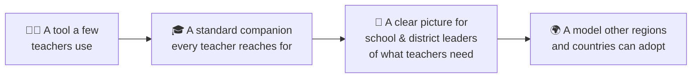
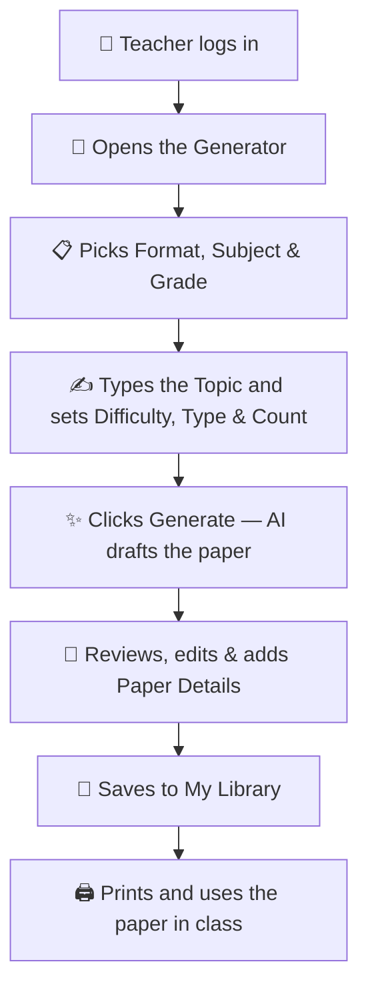
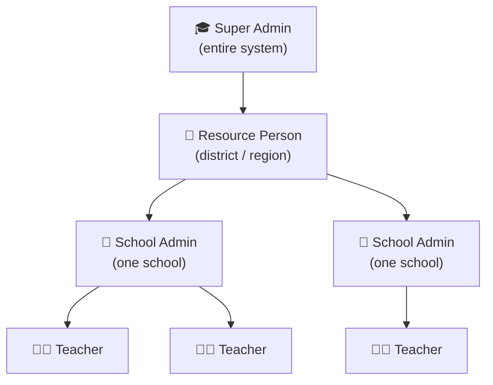
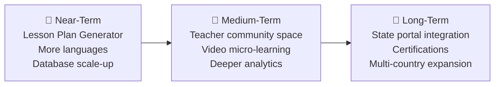

# 🎓 TeachMitra AI

### An AI-Powered Teaching Companion, Built for Every Classroom

**Product & Investment Brief**

*Prepared for Professors · Incubators · Mentors · Investors · Funding Organizations · School Administrators*

> 🖼️ **[Screenshot Placeholder — Product Hero View]**
> *Reserved for a full-screen product image (e.g., the AI Teacher Coach or the Quiz & Worksheet
> Generator) in the final designed version of this brief.*

---

> **How to read this document:** Every capability described here has been verified against the
> actual, working product — nothing is invented, and nothing is exaggerated. Anything not yet
> built is clearly marked **🚧 Planned**, never mixed in with what already works today.

---

## 📑 Table of Contents

1. [At a Glance](#1-at-a-glance)
2. [Executive Summary](#2-executive-summary)
3. [Why TeachMitra AI?](#3-why-teachmitra-ai)
4. [The Problem](#4-the-problem)
5. [Our Vision](#5-our-vision)
6. [Who It's For](#6-who-its-for)
7. [Core Features](#7-core-features)
8. [AI Question Paper Generation — A Closer Look](#8-ai-question-paper-generation--a-closer-look)
9. [The User Journey](#9-the-user-journey)
10. [How TeachMitra AI Compares](#10-how-teachmitra-ai-compares)
11. [Real-World Use Cases](#11-real-world-use-cases)
12. [Social Impact](#12-social-impact)
13. [Scalability](#13-scalability)
14. [Business Opportunities](#14-business-opportunities)
15. [Funding Potential](#15-funding-potential)
16. [Current Product Status](#16-current-product-status)
17. [Future Roadmap](#17-future-roadmap)
18. [Frequently Asked Questions](#18-frequently-asked-questions)
19. [Pitch Scripts](#19-pitch-scripts)
20. [Key Talking Points](#20-key-talking-points)
21. [Appendix — High-Level Product Information](#21-appendix--high-level-product-information)

---

## 1. At a Glance

| | |
|---|---|
| 🏷️ **Product Name** | TeachMitra AI *(also referred to internally as "Teacher Assistant / शिक्षक सहायक")* |
| 🗂️ **Category** | AI-Powered EdTech · Teacher Productivity Platform |
| 👥 **Target Users** | School teachers, school administrators, coaching institutes, NGOs, education departments |
| 📈 **Current Status** | ✅ Fully working product — usable end-to-end today |
| 🧩 **Core Features** | AI Teacher Coach · Personal Resource Library · Lesson Plan Workspace · Quiz & Worksheet Generator · Admin Analytics Dashboard |
| 💻 **Platform** | Cloud-based web application — installable on any phone, tablet, or computer |
| 🤖 **AI Capabilities** | Context-aware classroom coaching, multilingual answers, automatic question-paper generation with math support |
| 💡 **Primary Value Proposition** | Turns hours of teacher preparation and waiting-for-help into minutes of instant, reliable, classroom-ready support |

---

## 2. Executive Summary

> *A two-minute read that captures the entire product.*

**TeachMitra AI is a web-based teaching companion.** It gives every teacher two things that are
usually hard to get: **instant, specific classroom guidance**, and a **ready-to-print exam-paper
generator** that produces properly formatted quizzes and worksheets — with correct Mathematics
notation, a school letterhead, and a separate answer key — in under a minute.

**The problem it solves:** Teachers are expected to be subject experts, classroom managers, and
document designers, all at once, usually alone and under time pressure. Getting specific help
*exactly when it's needed* — and preparing a clean, professional test paper — both take far more
time and support than most teachers actually have.

**How it solves it:** A teacher can ask a classroom question, by typing or speaking, in one of ten
languages, and receive a detailed, practical answer in seconds. Separately, the same teacher can
generate a complete quiz or worksheet on any topic, in any subject, for any grade — reviewed and
edited before it's ever used, and printed as a polished exam paper.

> **💡 Key Takeaway**
> TeachMitra AI is not a general chatbot repurposed for education — it is purpose-built for the
> classroom: it understands grades, subjects, exam formatting, and answer-key discipline by
> design, without the teacher needing to explain any of that themselves.

**Where it stands today:** This is a complete, working product — not a concept, mockup, or slide
deck. Every feature in this document can be used by a teacher right now.

**Where it's going:** A scalable, cloud-based platform designed to grow from a handful of schools
to a national scale, aligned with India's own education priorities (NEP 2020, NIPUN Bharat), with
a clear, honestly-labelled roadmap for what comes next.

---

## 3. Why TeachMitra AI?

<table>
<tr><td width="33%" valign="top">

### ⚡ Instant, Not Eventual
Classroom help usually arrives late — if it arrives at all. TeachMitra AI responds in seconds, at
the exact moment a teacher needs it.

</td><td width="33%" valign="top">

### 🎯 Specific, Not Generic
No vague "teach better" advice. Every answer is shaped by the actual grade, subject, and
classroom situation described.

</td><td width="33%" valign="top">

### 🖨️ Classroom-Ready, Not Just Text
Generated papers aren't just AI text — they come out as clean, print-ready exam papers with a
letterhead, correct formatting, and a safely separated answer key.

</td></tr>
<tr><td width="33%" valign="top">

### 🗣️ In the Teacher's Own Language
Ten language options mean language is never the barrier between a teacher and the help they need.

</td><td width="33%" valign="top">

### 🧮 Built for Real Subjects
Mathematics and other formula-heavy subjects are fully supported, with equations rendered
properly — not typed-out approximations.

</td><td width="33%" valign="top">

### 🏫 Built for How Schools Are Organized
A ready-made structure for teachers, school leaders, and education administrators — not a
one-size-fits-all single-user tool.

</td></tr>
</table>

---

## 4. The Problem

Classrooms across India — government and private, urban and rural — share a set of everyday,
practical struggles:

| 🚩 Everyday Classroom Problem | What It Looks Like in Practice |
|---|---|
| **No one to ask, right now** | A teacher is mid-lesson and can't answer a student's question clearly. There's no mentor in the room, and the moment passes. |
| **Generic advice, not actionable help** | "Manage the class better" is true but useless — what does that actually look like for *this* lesson, *this* grade? |
| **Making a test is tedious** | Writing questions, plausible wrong options, correct numbering, and a separate answer key for a 10-question quiz can take an hour or more — usually done late at night. |
| **Formatting looks unprofessional** | Without design tools, a printed test often looks inconsistent, with hand-written Maths symbols and no clear answer key. |
| **Language is a barrier** | Most ready-made material online is in English only, forcing teachers to translate it themselves. |
| **Multi-grade, large classrooms** | One teacher, several grade levels, 40+ students — with no differentiated material for each level. |

> **📌 In short:** Teachers are expected to be subject expert, translator, content designer, and
> document formatter — all at once, usually with no extra time and no extra support.

---

## 5. Our Vision

> *"Every teacher — regardless of the school they teach in, the language they teach in, or how
> much official support they receive — should have an intelligent, patient, always-available
> assistant that helps them teach better and prepare better."*

The long-term impact this creates: better-prepared teachers, more consistent classroom material,
less time lost to repetitive paperwork, and — ultimately — better learning outcomes for students.

---

## 6. Who It's For

TeachMitra AI is purpose-built primarily for **school teachers**, with an account structure
directly aligned to national education priorities such as **NEP 2020** and **NIPUN Bharat**
(India's foundational literacy and numeracy mission). Teachers sign in under a **school**, and
school leaders, resource persons, and administrators each get a view scoped to their
responsibility — one school, one district, or the full system.

The same product, without any changes, serves several other groups equally well:

| 👤 User Group | Why It Fits |
|---|---|
| 🏫 **Government school teachers** | Everyday classroom coaching and quick, reliable test preparation. |
| 🏢 **Private school teachers** | Same lesson-prep and assessment needs, regardless of school type. |
| 📖 **Coaching institute teachers** | Frequent need for fresh practice quizzes on specific topics. |
| 🤝 **NGOs running teacher-training programs** | Coaching and analytics features to support and monitor many trained teachers at once. |
| 🏛️ **Educational trusts / multi-school organizations** | The school → admin structure matches how a trust manages several schools under one umbrella. |
| ✏️ **Individual tutors** | Can use the Quiz & Worksheet Generator on its own. |

> **✅ Summary:** One product, one consistent experience — equally useful for a single classroom
> teacher and for an organization managing hundreds of schools.

---

## 7. Core Features

<table>
<tr><td width="50%" valign="top">

### 🧑‍🏫 AI Teacher Coach
**What it does:** Answers classroom questions instantly, in plain language — typed or spoken —
with practical teaching methods, examples, and activities.
**Classroom example:** A teacher asks how to explain place value to Class 2 and gets a structured,
usable answer in seconds.

</td><td width="50%" valign="top">

### 🗣️ Multilingual & Voice-Friendly
**What it does:** Ask and receive answers in 10 language options, including a natural
Hindi-English mix. Answers can also be read aloud.
**Classroom example:** A teacher speaks a question in Bengali and receives a Bengali answer —
no typing required.

</td></tr>
<tr><td width="50%" valign="top">

### 📚 My Library
**What it does:** Save any useful AI answer into a personal, searchable library of teaching
resources.
**Classroom example:** A lesson explained well in September is found and reused again in March.

</td><td width="50%" valign="top">

### 📝 Lesson Plan / Resource Workspace
**What it does:** A document-style editor to refine saved material, with AI help to simplify
content or adapt it for another grade — always previewed before it's applied.
**Classroom example:** A Class 5 lesson plan is adapted for Class 3 in one click, then reviewed
before use.

</td></tr>
<tr><td width="50%" valign="top">

### 🖨️ Print / Export to PDF
**What it does:** Turns any saved resource into a clean, professional PDF — no app clutter, just
the content.
**Classroom example:** A finished lesson plan is exported and shared with a colleague over
WhatsApp.

</td><td width="50%" valign="top">

### 📊 Admin Dashboard
**What it does:** Shows school leaders and administrators how teachers are using the tool — usage
volume, common subjects, languages, and helpfulness — scoped to their role.
**Classroom example:** A district officer spots a spike in "classroom management" questions and
plans a targeted training session.

</td></tr>
</table>

> 🖼️ **[Screenshot Placeholder — Product Screens]**
> *Reserved for a short gallery of screenshots: AI Teacher Coach, My Library, Lesson Plan
> Workspace, Quiz & Worksheet Generator, and the Admin Dashboard.*

> **✅ Summary:** A coaching assistant, a personal resource library, a lesson-refinement workspace,
> a print-ready export tool, and a management dashboard — one connected product, not five
> separate tools.

---

## 8. AI Question Paper Generation — A Closer Look

This is TeachMitra AI's flagship capability: a dedicated **Quiz & Worksheet Generator**.

### 🧾 The Workflow

A teacher fills a short form — **Format** (Quiz/Worksheet), **Topic** (any chapter, in plain
text), **Grade & Subject**, **Difficulty** (Easy/Medium/Hard), **Question type** (MCQ / True-False
/ Short Answer / Mixed), **Number of questions** (3–30), **Language**, and optional extra
instructions. One click produces a complete draft — questions, answer options, and a separate
answer key — in seconds.

### 🖋️ Paper Details (The Exam Letterhead)

Before printing, a teacher can add a proper exam letterhead: school name, exam name, teacher name,
date, duration, maximum marks, and custom instructions — with blank fill-in lines for Class,
Subject, Name, and Roll Number, just like a real school exam paper. These details can be saved
once as a default and reused automatically on every future paper.

> 🖼️ **[Screenshot Placeholder — Exam Letterhead Preview]**
> *Reserved for an image of a generated paper showing the school letterhead, Class/Subject row,
> and Name/Roll Number fill-in lines.*

### 🧮 Mathematics Support

Equations, fractions, exponents, square roots, and trigonometric expressions render as proper,
readable mathematical notation — both on-screen and in print — not typed approximations like
"1/2" or "sqrt(9)".

### 📖 Any Subject, Any Chapter

Topic, Grade, and Subject are free text (with helpful suggestions, not a fixed list) — so the same
generator works for Mathematics, Science, English, Hindi, Social Studies, or any other subject and
chapter a teacher names.

### 🖨️ Print-Ready, Two Versions

| Version | Contents | Safety Behaviour |
|---|---|---|
| 🧑‍🎓 **Student Version** | Questions only | The answer key is **structurally absent** — not hidden, genuinely not included — from the document |
| 👩‍🏫 **Teacher Version** | Questions + Answer Key | Includes the full, correctly numbered answer key |

> **⚠️ Built-in Safeguard:** If a teacher manually edits a paper and accidentally removes the
> answer-key section, the system **warns before printing** the student version, rather than
> silently risking an answer leak.

> 🖼️ **[Screenshot Placeholder — Student vs. Teacher Print Output]**
> *Reserved for a side-by-side image comparing the printed Student version (no answers) and
> Teacher version (with the answer key).*

### ✏️ Teacher Customization

Nothing is final until the teacher approves it. After saving, a teacher can ask the AI to **make a
paper easier, make it harder, add more questions, or simplify the wording** — always shown as a
preview to accept or discard first.

> **✅ Summary:** One short form → a complete, correctly formatted, print-ready exam paper — with
> Mathematics handled properly, a real letterhead, and an answer key that can never accidentally
> leak into a student's copy.

---

## 9. The User Journey

> **⏱️ Speed:** Every step except choosing a topic and clicking Generate is optional to skip — a
> teacher who just needs a quick quiz can go from login to a printed paper in **under two
> minutes**.

---

## 10. How TeachMitra AI Compares

| Dimension | 📄 Traditional Method | 💬 Generic AI Chatbot | 🎓 TeachMitra AI |
|---|---|---|---|
| Paper matches exact topic/grade | Rarely — searched, not made-to-order | Depends entirely on how well the teacher writes the prompt | ✅ Always — built from the exact fields chosen |
| Answer key discipline | Manual, error-prone | Not designed to separate answer keys at all | ✅ Structurally separated Student/Teacher versions |
| Exam formatting & letterhead | Manual design work | Not provided | ✅ Automatic, reusable letterhead |
| Mathematics notation | Hand-written or typed approximations | Often inconsistent or plain-text | ✅ Properly rendered on-screen and in print |
| Classroom coaching | Occasional mentor visits (can take weeks) | Generic, not classroom-context-aware | ✅ Instant, context-aware (grade, subject, situation) |
| Language support | Usually English-only material | Depends on the chatbot | ✅ 10 language options, purpose-matched to Indian classrooms |
| Built for school structure (multi-teacher, multi-school) | N/A | Not designed for this at all | ✅ Teacher, School Admin, Resource Person, and Super Admin roles built in |

> **💡 Key Takeaway:** A generic AI chatbot can write *something* about any topic if prompted well
> enough. TeachMitra AI is purpose-built for the classroom — exam formatting, answer-key
> discipline, and school structure are built in, not left to the teacher to construct through
> clever prompting.

---

## 11. Real-World Use Cases

<table>
<tr><td width="50%" valign="top">

### 🏫 Government School Teacher
Class 3–5, multi-grade classroom, limited internet access. Asks the AI coach in Hindi how to
explain subtraction with borrowing using materials she already has. That evening, generates a
10-question worksheet on the same topic, printed with the school's own letterhead.

</td><td width="50%" valign="top">

### 🏢 Private School Teacher
Preparing a Class 8 Science unit test, generates a 15-question mixed quiz on the digestive system,
tweaks two questions, adds the exam letterhead with date and maximum marks, and prints both a
Teacher copy (for grading) and a clean Student copy.

</td></tr>
<tr><td width="50%" valign="top">

### 📖 Coaching Institute
Generates a fresh 20-question Mathematics quiz — with correctly rendered equations and a separate
answer key — every week for exam-preparation students, in minutes instead of hours of manual
paper-setting.

</td><td width="50%" valign="top">

### 🤝 NGO Teacher-Training Program
Creates school-level accounts for the teachers it supports. Program managers use the admin
dashboard to see which topics teachers across all supported schools need help with most —
informing which training workshops to run next.

</td></tr>
</table>

---

## 12. Social Impact

| Impact Area | What Changes |
|---|---|
| 🧑‍🏫 **Teacher isolation** | Support arrives the moment it's needed, not weeks later. |
| ⏱️ **Time saved** | Less time on repetitive paperwork means more time with students. |
| 🗣️ **Language equity** | A teacher's language should never limit access to good support or professional material. |
| 📐 **Consistency** | Every generated paper follows the same careful structure, regardless of the teacher's design experience. |
| 📊 **Visibility for leaders** | Aggregated, privacy-respecting usage data helps school and district leaders target training where it's actually needed. |

---

## 13. Scalability

- **Cloud-based, not location-bound** — any teacher with a phone or computer and an internet
  connection can use it; no per-school installation is required.
- **Multi-school structure already built in** — the hierarchy above matches how India's education
  system (and most large school networks) is actually organized.
- **Language-ready** — adding another language is a configuration change, not a rebuild.
- **A clear growth path for the underlying database** — a documented, ready-to-execute plan exists
  to move to a larger-scale database as usage grows, so scaling up is a known next step rather than
  an open risk.

---

## 14. Business Opportunities

| Opportunity | Description |
|---|---|
| 🏛️ **Government partnerships** | State/district education departments (grant or partnership-funded deployment) |
| 🏢 **Institutional licensing** | Private school groups and educational trusts |
| 📖 **Coaching institutes** | Subscription access for tutoring centers and exam-prep chains |
| 🤝 **NGO / CSR-funded programs** | Deployments aligned with teacher-training and education-equity missions |
| ✏️ **Individual teachers** | Freemium access, with a paid tier for schools needing admin tools |

> **📌 Note:** These are described as **potential** business models for discussion — no pricing or
> commercial terms currently exist in the product.

The existing school → admin → district → national role hierarchy is exactly the structure a school
group, NGO, or government department would need to onboard many schools under one umbrella — this
already works in the product today, not as a future build.

---

## 15. Funding Potential

Why this is attractive to an incubator, mentor, or impact investor:

| Factor | Why It Matters |
|---|---|
| 📊 **Large, defined market** | India has one of the largest school education systems in the world, spanning government schools, private schools, and coaching institutes nationwide — a very large potential user base for any teacher-facing product |
| ⏱️ **A real, persistent problem** | Every teacher, everywhere, spends real time on lesson prep and test-making — a problem that doesn't go away |
| 🤖 **Rides the AI adoption wave** | Applied to school education — a sector historically underserved by good, localized AI tools |
| 📜 **Aligned with national priorities** | Directly supports NEP 2020's continuous-teacher-development goals and the NIPUN Bharat foundational-literacy mission |
| 📈 **Scalable cost structure** | Cloud-based, no per-school hardware — the cost of the next school is far lower than traditional in-person training |
| ❤️ **Impact + commercial potential together** | Attractive to impact-focused funders and to funders seeking a large, addressable commercial market alike |

---

## 16. Current Product Status

> **📌 This section is intentionally strict:** nothing below is aspirational. Every ✅ item is
> usable in the product today; every 🚧 item is explicitly not yet built.

### ✅ Implemented Features

- Secure teacher login and registration (school code + name + PIN), with lockout protection after
  repeated failed attempts
- Role-based access for Teachers, School Admins, Resource Persons, and Super Admins
- AI Teacher Coach — context-aware Q&A, voice input, read-aloud, multilingual answers,
  conversation history, and follow-up actions (simplify, translate, create a worksheet, etc.)
- My Library — saving, searching, and filtering resources, kept strictly private between teachers
- Lesson Plan / Resource Workspace, with AI-assisted revisions and a preview-before-apply safeguard
- Print / Export to a clean PDF for any saved resource
- **Quiz & Worksheet Generator** — the exam letterhead, correctly rendered Mathematics, and
  separate Student/Teacher print versions with a fail-safe answer-key warning
- Admin Dashboard with usage analytics scoped by role, plus school/user management tools
- Mobile-friendly, installable app experience with dark/light themes
- An automated test suite for the backend, and a documented, continuously updated manual QA guide
  covering the whole product

### 🚧 Planned Features

- Full offline use — asking the AI a question or generating a paper currently requires an active
  internet connection at that moment
- A dedicated, guided Lesson Plan Generator (today, lesson plans are created via the AI Coach and
  refined in the Workspace)
- Video micro-learning content
- A dedicated native mobile app
- SMS / feature-phone support
- Integration with state government education portals

---

## 17. Future Roadmap

> **📌 Note:** Everything in this roadmap is a future plan, clearly separate from
> [Section 16 — Current Product Status](#16-current-product-status).

---

## 18. Frequently Asked Questions

**1. Why use AI for this instead of a normal website of resources?**
A static resource library can't adapt to the exact grade, subject, difficulty, and language a
teacher needs right now. AI generates something tailored, on demand.

**2. Why not just use a general AI chatbot?**
A general chatbot doesn't know classroom conventions — exam formatting, answer-key discipline,
grade-appropriate language — unless the teacher manually explains all of that every time.
TeachMitra AI builds all of that in automatically.

**3. How accurate is the AI's content?**
The AI drafts the content, but nothing is used until the teacher reviews it. The system also
checks the AI's output for structural correctness before showing it to the teacher — but teacher
review remains an essential final step.

**4. Can schools trust the platform with their data?**
Yes — teacher accounts are protected with securely hashed PINs (never stored in plain text), each
teacher's data is kept private from other teachers, and administrative access is strictly limited
by role.

**5. Does the platform replace teachers?**
No. It's a support tool the teacher directs and reviews. Every AI suggestion is a draft — the
teacher decides what to keep, change, or discard.

**6. Can it work offline?**
The app can be installed like a phone app for quick access, but generating AI content currently
requires an internet connection at that moment. Full offline use is a planned future capability.

**7. How is Mathematics/formula support handled?**
Equations, fractions, exponents, and other math notation render as proper, readable mathematical
symbols, both on-screen and in print.

**8. Can it generate papers for any subject or chapter?**
Yes. Subject, grade, and topic are all free text with helpful suggestions — not limited to a fixed
list.

**9. How is teacher/student data kept private?**
Content is private to the teacher who created it by default. Administrators only see aggregated
usage patterns needed for their role.

**10. Can it support multiple Indian languages?**
Yes — 10 language options today, including a natural Hindi-English mix, with more planned.

**11. Is it free to use?**
The core product is designed to be low-cost to run; specific pricing for institutions is still
being defined (see Section 14).

**12. Who can use it — only government schools?**
It's purpose-built around government schools, but the same features work equally well for private
schools, coaching institutes, and NGOs.

**13. How does the quiz generator avoid mistakes like wrong answer counts?**
The system itself builds the final numbering, multiple-choice lettering, and answer key — not left
to the AI's free-form writing — so the structure stays consistent every time.

**14. Can a teacher edit AI-generated content before using it?**
Yes, at every stage — before saving, and again afterward in the Workspace editor.

**15. Can the answer key ever accidentally show up on a student's copy?**
No — the student version simply does not include the answer key content at all, and the tool warns
the teacher if it can't confidently tell the two apart before printing.

**16. What happens if the AI generates something wrong or inappropriate?**
The teacher reviews everything before it's saved or printed, and the system validates the AI's
output structurally, allowing an easy retry if something doesn't match what was requested.

**17. Is this only useful in India?**
The current design is India-first (languages, curriculum context, national policy alignment), but
the underlying idea — instant, contextual teaching support and paper generation — applies wherever
teachers face similar challenges.

**18. How is this different from a question bank website?**
A question bank gives you existing questions to search through. TeachMitra AI creates new
questions matched exactly to your topic, grade, and difficulty, and formats the entire paper for
you.

**19. Is it live and usable today?**
Yes. Teachers can log in right now, use the AI coach, save resources, and generate and print real
exam papers — every capability described in this brief is available today, in a form ready for
pilot use.

**20. What's needed to make this available to more schools?**
Mainly partnerships to reach schools (government, NGO, or institutional), and funding to support
AI usage costs and infrastructure as adoption grows — which scales gradually and predictably, not
in one large jump.

---

## 19. Pitch Scripts

### 🎤 Elevator Pitch (30 Seconds)

> "TeachMitra AI is an AI teaching companion for school teachers. It answers classroom questions
> instantly, in the teacher's own language, and generates ready-to-print quizzes and worksheets —
> complete with a school letterhead, properly formatted Mathematics, and a separate answer key —
> in under a minute. It's built for how Indian schools are actually organized, it's ready to use
> today, and it's designed to scale from a handful of schools to millions of teachers."

---

### 🎤 2-Minute Pitch

> "Every teacher, at some point, faces a moment where they need help right now — a tricky concept
> to explain, a difficult classroom to manage, or a test to prepare for tomorrow — and there's
> often no one available to ask. TeachMitra AI is an AI-powered teaching companion that solves
> exactly that. A teacher can ask a classroom question in their own language, by typing or
> speaking, and get a detailed, practical answer in seconds — not generic advice, but specific
> teaching methods and activities suited to their exact grade and subject.
>
> Beyond day-to-day coaching, TeachMitra AI includes a dedicated Quiz and Worksheet Generator. A
> teacher picks a subject, types in any topic or chapter, sets the difficulty and number of
> questions, and gets a complete, correctly formatted exam paper in under a minute — including
> properly rendered Mathematics, a professional exam letterhead with the school's details, and a
> separate answer key that's structurally guaranteed to never leak into the student's copy.
>
> It's built specifically for the Indian classroom — ten language options, alignment with national
> education priorities like NEP 2020 and NIPUN Bharat, and a school-and-district account structure
> that matches how India's education system is actually organized. Teachers can log in and use it
> right now. And because it's cloud-based with no per-school installation, it's built to scale from
> a handful of pilot schools to millions of teachers without a redesign."

---

### 🎤 5-Minute Pitch

> "Let me start with a simple observation: teachers are expected to be experts in everything —
> their subject, classroom management, lesson design, and document formatting — usually alone, and
> usually without enough time. When a teacher struggles with something in the classroom, real
> support often takes weeks to arrive, if it arrives at all. And when they need to prepare a test,
> they're stuck manually writing questions, formatting a paper, and keeping the answer key
> separate — an hour or more of repetitive work, often done after school hours.
>
> TeachMitra AI was built to close that gap. At its core is an AI Teacher Coach: a teacher types or
> speaks a question about their classroom — in any of ten supported languages, including a natural
> Hindi-English mix — and gets back a structured, practical answer: teaching methods, examples,
> classroom activities, and things to watch out for. It's context-aware — it knows the grade,
> subject, and classroom situation — so the advice isn't generic, it's specific enough to use
> immediately.
>
> Every useful answer can be saved into a personal library, and refined further in a
> document-style workspace, where the teacher can ask the AI to simplify content, adapt it for a
> different grade, or add activities — always previewing the suggestion before deciding whether to
> keep it. Nothing is ever auto-applied.
>
> The feature I want to highlight most is the Quiz and Worksheet Generator. A teacher picks a
> subject, types any topic or chapter — it isn't limited to a fixed list — sets the difficulty and
> number of questions, and generates a complete paper in seconds. What makes this genuinely
> useful, not just a novelty, is the attention to real classroom needs: Mathematics and other
> subjects with equations render as proper mathematical notation, not typed approximations. The
> paper gets a real exam letterhead — school name, exam name, date, maximum marks — that a teacher
> configures once and reuses. And critically, the system — not the AI's free-form writing — builds
> the final question numbering and answer key, so it's always consistent. When it's time to print,
> the teacher can generate a clean Student version with the answer key structurally absent — not
> just hidden — and a separate Teacher version with it included.
>
> Around all of this sits a proper account and administration system: teachers sign in under a
> school code, and school leaders, district resource persons, and top-level administrators get an
> analytics dashboard scoped to their role — showing usage patterns and common topics teachers need
> help with, without exposing anyone's private conversations unnecessarily.
>
> Every feature just described is live and usable today — not a plan, not a mockup. It's designed
> around India's government school system, in alignment with
> national priorities like NEP 2020 and NIPUN Bharat, but the same product works equally well for
> private schools, coaching institutes, and NGOs running teacher training — the underlying
> school-and-organization account structure already supports all of them.
>
> And because it's built as a standard cloud web application — not something that needs to be
> installed school-by-school — it's designed to grow from a handful of pilot schools to a national
> scale without needing to be rebuilt. We're honest about what's still ahead: full offline use and
> a dedicated lesson-plan generator are on our near-term roadmap, not built yet. But the core
> promise — instant, contextual, multilingual support for the moments teachers actually need it —
> is real, working, and ready to be put in front of more teachers today."

---

## 20. Key Talking Points

- 🎓 **What it is:** An AI-powered coaching assistant + a Quiz & Worksheet Generator, built for
  teachers.
- 🎯 **Core problem solved:** Teachers lack instant, specific support and spend too much time on
  repetitive test/paper preparation.
- 📝 **Flagship feature:** Quiz & Worksheet Generator — any subject, any chapter, proper
  Mathematics rendering, exam letterhead, structurally separate Student/Teacher print versions.
- 🤖 **Not a generic chatbot:** Built-in classroom conventions (formatting, answer keys, grade
  context) that a general AI tool doesn't provide out of the box.
- 🗣️ **Multilingual:** 10 language options, including Hinglish.
- 🧑‍🏫 **Human stays in control:** Every AI output is a reviewable draft — never auto-applied or
  auto-saved.
- 📈 **Built for scale from day one:** Cloud-based, multi-school/district account structure already
  built in.
- 📜 **Policy-aligned:** Built around NEP 2020 and NIPUN Bharat priorities.
- ✅ **Working today, not a mockup:** Every feature described in this document is live in the
  product right now.
- 📌 **Honest roadmap:** Full offline use, a dedicated lesson-plan generator, and more languages
  are clearly labelled as next steps, not existing features.
- 📊 **Market size:** Millions of teachers across government schools, private schools, and coaching
  institutes in India alone.
- 💼 **Business angle:** Freemium for individual teachers, institutional licensing for
  schools/NGOs/government partners — the account structure to support this already exists.

---

## 21. Appendix — High-Level Product Information

*A quick-reference summary — no technical detail, just the facts.*

| Item | Details |
|---|---|
| 🏷️ **Product Name** | TeachMitra AI *(also referred to internally as "Teacher Assistant / शिक्षक सहायक")* |
| 🗂️ **Category** | AI-Powered EdTech · Teacher Productivity Platform |
| 💻 **Platform** | Cloud-based web application; installable on phones, tablets, and computers |
| 🤖 **AI Engine** | Powered by a modern generative AI model (Google Gemini) |
| 👥 **User Roles Supported** | Teacher · School Admin · Resource Person · Super Admin |
| 🗣️ **Languages Supported** | English, Hindi, Bengali, Telugu, Marathi, Tamil, Gujarati, Kannada, Odia, and Hinglish (10 total) |
| 🏫 **Grade Levels Covered** | Pre-Primary, Class 1–2, Class 3–5, Class 6–8, Class 9–10, Class 11–12 |
| 📖 **Subjects Covered** | Mathematics, Science, English, Hindi, Social Studies, Languages, General — plus any custom subject a teacher enters |
| 🔐 **Access Model** | School-code based login with role-based permissions |
| 📄 **Document Status** | Living document — content reflects the product as currently implemented |

> **📌 Note:** This appendix is a factual summary for quick reference. For full detail on any item,
> see the relevant numbered section earlier in this brief.

---

*End of Document — TeachMitra AI Product & Investment Brief*

