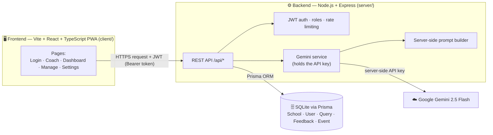
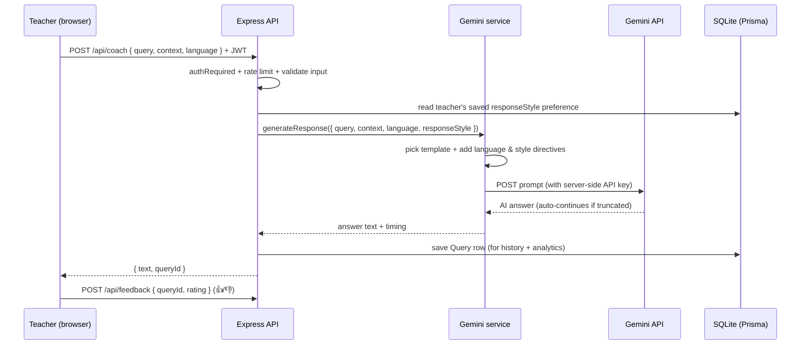
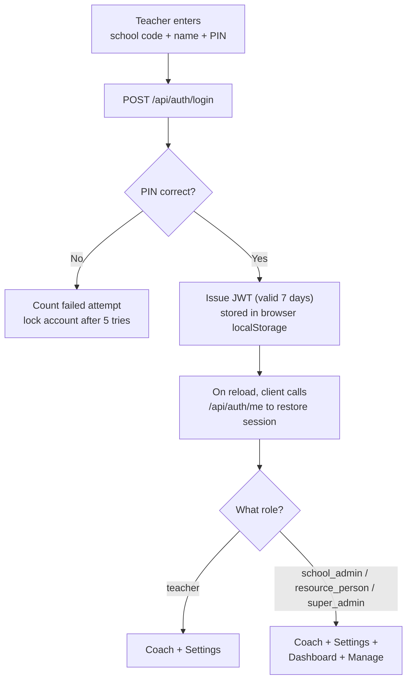
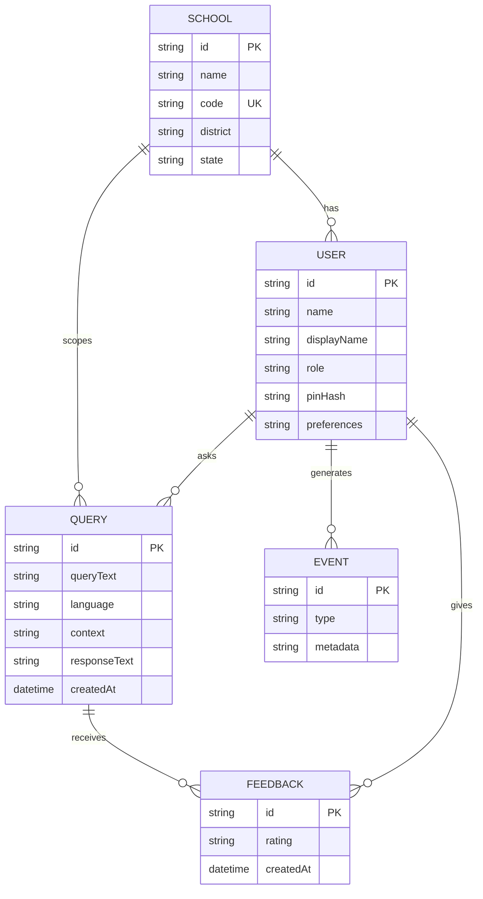
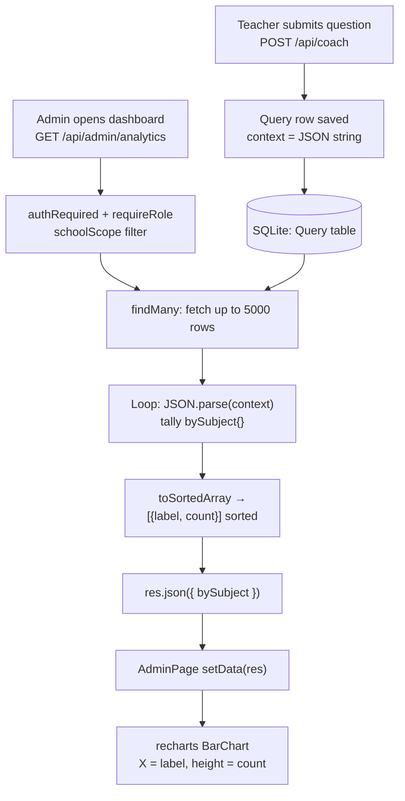

# Teacher Just-In-Time Coaching Tool 👨‍🏫

> **शिक्षक सहायक** - An AI-powered coaching assistant providing just-in-time support for Indian government school teachers

## 🎯 Problem Statement

Teachers in rural India face critical gaps in professional development:
- **Lag Time**: Resource persons visit only once a month for 10-30 minutes
- **Generic Feedback**: Non-actionable advice instead of specific solutions
- **No Just-In-Time Support**: Teachers struggle alone during immediate classroom challenges

This tool provides **immediate, personalized, context-aware coaching** to teachers on-demand.

## ✨ Features

### Core Functionality
- 🤖 **AI-Powered Coaching**: Uses Google Gemini (2.5 Flash) for context-aware responses. The API key stays **server-side** and is never exposed to the browser.
- 🎤 **Voice Input**: Ask questions by speaking, using the browser's Web Speech API
- 🗣️ **Read Aloud**: Text-to-speech playback of the AI answer
- 🌐 **Multilingual Support**: 9 Indian languages + Hinglish (English, Hindi, Bengali, Telugu, Marathi, Tamil, Gujarati, Kannada, Odia)
- 🎨 **Personalization**: Per-teacher settings — display name, avatar, default grade/subject/language, and preferred response style (concise, detailed, step-by-step, practical)
- 🕘 **Question History**: Each teacher's past questions and answers, stored server-side
- 📊 **Admin Dashboard**: Role-scoped usage analytics for school admins, resource persons, and super admins
- 📱 **Installable PWA**: Installs like an app with an offline-cached app shell (API calls are never cached)

### Specialized Coaching Areas
1. **Classroom Management** - Handle disruptions, manage multi-grade classrooms
2. **Concept Explanation** - Break down complex topics with local context
3. **Student Engagement** - Strategies to keep students interested
4. **Assessment** - Quick, effective evaluation techniques
5. **FLN Support** - Foundational Literacy & Numeracy guidance
6. **Resource-Constrained Teaching** - Creative solutions with limited materials

## 🏛️ Architecture at a Glance

> New to the project? Start here. These diagrams explain how the whole system fits
> together before you dive into any code.

The app has **two parts**: a **React frontend** (`client/`) that teachers and
administrators use in the browser, and a **Node.js backend** (`server/`) that keeps
the Gemini API key secret, talks to the database, and enforces who can see what.

### 1. System components — how the pieces connect



**Why a backend at all?** So the Gemini API key is never shipped to the browser, so
prompts can't be tampered with, and so questions/feedback can be stored and analysed.

### 2. Asking a question — the coaching request lifecycle



### 3. Signing in — authentication & roles

Teachers log in with a **school code + their name + a 6-digit PIN**. There are four
roles; admins see extra pages.



| Role | Coach | Settings | Dashboard | Manage schools/users | Data they can see |
| --- | :---: | :---: | :---: | :---: | --- |
| Teacher | ✅ | ✅ | — | — | Only their own history |
| School Admin | ✅ | ✅ | ✅ | View users | Their own school |
| Resource Person | ✅ | ✅ | ✅ | View users | Their whole district |
| Super Admin | ✅ | ✅ | ✅ | Create schools, change roles | All schools |

### 4. The data model

Everything is scoped to a **School** (the tenant). A **User** asks **Queries**; each
query can receive **Feedback**.



## 🚀 Quick Start

### Prerequisites
- Modern web browser (Chrome, Edge, Firefox, Safari)
- Internet connection (for AI responses)
- Google Gemini API key (free tier available)

### Setup Instructions

1. **Get a Gemini API Key** (Free)
   - Visit: https://makersuite.google.com/app/apikey
   - Sign in with Google account
   - Click "Create API Key"
   - Copy your API key

2. **Configure & run the backend** (keeps your API key secret)

   The frontend never holds the API key. A small Node.js backend proxies
   requests to Gemini. You need Node.js 18 or newer.

   ```bash
   cd server
   npm install
   cp .env.example .env      # on Windows PowerShell: Copy-Item .env.example .env
   ```

   Open `server/.env` and set your key:
   ```env
   GEMINI_API_KEY=your-actual-api-key-here
   CORS_ORIGINS=http://localhost:5173,http://localhost:8000
   ```

   Set up the database (SQLite via Prisma) and seed demo accounts:
   ```bash
   npx prisma migrate dev     # creates prisma/dev.db and applies the schema
   npm run seed               # adds demo schools + accounts (see below)
   ```

   Start the backend:
   ```bash
   npm start
   ```
   It listens on `http://localhost:3000` by default.

3. **Run the React client** (`client/`)

   The modern web app is a Vite + React + TypeScript PWA.
   ```bash
   cd ../client
   npm install
   cp .env.example .env       # on Windows PowerShell: Copy-Item .env.example .env
   npm run dev
   ```
   Open the browser to the URL Vite prints (default `http://localhost:5173`).
   `VITE_API_BASE` in `client/.env` points the app at the backend API.

   Build for production with `npm run build` (outputs to `client/dist/`).

### Demo accounts (from `npm run seed`)

All demo accounts use PIN **123456**. Sign in with a school code + name + PIN.

| School code | Name          | Role            |
| ----------- | ------------- | --------------- |
| RAMPUR01    | Demo Teacher  | Teacher         |
| RAMPUR01    | Rampur Admin  | School Admin    |
| RAMPUR01    | Rampur RP     | Resource Person |
| RAMPUR01    | Super Admin   | Super Admin     |

New teachers can self-register with a valid school code from the **Register** tab.

> **Legacy note:** The original vanilla HTML/JS prototype now lives in
> `archive/` (`index.html`, `app.js`, `styles.css`, etc.). It is superseded by
> the React client in `client/` and no longer works against the API because
> `/api/coach` now requires authentication. It is kept only for reference.

> **Security note:** The API key lives only in `server/.env`, which is
> git-ignored. Never put the key in any frontend file. If a key
> was ever committed to git, rotate it immediately in the Google console.

## 📖 How to Use

### Basic Usage

1. **Select Context** (Optional but recommended)
   - Choose your grade/class
   - Select subject
   - Pick classroom type
   - Identify issue type

2. **Ask Your Question**
   - Type your question in the text area, OR
   - Click the 🎤 microphone button to speak

3. **Get Instant Coaching**
   - Click the "Get advice" button
   - Receive personalized, actionable advice in seconds

4. **Provide Feedback**
   - Mark responses as helpful or not helpful
   - Helps improve future recommendations

### Example Queries

**Classroom Management:**
> "My Class 4 students finished group work at different times. Advanced students are disrupting while others are still working. What should I do?"

**Concept Explanation:**
> "Students don't understand borrowing in subtraction when there's a zero in the tens place. How do I explain this?"

**Multi-Grade Teaching:**
> "I teach Class 3 and Class 5 together in one room. How can I manage both during a math lesson?"

**Resource Constraints:**
> "I need to teach fractions but have no teaching materials. What can I use from the classroom?"

## 🎨 Features in Detail

### Voice Input
- Click the microphone button
- Speak clearly in your preferred language
- The app will transcribe and process your question
- Works in all 9 supported languages

### Installable PWA
- Install the app to your home screen / desktop (it's a Progressive Web App)
- The app shell is cached, so the interface loads even on a flaky connection
- Getting a **new** answer still needs the internet (API calls are never cached)

### Personalization (Settings)
- Set a display name and pick an avatar
- Choose default grade, subject, classroom type, and language so the Coach page is pre-filled
- Pick a preferred **response style**: balanced, concise, detailed, step-by-step, or practical
- Change your PIN

### Question History
- Every question and answer you submit is saved to your account
- Open the 🕘 history drawer to revisit a past answer instantly (no new API call)

### Language Support
The tool supports 9 Indian languages:
- English (en)
- हिंदी / Hindi (hi)
- বাংলা / Bengali (bn)
- తెలుగు / Telugu (te)
- मराठी / Marathi (mr)
- தமிழ் / Tamil (ta)
- ગુજરાતી / Gujarati (gu)
- ಕನ್ನಡ / Kannada (kn)
- ଓଡ଼ିଆ / Odia (or)

## 🏗️ Technical Architecture

### Repository structure
```
Teacher-Assistant/
├── client/                      # Vite + React + TypeScript PWA (what users open)
│   ├── src/
│   │   ├── pages/               # LoginPage, CoachPage, AdminPage (dashboard),
│   │   │                        #   ManagePage, SettingsPage
│   │   ├── components/          # TopBar, AdminTabs, HistoryDrawer, ResponseCard, Toast
│   │   ├── hooks/               # usePreferences (theme/font), useVoiceInput
│   │   ├── lib/                 # format, tts (text-to-speech)
│   │   ├── api.ts               # fetch wrapper + JWT handling
│   │   ├── auth.tsx             # auth context (login / register / me / updateUser)
│   │   ├── config.ts            # languages, grades, subjects, roles, response styles
│   │   └── types.ts             # shared TypeScript types
│   └── vite.config.ts           # PWA config (app-shell cached; API never cached)
│
├── server/                      # Node.js + Express + Prisma backend (holds the API key)
│   ├── src/
│   │   ├── index.js             # app setup, CORS, rate limits, POST /api/coach
│   │   ├── gemini.js            # Gemini API client (retries + answer continuation)
│   │   ├── prompts.js           # prompt templates + language & response-style directives
│   │   ├── seed.js              # demo schools + accounts
│   │   ├── lib/db.js            # Prisma client
│   │   ├── middleware/auth.js   # JWT sign/verify, requireRole
│   │   └── routes/              # auth.js, queries.js, admin.js
│   └── prisma/
│       ├── schema.prisma        # School, User, Query, Feedback, Event
│       └── migrations/          # SQL migration history
│
└── archive/                     # ⚠️ Legacy vanilla HTML/JS prototype (deprecated — reference only)
```

### Technology Stack
- **Frontend**: React 18, TypeScript, Vite, React Router, Recharts (charts), vite-plugin-pwa
- **Backend**: Node.js 18+, Express, Prisma ORM
- **Database**: SQLite for the pilot — swappable to PostgreSQL by changing the Prisma datasource
- **AI Model**: Google Gemini 2.5 Flash (called only from the server)
- **Auth & security**: JWT (jsonwebtoken), bcryptjs (PIN hashing), Helmet, CORS, express-rate-limit, Zod validation
- **Browser APIs**: Web Speech API (voice input), SpeechSynthesis (read aloud)

### Key Modules

**Backend (`server/src/`)**
1. **`index.js`** — Express app, CORS, rate limiting, and the `POST /api/coach` endpoint
2. **`gemini.js`** — calls Gemini, retries on transient errors, and auto-continues truncated answers
3. **`prompts.js`** — selects a scenario template and appends language + response-style directives
4. **`routes/auth.js`** — login/register, `/me`, profile updates, PIN change
5. **`routes/queries.js`** — a teacher's personal history + feedback
6. **`routes/admin.js`** — role-scoped analytics + school/user management
7. **`middleware/auth.js`** — JWT signing/verification and `requireRole`

**Frontend (`client/src/`)**
1. **`pages/CoachPage.tsx`** — ask questions (typed or voice), see the answer and history
2. **`pages/AdminPage.tsx`** — the analytics dashboard (Recharts)
3. **`pages/ManagePage.tsx`** — manage schools and users
4. **`pages/SettingsPage.tsx`** — per-teacher personalization
5. **`auth.tsx` / `api.ts`** — session management and authenticated API access

## � Data Flow (Analytics Dashboard)

This walks through the **complete data flow** behind the admin **Usage dashboard**,
using the **"By subject" bar chart** as the example (every other chart follows the
same pattern). It shows how a single teacher question ends up as a bar on an
administrator's screen.

### Step 0 — The data is born (teacher asks a question)
When a teacher submits a question on the Coach page, the browser `POST`s to
`/api/coach`. The server sanitizes the context and **persists the query**
(`server/src/index.js`):

```js
const safeContext = { grade, subject, classroomType, issueType };
await prisma.query.create({
  data: {
    userId: req.user.id,
    schoolId: req.user.schoolId,
    queryText: query.trim(),
    context: JSON.stringify(safeContext), // subject is stored INSIDE this JSON string
    // ...
  },
});
```

> Key detail: `subject` is **not** its own column — it lives inside a JSON blob in
> the `Query.context` field (`server/prisma/schema.prisma`), e.g.
> `{"grade":"Class 3-5","subject":"Mathematics",...}`.

### Step 1 — The admin opens the dashboard (frontend requests data)
When `AdminPage` mounts it makes one authenticated request
(`client/src/pages/AdminPage.tsx`). The `api()` helper attaches the admin's JWT as
a `Bearer` token (`client/src/api.ts`):

```tsx
const res = await api<Analytics>('/admin/analytics');
setData(res);
```

### Step 2 — The server authorizes and scopes the request
The `/admin/analytics` route runs two guards, then decides which schools this admin
may see (`server/src/routes/admin.js`):

```js
router.get('/analytics', authRequired, requireRole(...ADMIN_ROLES), async (req, res) => {
  const scope = await schoolScope(req.user); // null = all, [ids] = district/school
  const where = scopeWhere(scope);           // Prisma filter
```

| Role | Sees data for |
| --- | --- |
| School Admin | their own school |
| Resource Person | their whole district |
| Super Admin | all schools |

### Step 3 — Fetch the raw rows
It pulls up to 5000 recent queries, selecting only the needed fields:

```js
prisma.query.findMany({
  where,
  select: { userId: true, context: true, language: true, queryText: true, createdAt: true },
  orderBy: { createdAt: 'desc' },
  take: 5000,
});
```

### Step 4 — Parse the JSON and tally per subject
The server loops over every row, **parses the JSON string** back into an object, and
counts subjects into a plain map:

```js
const bySubject = {};
for (const q of recent) {
  let ctx = {};
  try { ctx = q.context ? JSON.parse(q.context) : {}; } catch { ctx = {}; }
  if (ctx.subject) bySubject[ctx.subject] = (bySubject[ctx.subject] || 0) + 1;
}
// bySubject => { Mathematics: 12, Science: 5, English: 3 }
```

### Step 5 — Reshape into chart-friendly rows
The map is converted into a **sorted array of `{ label, count }`**:

```js
function toSortedArray(obj) {
  return Object.entries(obj)
    .sort((a, b) => b[1] - a[1])            // biggest first
    .map(([label, count]) => ({ label, count }));
}
// => [{ label: "Mathematics", count: 12 }, { label: "Science", count: 5 }, ...]
```

This is returned as `res.json({ ..., bySubject, ... })`.

### Step 6 — The shared contract
Both sides agree on the shape via the `Analytics` type (`client/src/types.ts`):

```ts
bySubject: { label: string; count: number }[];
```

### Step 7 — Render the bars
Finally, `recharts` maps the array to bars — `label` on the X axis, `count` as the
bar height (`client/src/pages/AdminPage.tsx`). If `bySubject` is empty it shows
"No data yet." instead:

```tsx
<BarChart data={data.bySubject}>
  <XAxis dataKey="label" />              {/* "Mathematics", "Science"... */}
  <YAxis />
  <Bar dataKey="count" fill="#1E88E5" /> {/* 12, 5, 3... */}
</BarChart>
```

### The whole flow at a glance



> **Scaling note:** because `subject`/`grade` are stored inside a JSON string rather
> than real columns, the database cannot aggregate them directly — the server counts
> them in JavaScript after `JSON.parse`. This is simple and fine for the pilot. At
> large scale you would promote these to indexed columns (or use `GROUP BY`) so the
> database does the aggregation instead of loading thousands of rows into memory.

## �📊 Success Metrics

The tool tracks:
- **Query-to-Resolution Time**: How fast teachers get answers
- **Interaction Frequency**: How often teachers use the tool
- **Implementation Success**: Feedback on whether strategies worked
- **Offline Usage**: Percentage of queries submitted offline
- **Voice vs Text**: Usage patterns to optimize UX

View these live in the **admin Dashboard** (sign in as a school admin, resource person, or super admin).

## 🔒 Privacy & Data

- The **Gemini API key lives only in `server/.env`** (git-ignored) — never in the browser.
- Teacher **PINs are hashed with bcrypt**; they are never stored in plain text.
- Questions, answers, and feedback are stored in the **server database** (SQLite) for history and analytics, and are **scoped per school**.
- **JWT sessions expire after 7 days**; accounts lock after 5 failed PIN attempts.
- Only lightweight **display preferences** (theme, font size) are stored locally in the browser.

## 🛠️ Troubleshooting

### `FATAL: GEMINI_API_KEY is not set` (backend won't start)
- Copy `server/.env.example` to `server/.env` and set `GEMINI_API_KEY`
- Restart the backend with `npm start`

### `npm : running scripts is disabled on this system` (Windows PowerShell)
- Run `Set-ExecutionPolicy -Scope CurrentUser -ExecutionPolicy RemoteSigned` once, **or**
- Use the `.cmd` form: `npm.cmd install`, `npm.cmd run dev`

### The Dashboard link doesn't appear
- The dashboard is admin-only. Log in as `Super Admin` / `Rampur Admin` / `Rampur RP`
  (not `Demo Teacher`). All demo PINs are `123456`.
- If charts say "No data yet", ask a few questions from the Coach page first.

### Voice Input Not Working
- Allow microphone permissions when prompted
- Use Chrome or Edge (best Web Speech API support)
- Make sure no other app is using the microphone

### Slow Responses
- Check internet connection speed
- Gemini's free tier has rate limits (the server also rate-limits requests)

## 🚀 Deployment

The app is two deployable pieces: a **static frontend build** and a **Node.js API server**.

### 1. Build the frontend
```bash
cd client
npm run build          # outputs a static site to client/dist/
```
Host `client/dist/` on any static host (Netlify, Vercel, GitHub Pages, Nginx, etc.).
Set `VITE_API_BASE` at build time to point at your deployed API URL.

### 2. Run the backend
```bash
cd server
npm install
npx prisma migrate deploy   # apply migrations on the server
npm start                   # or run under a process manager (pm2, systemd)
```

### Production notes
- Set `NODE_ENV=production` and list exact allowed origins in `CORS_ORIGINS`.
- Provide `GEMINI_API_KEY` and a strong `JWT_SECRET` as environment variables — never commit them.
- For higher traffic, switch the Prisma datasource from SQLite to PostgreSQL and re-run migrations.

## 🎓 Educational Context

### Aligned with Indian Education Policies
- **NIPUN Bharat**: Foundational Literacy & Numeracy support
- **NEP 2020**: Continuous professional development for teachers
- **Teaching at the Right Level (TaRL)**: Differentiation strategies

### Target Users
- Primary & Secondary Government School Teachers
- Cluster Resource Persons (CRPs)
- Academic Resource Persons (ARPs)
- Block Resource Persons (BRPs)

## 🤝 Contributing

This is a hackathon project. Potential improvements:
- [ ] Add more languages
- [ ] Integrate video micro-learning modules
- [ ] Create mobile app (React Native / Flutter)
- [ ] Add peer teacher community features
- [x] Implement admin dashboard for CRPs
- [ ] Add SMS/WhatsApp integration for feature phones

## 📄 License

This project is created for educational purposes as part of a hackathon.

## 🙏 Acknowledgments

- Problem statement inspired by real challenges faced by teachers in rural India
- Built with Google Gemini AI
- Designed for ShikshaLokam hackathon

## 📞 Support

For issues or questions:
1. Check the Troubleshooting section above
2. Review browser console for error messages
3. Ensure API key is correctly configured

---

**Made with ❤️ for Indian Teachers**

*"Empowering teachers with just-in-time support to transform classrooms"*
