# Individual vs School Accounts — Sign-up Analysis for the Payment System

**Status:** Analysis only. Nothing is built. No code, database, migration or `mobile/` file was changed.
**Related documents:** `payment-system-analysis.md` (the payment analysis) and `payment-implementation-phases.md` (the phase plan).
**The question this document answers:**
1. Does the app today tell a single teacher apart from a school at sign-up?
2. Must that be solved before the payment system?
3. What is the ideal flow, and what does the project lack?

---

## 1. The short version

1. **No.** The app does not ask at sign-up whether someone is an individual teacher or a school.
2. **Website sign-up** has only name, email and password (or Google). Everyone is placed in one school, `RAMPUR01`, as a teacher.
3. **Mobile sign-up** has a school code field, so only mobile can put someone into a real school.
4. **A school can only be created by a `super_admin`.** The Principal role (`school_admin`) is also given by hand by a `super_admin`.
5. **You do not need to fix this to start the payment system.** Teacher plans and the first phases work without it. It matters only for **selling School plans online by themselves**.
6. **Recommended for launch:** sell to schools by hand (sales-led). Add the ideal sign-up later, as its own project.
7. **A real gap for team plans (verified in the code):** the website can never put a teacher into a real school, and **no route can move a user into another school afterwards**. So a school could buy a School plan while its web-registered teachers are not in the school at all (section 9).
8. **Verdict:** the current model can carry individual and team plans with **small changes, not a rewrite**. Individual plans need no change. Team plans need four small changes (section 9).
9. **What will go wrong for a buyer today:** section 10 lists 14 issues with the current sign-up and login, in simple words. The worst ones are: teachers can't join a school from the website, password sign-ups are never checked (so anyone can make unlimited free accounts), and a teacher who wants to buy for their school may not be allowed to.

---

## 2. What happens today (from the code)

Files checked: `server/src/routes/auth.js`, `server/src/routes/admin.js`, `client/src/components/AuthForm.tsx`, `mobile/src/screens/auth/AuthScreen.tsx` (read only).

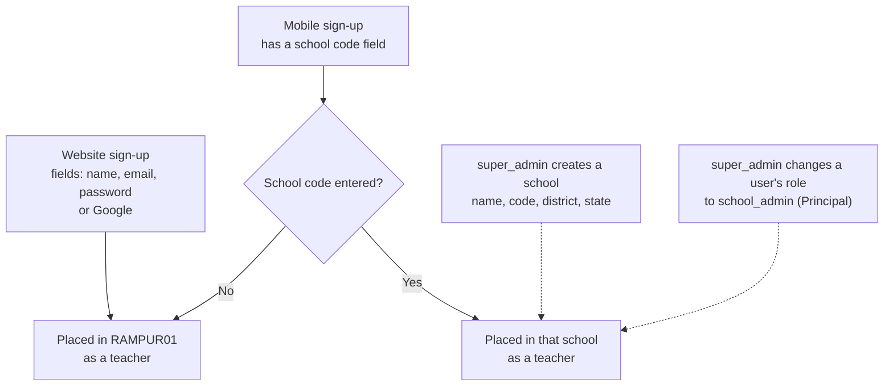

| Fact | Detail |
| --- | --- |
| Account type at sign-up | **Not asked.** There is no "individual" or "school" choice. |
| Website form fields | Name, email, password, plus Google. No school code. |
| Default school | `RAMPUR01`, **hardcoded** in `routes/auth.js` (`DEFAULT_REGISTRATION_SCHOOL_CODE`). It is not an environment variable. |
| Mobile form | Has a school code field. A code puts the user in that school. |
| Creating a school | Only `super_admin`, through `POST /api/admin/schools` (name, code, district, state). |
| Creating a Principal | Nothing at sign-up. A `super_admin` changes a user's role by hand. |
| Website sends a school code? | **Never.** The client has no school code field. A teacher from a real school who registers on the website lands in `RAMPUR01`. |
| Any route that moves a user to another school? | **None.** Only the sign-up code ever sets a user's school. A `super_admin` can change a role, but not a school. |
| Onboarding for schools | None. The "onboarding" files in the client are first-time tips for users. |
| New account status | `active` right away. |
| One user, many schools | The same email can have separate accounts in different schools (like Google's model), not one account in many schools. |
| Small existing bug | The website's Google sign-in error still says "enter your school code", but the website has no such field. |

---

## 3. Does this need to be solved before payments?

**Only partly.**

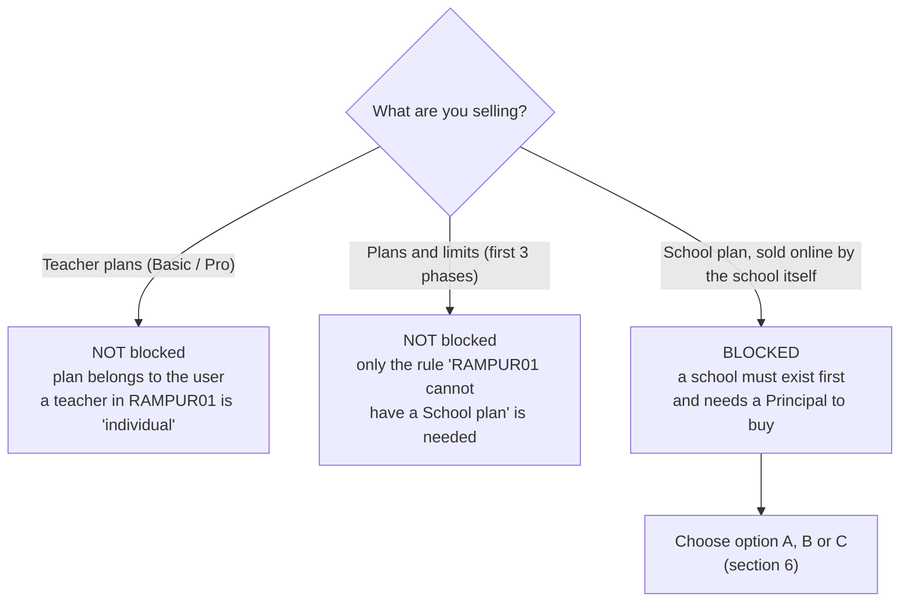

| Payment part | Blocked by this? | Why |
| --- | --- | --- |
| Teacher plans (Basic / Pro) | **No** | They belong to the user. |
| Plan, limit and lock layer | **No** | Only needs the rule "`RAMPUR01` is individual and not billable". |
| School plan bought online by the school | **Yes** | A school and its Principal must exist first, and today only a `super_admin` can create them. |
| School plan sold by hand (bank transfer or contract) | **No** | A `super_admin` creates the school and turns the plan on. |

---

## 4. How other companies do it

These are general SaaS patterns from public articles, not education-specific rules. Use them as patterns.

- **Team subscriptions belong to the organization**, not to one person. Billing, permissions and usage limits are tied to the organization. A user can belong to one or more organizations.
- **Teams are joined by invitation.** Admins invite members by email, so nobody adds each person by hand.
- **Billing ownership can move.** When the billing admin leaves, another member takes over by switching roles. The subscription is not tied to a person.
- **Single-user and team plans are different plan types.** A plan says what kind of group can use it and how many members it allows.
- **Three common account models:**
  - **GitHub model:** one account can join many organizations.
  - **Google model:** each organization needs its own account.
  - **Linear model:** a mix of both.
- **Business buyers need more than cards:** invoices, purchase orders and central management of the subscription.
- **India (Razorpay as a reference):** subscriptions send events for activated, charged, halted (after failed retries) and cancelled. UPI AutoPay works only in INR and for recurring amounts under ₹15,000.

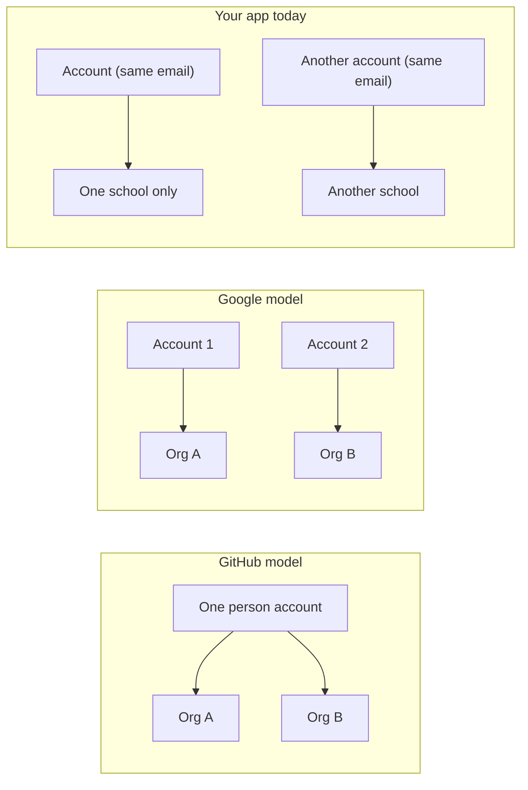

Your app is closest to the Google model: one account per school.

---

## 5. The ideal flow

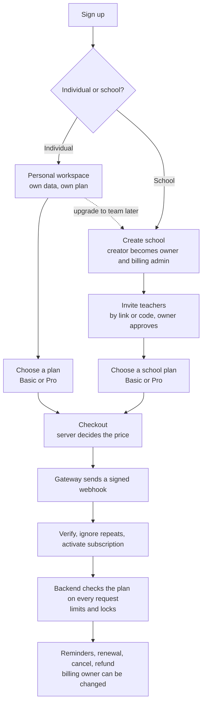

The main ideas:
1. **Ask at sign-up who the person is.** An individual and a school are different customers with different plans.
2. **Individuals get their own private space.** They are not placed in a shared school with strangers.
3. **A school is created by its own Principal**, who becomes the owner and pays. No `super_admin` has to do it by hand.
4. **Teachers join by an invite** (a code or a link), and the Principal approves them.
5. **The subscription belongs to whoever pays:** the individual for a personal plan, the school for a school plan.
6. **Billing ownership can change** when the Principal leaves.

### The cleanest fit for your codebase

Every user must have a school (`schoolId` is required). The simplest ideal approach is to give **each individual teacher their own one-person "school"**, marked as personal.

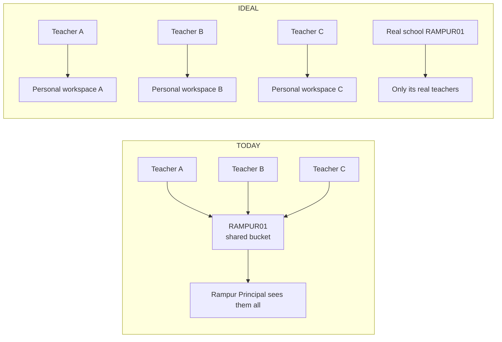

Why this is good:
- The shared `RAMPUR01` bucket goes away, and the privacy problem goes with it.
- The plan owner is simple: the user for individuals, the school for real schools.
- It avoids the risky change of making `schoolId` optional across the whole app.

**The catch:** the existing `RAMPUR01` users are a mix of real Rampur teachers and independent sign-ups. The code cannot tell them apart, so someone must say who is who. Any change to school data also needs a database migration and **your approval first**.

---

## 6. Your options for schools

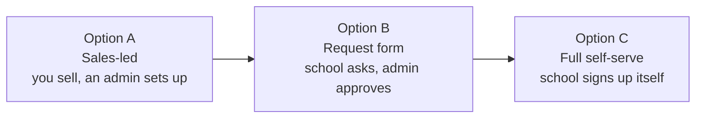

| Option | What it means | My view |
| --- | --- | --- |
| **A. Sales-led** | You sell to the school. A `super_admin` creates the school and the Principal and turns the plan on by hand (or the Principal pays online afterwards). No sign-up change. | **Recommended for launch.** It matches how the app works and needs no extra build. |
| **B. Request form** | A school fills a "register my school" form and a `super_admin` approves it. | A good next step once you have several schools. |
| **C. Full self-serve** | An "I'm a school" sign-up that creates the school and its first Principal, with verification. | A separate feature. Not needed for payments to launch. |

---

## 7. What the project lacks today

| # | Ideal | Your app today | Blocks payments? |
| --- | --- | --- | --- |
| 1 | Ask "individual or school" at sign-up | Not asked. Website sign-ups all go to `RAMPUR01`. | Not for teacher plans. Yes for self-serve school plans. |
| 2 | Individuals have a private workspace | All independent teachers share one school, and its Principal sees them. | **Yes.** A school plan on that school would cover everyone. The biggest gap. |
| 3 | A school creates itself and its creator becomes owner | Only a `super_admin` can create a school and assign the Principal by hand. | Only for self-serve schools. |
| 4 | Invite teachers by link or code | Mobile has a school code field. The website has none. | No, but school onboarding stays manual. |
| 5 | A billing owner who can change | No such role. Only `super_admin` can change roles. | Yes, once a school pays and the Principal leaves. |
| 6 | Plans, subscriptions and usage records | None exist. | **Yes.** This is the payment system itself. |
| 7 | Plan read from the database on every request | The login token holds role and school, and access checks never touch the database. | Yes (already in the phase plan). |
| 8 | Seats and member limits for team plans | No idea of "members of a plan". | Only if you want seat limits. |
| 9 | Business billing details (legal name, address, GSTIN) | A school stores only name, code, district and state. | Yes for invoicing schools. |
| 10 | Move from personal to team | No way to join or switch schools. One account belongs to one school. | No, but the ideal flow needs it later. |
| 11 | Safe payment webhooks | No webhook route. The JSON parser would break signature checks. No public server address today. | Yes (already in the phase plan). |
| 12 | Reliable usage counting | Only in-memory daily counters that reset on restart. | Yes (already in the phase plan). |
| 13 | Admin billing tools | None. | Not for launch, but soon. |
| 14 | Same sign-up on web and mobile | Web has no school code, mobile does, and the web Google error still asks for one. | No, but it causes confusion. |
| 15 | A durable, backed-up database | Not documented. | Yes before real money. |

---

## 8. Recommended order

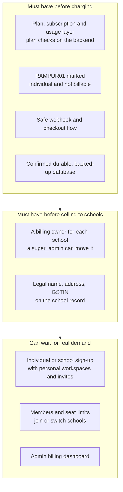

- **Must have before charging** is already covered by the phase plan (`payment-implementation-phases.md`).
- **Must have before selling to schools** is new work for the school-billing phase.
- **Can wait** are separate projects to add after launch. They are not blockers.

---

## 9. Can the current model support individual and team plans?

**Short answer:** Yes, with **small changes, not a rewrite**. Individual plans work as they are. Team plans work only partly today.

### 9.1 What I verified in the code

- **The website never sends a school code.** `schoolCode` appears in the client only as a display field on the admin Manage page. No sign-up code sends it.
- **No route moves a user to another school.** In the server, the only place a user's school is set is at sign-up (`routes/auth.js`). The admin routes can change a role, approve or reject, and revoke sessions, but not a school.
- **Only mobile has a school code field.** That is the only path into a real school.

### 9.2 The problem, in one picture

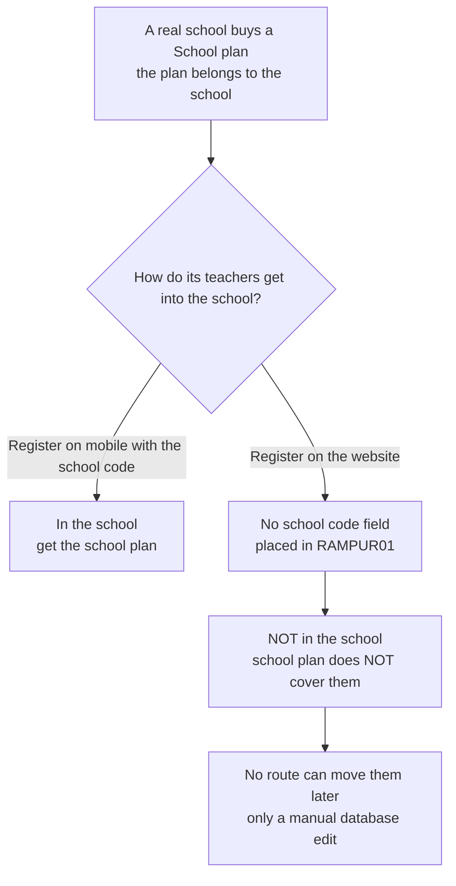

So a school could pay for a plan that covers nobody who signed up on the website.

### 9.3 Verdict by part

| Part | With the current model | Change needed |
| --- | --- | --- |
| **Individual plans** (Basic / Pro) | **Works as is.** The plan belongs to the user. | None |
| **A school owning a plan** | Works. The plan belongs to the school. | None |
| **Principal as billing owner** | Works. `school_admin` already exists, and a `super_admin` can change roles. | None for launch |
| **Teachers of a school getting its plan** | **Broken for the website.** They can't join the school. | **Yes (small)** |
| **`RAMPUR01` being both a real school and the shared bucket** | **Conflict.** | **Yes (small)** |
| **Invoicing schools** | The school record has no legal name, address or GSTIN. | Yes (small) |

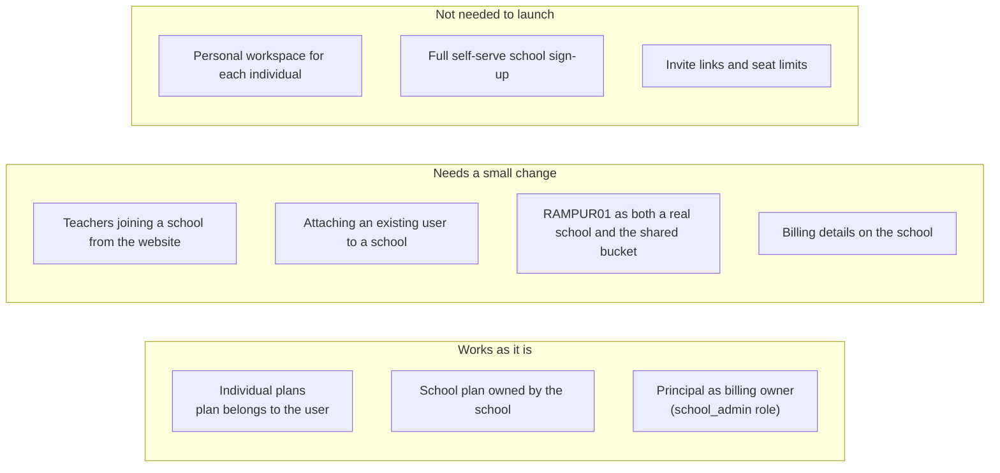

### 9.4 The four small changes

1. **Add an optional school code field to the website sign-up.** It works like mobile's field. It would also fix the stale Google message. This is a small client change.
2. **Add a way to attach an existing user to a school.** Either a `super_admin` tool or a "join with code" step. Without it, teachers who already signed up stay stuck in the shared bucket.
3. **Give independent teachers their own bucket school.** Use a new school (for example with the code `INDEPENDENT`) as the default for new website sign-ups. Then `RAMPUR01` can be a real school that is allowed to buy a School plan. Existing independent users in `RAMPUR01` need a one-time decision about who is real and who moves. This needs a database change and **your approval first**.
4. **Add billing details to the school.** Legal name, address and GSTIN. Only needed once you invoice schools.

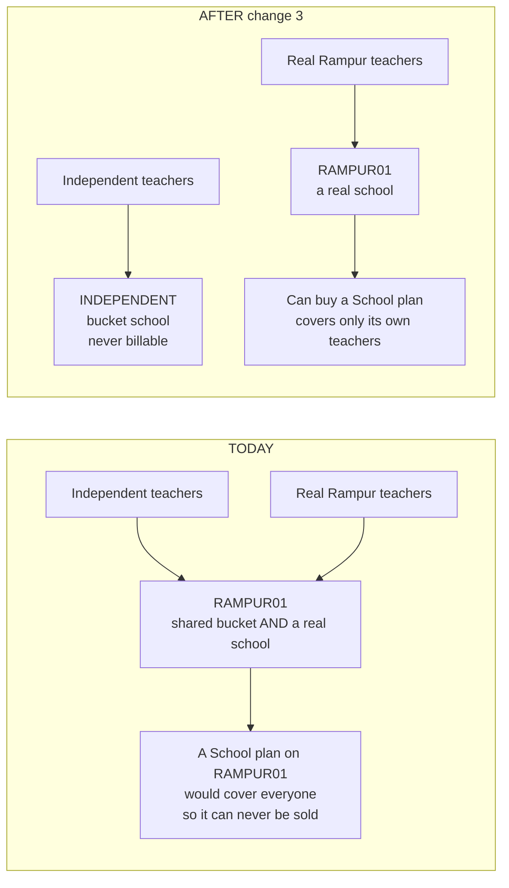

### 9.5 How a team plan works after the changes

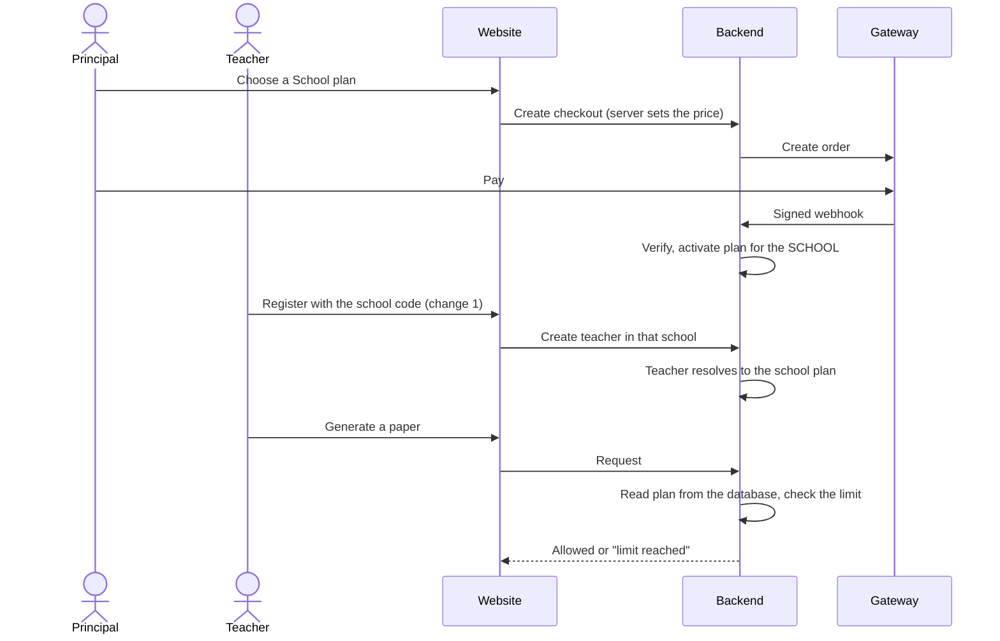

### 9.6 What does NOT need to change

- Every user still belongs to one school (`schoolId` stays required).
- The login token, the roles and the one-account-per-school model.
- The plan is still read from the database on every request (already in the phase plan).
- A personal workspace for each individual, full self-serve school sign-up, invite links and seat limits. These are good later projects. They are not needed to launch.

### 9.7 How this fits the phase plan (`payment-implementation-phases.md`)

| Phase group | Sign-up change needed? |
| --- | --- |
| Plans, usage counting and limits (Phases 1–3) | **No.** |
| Gateway and teacher checkout (Phase 4) | **No.** |
| School billing (Phase 5) | **Yes.** Changes 1 to 4 above should be added as prerequisites. |

**Alternative if you do not want to change the sign-up:** sell to schools by hand. A `super_admin` creates the school and attaches its teachers. That still needs change 2 (the attach tool) at minimum.

---

## 10. Issues we will face with the current sign-up and login

This section is in simple words. It follows a person who wants to **buy** a plan and shows where today's sign-up and login will get in the way.

### 10.1 The buyer's journey and where it breaks

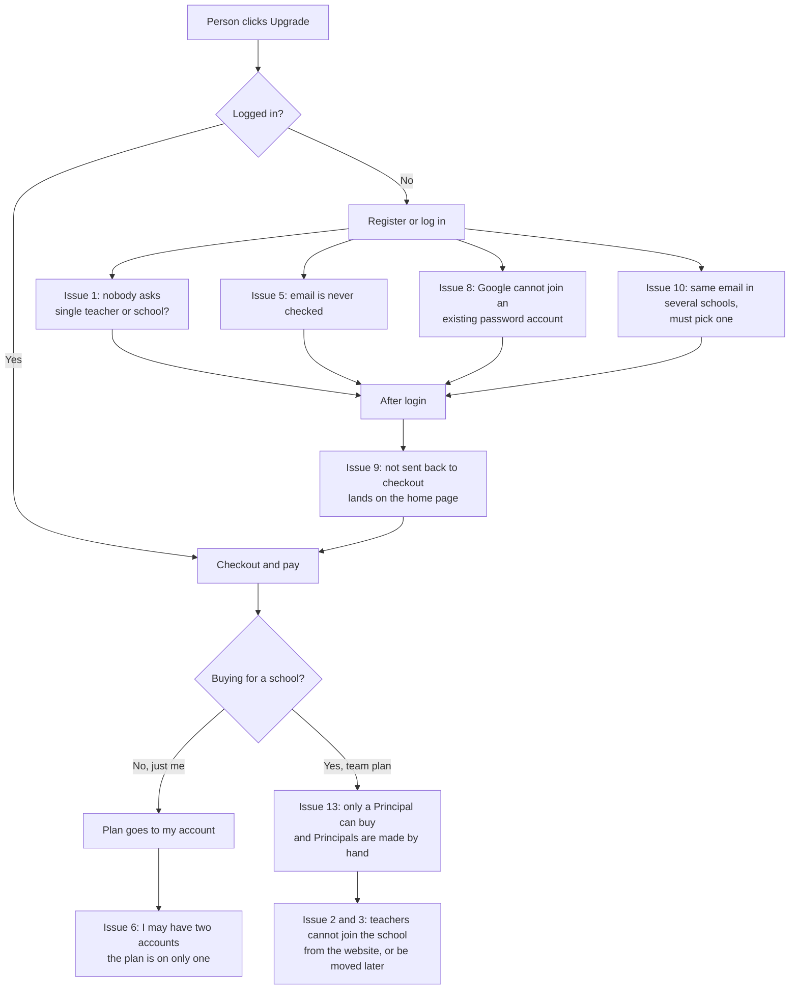

### 10.2 The issues, in simple words

**A. Sign-up problems**

| # | The problem | Who feels it | How bad |
| --- | --- | --- | --- |
| **1** | **Nobody is asked "single teacher or school?"** Everyone is treated as one teacher. The app can't tell a school buyer from a single teacher. | Team | High |
| **2** | **A school's teachers can't join their school from the website.** There is no school code field, so they land in `RAMPUR01`. A school could pay for a plan that covers nobody. | Team | **High** |
| **3** | **Nobody can be moved to a school later.** No screen or route changes a user's school. Only a manual database edit can. | Team | **High** |
| **4** | **All independent teachers share one school (`RAMPUR01`).** That school can never be sold a School plan, and its Principal can see all of them. | Both | **High** |
| **5** | **Emails are never checked for password sign-ups.** Only Google confirms an email. So a typo means receipts and reminders go nowhere, and someone can make **unlimited free accounts**, each with its own free paper limit. | Both | **High** |
| **6** | **One person can end up with two accounts.** For example one on mobile with a school code and one on the website in `RAMPUR01`, or accounts in two schools. They pay for one and the other stays free. | Both | Medium |
| **7** | **Website and mobile sign up differently.** Mobile has a school code, the website doesn't. The website's Google error still tells people to "enter your school code" even though there is no such field. | Both | Low |
| **8** | **Google sign-in can't attach to an existing password account.** It matches only on Google's own id, never on the email. A person who signed up with a password and later taps Google may be refused or confused, and might pay on the wrong account. | Both | Medium |

**B. Login problems**

| # | The problem | Who feels it | How bad |
| --- | --- | --- | --- |
| **9** | **After login, the user is not sent back to where they were.** I found no "return to the page you came from" logic. A buyer who clicks Upgrade, logs in, and lands on the home page loses the checkout step. | Both | Medium |
| **10** | **If one email is in several schools, login asks you to pick one.** A buyer could pick the wrong account and pay for it. | Both | Medium |
| **11** | **Login is short.** The access token lasts 15 minutes and is renewed for up to 7 days. Someone could pay and come back logged out. A new role (for example a new Principal) shows up only after the next renewal, up to about 15 minutes later. | Both | Low to Medium |
| **12** | **No limit on devices.** One paid account can be shared by a whole staff room. | Individual | Medium |

**C. Problems that only appear when buying**

| # | The problem | Who feels it | How bad |
| --- | --- | --- | --- |
| **13** | **A teacher who wants to buy for their school may not be allowed to.** Only a Principal (`school_admin`) can, and Principals are made by hand by a `super_admin`. There is no way for a normal teacher to become one. | Team | **High** |
| **14** | **When a Principal leaves, only a `super_admin` can change who owns billing.** The school has no billing owner concept. | Team | Medium |

I also found no way to change your email in the profile screen (it changes the display name and preferences). Every receipt would keep going to the email used at sign-up. I did not check this in depth, so it is a note to confirm.

### 10.3 Two pictures of the worst cases

**A person with two accounts pays for one**

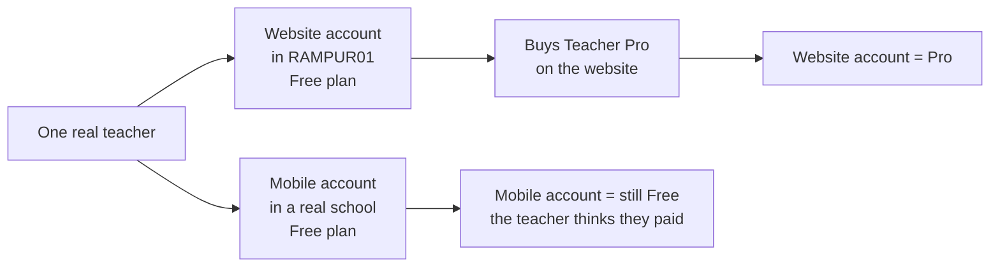

**A teacher wants to buy a team plan**

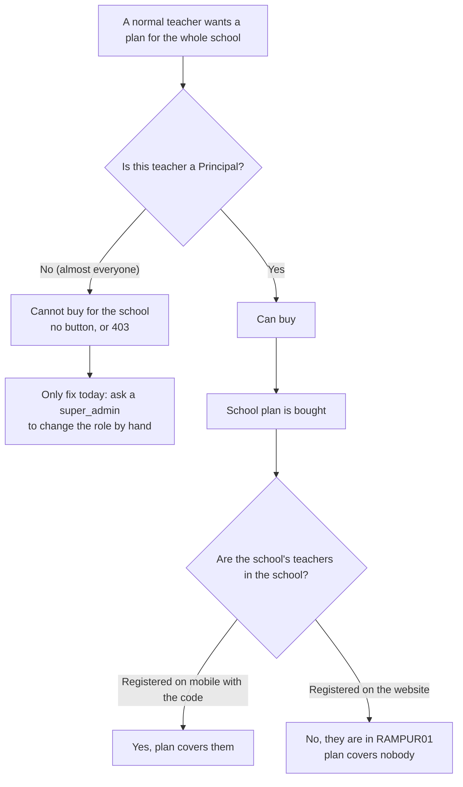

### 10.4 What fixes each issue

| Issue(s) | Fix | Size | Needed before |
| --- | --- | --- | --- |
| 2, 7 | Optional school code field on the website sign-up | Small | Selling to schools |
| 3 | A way to attach an existing user to a school (`super_admin` tool or "join with code") | Small | Selling to schools |
| 4 | A separate bucket school for independent teachers, so `RAMPUR01` can be a real school | Small, needs a database change and your approval | Selling to schools |
| 1, 13, 14 | A clear rule for who is the school's owner and can buy: Principal only for now, a `super_admin` sets it up. Later a real "I'm a school" sign-up | Small now, larger later | Selling to schools |
| 5 | **Verify the email before a purchase** (a link sent to the address). It also stops receipts going nowhere. It can start as "verify at checkout only", so all existing users are not disturbed. | Medium | **Before charging anyone** |
| 5 (free-limit abuse) | The paper limit only means something once emails are verified. A free plan with no verification can always be reset with a new account. | Part of the fix above | Before turning limits on |
| 9 | Send the user back to where they were after login (for example the checkout page) | Small | Before charging anyone |
| 6, 10 | Show clearly **which account** (email and school) the user is buying for, on the checkout and billing pages | Small | Before charging anyone |
| 8 | Let a Google identity attach to an existing account, or show a clear message | Medium | Can wait |
| 11 | Nothing to fix. Read the plan from the database on every request, as already planned | None | Already planned |
| 12 | A device or session limit, only if you see sharing | Medium | Can wait |
| 14 | A billing-owner field on the school that a `super_admin` can change | Small | Selling to schools |

### 10.5 What this means for the plan

- **Individual plans** are affected by issues 5, 6, 8, 9, 10 and 12. None of them needs a big change. The two that matter before charging are **email verification (5)** and **returning after login (9)**.
- **Team plans** are affected by issues 1, 2, 3, 4, 13 and 14. These are the changes already listed in section 9, plus a clear owner rule.
- **Nothing here needs a rewrite of sign-up or login.** The current setup can carry both plan types once these small fixes are made.

---

## 11. Related open questions

These come from the payment question list. The numbers are from the latest business-first list.

| Question | Why it matters here |
| --- | --- |
| **Q1** | Should `RAMPUR01` stay as the shared default school, but never buy a School plan? |
| **Q4** | The `RAMPUR01` Principal can see all independent teachers. Fix before School plans go live? |
| **Q21** | Should a school be able to sign up and buy a plan by itself? (Options A, B or C above.) |
| **Q3** | Does a School plan cover all teachers, with no seat limit? |
| **Q28** | Do schools need GST invoices, and with which details? |

**New decisions this document adds:**
- Which option (A, B or C) do you want for getting schools onto the app?
- Do you want the Principal's role given by hand for now?
- Should the "individual or school" sign-up with personal workspaces be added as its own later project?
- **Bucket school:** do you want a separate bucket school for independent teachers (change 3), or keep `RAMPUR01` as it is and never sell it a School plan?
- **Website school code:** should the website get an optional school code field (change 1), or do school teachers use mobile or admin tools only?
- **Attaching users to schools:** do you want a `super_admin` tool, a "join with code" step, or both (change 2)?
- **Email verification (issue 5):** should a user have to verify their email before their first purchase? Recommended: yes, at checkout only, so current users are not disturbed.
- **Free-plan abuse (issue 5):** are you OK that the free paper limit can be reset by making a new account until emails are verified? If not, verification must come before limits switch on.
- **Return after login (issue 9):** should a person who logs in from the pricing or checkout page be sent back there? Recommended: yes.
- **School owner (issues 13 and 14):** for launch, is "Principal only, set up by a `super_admin`" acceptable as the rule for who can buy for a school?

---

## 12. Sources

General SaaS patterns (not education-specific):
- [WorkOS: user management for B2B SaaS](https://workos.com/blog/user-management-for-b2b-saas)
- [Kinde: plan variants for B2B vs B2C](https://www.kinde.com/learn/billing/plans/structured-plan-variants-for-b2b-vs-b2c-saas-best-practices/)
- [Kinde: billing governance for team-based SaaS](https://kinde.com/learn/billing/saas/billing-governance-and-access-control-for-team-based-saas/)
- [Red Gate: a SaaS subscription data model](https://www.red-gate.com/blog/a-saas-subscription-data-model/)
- [Ravion: multi-tenant SaaS data modeling](https://www.ravion.com/blog/ultimate-guide-to-multi-tenant-saas-data-modeling)
- [Younium: SaaS billing](https://www.younium.com/blog/what-is-saas-billing)
- [Lago: SaaS billing best practices](https://getlago.com/blog/saas-billing-best-practices)
- [Razorpay: subscription webhook events](https://razorpay.com/docs/webhooks/subscriptions/)
- [Razorpay: UPI AutoPay guide](https://razorpay.com/blog/master-recurring-payments-upi-autopay-guide/)

Code files read for this analysis: `server/src/routes/auth.js`, `server/src/routes/admin.js`, `client/src/components/AuthForm.tsx`, `mobile/src/screens/auth/AuthScreen.tsx` (read only, nothing changed). For section 9 I also searched all client source for `schoolCode` and all server routes for any place that changes a user's school. For section 10 I also checked `server/src/lib/googleAuth.js` and the Google, refresh and profile-update handlers in `routes/auth.js`, the token lifetimes in `middleware/auth.js`, and the client login pages for any "return to where you were" logic (none found).
