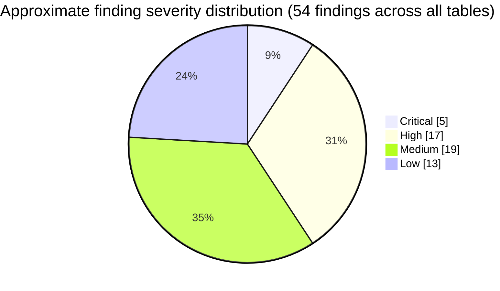
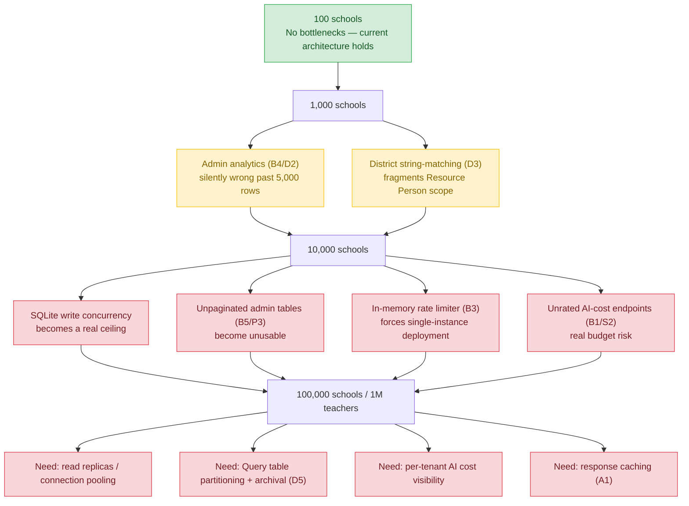

# Teacher Assistant — Enterprise Engineering Audit

**Audit date:** 2026-07-25
**Scope:** full repo — `client/` (React 18 + TypeScript + Vite PWA), `server/` (Node/Express + Prisma/SQLite), Google Gemini 2.5 Flash integration, CI, docs, and the quiz/worksheet/resource-generator feature that shipped partway through this audit.
**Method:** read-only — nothing modified, nothing committed. Six parallel deep-dive reviews (frontend/product, backend, database, security, AI architecture, DevOps/testing/docs/business) plus a supplementary review of the quiz/worksheet generator feature that landed mid-audit via external commits. The two highest-stakes claims (leaked git-history keys, rate-limiter route wiring) were independently re-verified directly against current `HEAD` rather than trusted from a single pass.

> **Status: point-in-time snapshot.** The codebase is under active development (this audit itself caught a feature shipping mid-review). Treat file:line references as accurate as of the commit reviewed, and re-verify before acting on any specific line reference if significant time has passed.

---

## Follow-up log

**2026-07-26 — `feature/auth1`: findings P2, S4 and S6 resolved.**

The authentication rework closed three of this audit's findings. Rows for those findings are struck
through below and annotated in place; nothing else in the report has been re-audited, so every other
finding stands exactly as written on 2026-07-25.

| Finding | Was | Now |
|---|---|---|
| **P2** / **S4** | Self-registration needed only a school code + name + PIN, with no approval step | Every sign-up — email+password *or* Google — is created `status: 'pending'` and **receives no session**. Approval is restricted to `school_admin` (own school) and `super_admin` (any school); `resource_person` sees the queue read-only. Each decision writes a `user_approved`/`user_rejected` audit `Event`. |
| **S6** | bcrypt cost 10 over a 6-digit-PIN keyspace — brute-forceable if `pinHash` leaked | PINs removed. Credentials are bcrypt-hashed passwords of **8+ characters**, or Google identities with no local secret. `pinHash` stays in the schema (so the migration is non-destructive) but is never read or written. |

Also delivered in the same change, beyond the audit's scope: identity moved from `name` to `email`
(fixing name collisions within a school), Google Sign-In with server-side ID-token verification,
and self-service password reset with single-use, expiring, hash-at-rest tokens that revoke all
existing sessions on redemption.

**Known gaps introduced by this work**, neither yet addressed:
- **Rejection is terminal.** A rejected sign-up cannot re-register (409 on the same email) and
  cannot be re-approved, since approve/reject only act on `pending`. There is no suspend or
  delete path for an approved teacher either.
- **No production path for creating admin accounts.** Both signup routes hardcode `role: 'teacher'`;
  the only promotion route is `PATCH /admin/users/:id/role` (super_admin only), and the first
  super_admin comes from `npm run seed` with the publicly-known password `demo1234`. That seeded
  account **must not reach production** — see D1 below, which remains open.

---

## 🚨 Act on this today, regardless of the rest of this report

Three real-looking Google Gemini API keys are still present in this repo's git history (verified via `git log --all -p | grep -E "AIza[0-9A-Za-z_-]{35}"`). `docs/git-history-secret-purge.md` documents this exact incident and a purge runbook, but its own status line says the purge has never been run — and that is still true today. If this repo has ever been pushed to a remote (it has), assume these keys are already scraped by bots. **Rotate all three keys in Google AI Studio today, then run the documented purge.** Everything else in this report can wait; this can't.

---

## Executive Summary

This is a **genuinely above-average pilot-stage codebase** — more disciplined than the large majority of projects at this maturity level, hackathon-descended or not. The AI integration is the standout: a real API-level trust boundary between app instructions and user text (not string concatenation), a shared per-request cost/latency budget with correct jittered backoff, truncation-aware continuation that understands Devanagari punctuation, a genuinely clever structured-output pipeline for the new quiz generator (Gemini JSON mode + strict Zod schema + request-contract cross-checking), and a careful, narrowly-scoped emergency-query safety path with an explicit anti-hallucination rule against inventing emergency phone numbers. Auth has refresh-token rotation with reuse/theft detection done correctly. Tenant isolation and RBAC are enforced server-side and backed by real negative-case tests, not just happy-path smoke tests.

Against that: this is a **single-instance, single-district pilot architecture** wearing a "thousands of schools, millions of users" ambition. Several load-bearing assumptions break in the same 1,000–10,000-school range: the rate limiter is in-memory (breaks the moment you run more than one server process) *and* two entire route groups (`/api/queries`, `/api/resources/*`) currently have **no rate limiting applied at all**; admin analytics aggregate at most 5,000 rows in application JavaScript, which is both wrong and unscalable; SQLite is a single-writer bottleneck (already known and documented by the team); there's no dependency-vulnerability scanning in CI; zero client-side tests exist; there's no deployment/IaC configuration committed anywhere despite README claims of Vercel/Railway; and the one unresolved live-secret exposure above needs to close today.

None of this reflects sloppy engineering. Almost all of it reflects a team that correctly triaged "what a pilot needs" and hasn't yet done the (larger, different) work of "what national scale needs." The right next move is a focused remediation phase, not a rewrite.

## Overall Score: 6.5 / 10

## Production Readiness

- **~25–30%** against the stated goal (thousands of schools, millions of users, national scale)
- **~70–75%** for a single-district pilot on one server instance, once the leaked-key exposure is closed

---

## 1. Product Review

**Strengths:** a clean, single-purpose core loop (ask → get advice → rate it) with genuinely good empty/loading/error states on the Coach page; voice input with graceful feature-detection fallback; read-aloud via Web Speech API; dark mode and adjustable font size; a WhatsApp share button that reflects how Indian teachers actually communicate rather than a generic "share" button; optimistic UI with correct rollback on delete/clear actions. The new quiz/worksheet generator adds a real print-safe exam-paper experience (letterhead component, `@media print` stylesheet, and — notably — a structural split between the student-facing paper and the answer key so the key literally cannot leak even if print CSS is bypassed).

| # | Sev | Finding | Why it matters at scale | Effort/Impact |
|---|---|---|---|---|
| P1 | **High** | UI chrome (nav, buttons, labels) is English-only; the 9-language support only controls the *AI response* language, not the interface | Undercuts the core accessibility promise for the least English-fluent teachers — exactly who the product targets | M / H |
| P2 | ~~**Medium**~~ **RESOLVED** | ~~Self-registration requires only a school code + name + PIN — no admin approval, invite token, or verification step~~ Every sign-up (email+password *or* Google) is now created `status: 'pending'` with **no session issued**, and requires approval by a `school_admin` (own school) or `super_admin` (any school). Each decision writes a `user_approved`/`user_rejected` audit `Event`. | Closed — see S4 | M / M |
| P3 | **Medium** | Admin `ManagePage` has no pagination, search, or filter on users/schools tables | Unusable past a few dozen rows — breaks immediately at real multi-school scale | M / H |
| P4 | **Low** | No first-run tutorial beyond example-question chips | Minor; would reduce support load for low-digital-literacy users | S / M |
| P5 | **Low** | No in-app support/bug-report channel beyond 👍/👎 feedback | No way to close the loop on a real problem a teacher hits | S / M |
| P6 | **Resolved** | ~~No print stylesheet~~ — the quiz/worksheet feature shipped a real one (`index.css` `@media print`, `ExamHeader.tsx`) | Confirmed present as of current `HEAD`; the gap was real earlier in the audit but has since been closed by the new feature | — |

## 2. Frontend Review

**Strengths:** strict TypeScript with no loose `any` found; a well-built API layer with token-refresh deduplication (concurrent 401s share a single refresh call — most teams miss this); the one `dangerouslySetInnerHTML` use is safe by construction (HTML-escaped before any markdown/KaTeX transform runs — verified, not just asserted); consistent, sensible accessibility (`aria-live`, `aria-pressed`, labelled fields, focus management); PWA config correctly excludes `/api/*` from the cache (avoids stale-data bugs); a well-engineered defensive KaTeX integration (`throwOnError:false`, fallback to escaped source, and a non-trivial repair layer for a real observed Gemini JSON-escaping failure mode).

| # | Sev | Finding | File | Effort/Impact |
|---|---|---|---|---|
| F1 | **High** | No error boundary anywhere in the React tree | `App.tsx` | A single render-time exception white-screens the entire app for that user with no recovery | S / H |
| F2 | **High** | No code-splitting — admin pages, `recharts`, and now `katex` + the entire generator/library surface all ship in one bundle to every teacher on every login | `App.tsx` | Real cost on low-end Android / patchy rural connections, the exact target environment | S / M-H |
| F3 | **Medium** | Zero client-side tests — no test runner even configured | whole `client/` | The most complex/fragile client logic (auth refresh, RBAC-gated routing, the new LaTeX repair regexes) has no automated coverage | M / H |
| F4 | **Medium** | Hand-rolled per-page fetch-on-mount state (no caching/dedup/revalidation layer) | `CoachPage.tsx`, `AdminPage.tsx`, `ManagePage.tsx` | Fine today; duplicated boilerplate and stale-data risk as more admin views are added | M / M |
| F5 | **Medium** | LaTeX-repair logic duplicated near-verbatim between client and server, synced only by a comment | `client/src/lib/math.ts` ↔ `server/src/lib/assessmentSchema.js` | Silent-drift risk if one side is patched without the other | M / M |
| F6 | **Low** | Single 1,000+ line global CSS file, string-concatenated class names, no scoping | `index.css` | Works today; gets harder to keep consistent with more contributors | L / M |
| F7 | **Low** | API responses cast (`as T`) with no runtime schema validation at the client boundary | `api.ts` | A backend contract change fails silently rather than being caught | M / M |

## 3. Backend Review

**Strengths:** this is the strongest layer in the codebase. Fail-fast boot guards for `GEMINI_API_KEY`, CORS-in-production; a stricter dedicated rate limiter on auth vs. general traffic (where it *is* applied); a real error taxonomy on `/api/coach` distinguishing timeout/rate-limit/safety-block/upstream-failure with distinct status codes instead of a bare 500; metadata-only structured logging that explicitly, deliberately never logs prompt/response/PII; zod validation applied consistently everywhere it's used; correct `$transaction` usage for the multi-table deletes that need atomicity.

| # | Sev | Finding | File | Effort/Impact |
|---|---|---|---|---|
| B1 | **Critical** | `/api/queries` and `/api/resources/*` (including the Gemini-calling `resources/generate` and `resources/:id/ai-action`) are mounted with **no rate limiter at all** — only `/api/coach` and `/api/auth` get one | `index.js:400-401` (verified directly) | Any authenticated account can loop AI-cost-incurring endpoints unbounded — a direct budget-exhaustion vector, not theoretical | S — attach the existing limiter to these routers |
| B2 | **Critical** | No unhandled-rejection/global error middleware — most route handlers (`auth.js`, `admin.js`, `resources.js` bodies) aren't wrapped in try/catch and there's no `app.use((err,req,res,next)=>...)` catch-all or `express-async-errors` | whole `server/src/routes/` | Since Node 15+, an unhandled promise rejection **crashes the process** — one bad request (a DB lock, a constraint violation) can take the entire API down for every school | S — add `express-async-errors` + one error-handling middleware |
| B3 | **High** | `express-rate-limit`'s default store is in-memory, per-process | `index.js:178-198` | Breaks the moment you run more than one server instance (the exact scaling path this product needs) — each instance gets an independent counter | S-M — Redis-backed store |
| B4 | **High** | `/api/admin/analytics` aggregates by pulling up to 5,000 raw rows into Node and reducing in JS | `admin.js:47-87` | Silently *wrong*, not just slow, once any tenant scope exceeds 5,000 queries — "top questions"/"by day" reflect only a recent slice, not the true window | M — SQL-native `groupBy`/aggregation |
| B5 | **Medium** | `GET /admin/users` and `/admin/schools` return unbounded result sets — no pagination | `admin.js:117,161` | Multi-MB payloads / OOM risk at 10,000+ schools | S |
| B6 | **Medium** | Login lockout has a read-then-write race on `failedLoginCount`; lockout counter also resets to 0 on lock (no escalating lockout) | `auth.js:161-181` | Concurrent/distributed brute-force attempts can exceed the intended attempt cap; repeated lockouts never escalate | S |
| B7 | **Low** | No graceful shutdown (`SIGTERM`→`$disconnect()`) | `db.js`/`index.js` | Dropped in-flight requests on redeploy | S |
| B8 | **Low** | No `DELETE` endpoint for users or schools despite schema clearly supporting it (`SET NULL` on delete) | `admin.js` | No offboarding story for a departing teacher or closed school | M |

## 4. Database Review

**Strengths:** `cuid()` PKs on every model, chosen specifically to make a future Postgres migration ID-remap-free — verified correct and deliberate. Explicit `onDelete` behavior everywhere (not left to Prisma defaults). The team's own `docs/postgres-migration-plan.md` is unusually honest — verified against actual code, not aspirational — with a real cutover/rollback runbook.

| # | Sev | Finding | Effort/Impact |
|---|---|---|---|
| D1 | **Critical** | No user-deletion endpoint anywhere, despite the schema being explicitly designed for it (nullable `userId` + `SET NULL`) | This is a GDPR/India-DPDP-Act "right to erasure" gap for a product handling teacher (and indirectly student-context) data at national scale — compliance-blocking, not just a technical gap. M / H |
| D2 | **High** | `preferences`, `context`, `metadata` are JSON-serialized into plain `TEXT` columns, already being deserialized in application code for analytics | Can never be filtered/grouped at the DB layer — directly causes B4's aggregation problem. M / H |
| D3 | **High** | `School.district` is a free-text string, and Resource Person scope is computed by matching it | At 10,000+ schools, `"Pune"`/`"pune"`/`"PUNE"` become silently distinct scopes — a real multi-tenancy modeling gap, not cosmetic. M / H |
| D4 | **High** | Missing composite indexes (`[schoolId, createdAt]` on `Query`, `[schoolId, role]` on `User`) — only single-column indexes exist | SQLite/Postgres can use one index per query, not both; real cost once scope+ordering are combined. S / H |
| D5 | **Medium** | No retention/archival policy — every query stored forever, `Session` rows never purged | Unbounded growth; ~1.1B `Query` rows/year at full projected scale with no partitioning story. M / M |
| D6 | **Low** | `Event` model exists, indexed, migrated — but per the team's own migration doc, nothing currently writes administrative events to it (only AI-safety telemetry does) | Dead weight for its intended audit-log purpose — see Business Readiness. S |

## 5. Security Review

*(OWASP-mapped; independently re-verified — see methodology note above.)*

**Strengths, verified against code:** bcrypt credential hashing at a real cost factor (PINs at the time of audit; 8+ character passwords since `feature/auth1` — see the follow-up log above); refresh-token rotation with theft/reuse detection that revokes **all** sessions on reuse — textbook-correct; ownership always derived from the JWT, never from client-supplied IDs, across every route including the newer `resources.js`; tenant scoping centralized and covered by genuine negative-case tests; production fail-fast on missing `JWT_SECRET`/`GEMINI_API_KEY`/CORS; Prisma-only data access (no raw SQL anywhere — no SQL injection surface); the prompt-injection defense is structural (`systemInstruction` vs. `contents`), applied consistently across all four AI entry points including the new quiz generator; output-side leak detection for both system-prompt echo and API-key-shaped strings, independently tested; no cookies set anywhere — Bearer-token-only auth makes CSRF structurally moot; no file-upload surface exists.

| # | Sev | OWASP | Finding | Effort |
|---|---|---|---|---|
| S1 | **Critical** | A05 | Leaked Gemini API keys still live in git history, unrotated — see top-of-report flag | S (rotate today) / M (purge) |
| S2 | **High** | A01 | Same as B1 — `/api/resources/*` and `/api/queries` have no rate limiting, meaning unbounded AI-cost exposure per authenticated account | S |
| S3 | **High** | A02 | `JWT_SECRET` checked only for presence, never length/entropy — a trivially weak secret boots successfully in production, enabling offline token forgery | S |
| S4 | ~~**High**~~ **RESOLVED** | A04 | ~~No approval step on self-registration~~ Approval gate added: sign-ups start `pending` and receive no token until approved. Identity also moved from `name` to `email`, removing the name-collision weakness. `resource_person` can view the queue but not act. | M |
| S5 | **High** | — | No dependency-vulnerability scanning in CI (no Dependabot/Renovate/`npm audit` gate) | S |
| S6 | ~~**Medium**~~ **RESOLVED** | A02 | ~~bcrypt cost factor 10 combined with 6-digit-PIN keyspace~~ PINs are gone. Credentials are now bcrypt-hashed passwords of at least 8 characters (or Google identities with no local secret at all), so the 10^6 keyspace no longer exists. `pinHash` remains in the schema but is never read or written. | M |
| S7 | **Medium** | A07 | Lockout resets attempt counter to 0 on lock rather than escalating — brute force is throttled but never actually stopped | S |
| S8 | **Medium** | A09 | No `Event`/audit entry on failed logins, lockouts, or admin role changes | S |
| S9 | **Low** | A07 | Tokens in `localStorage`, not `httpOnly` cookies — a reasonable, defensible tradeoff given the narrow XSS surface, but should be a documented risk-acceptance rather than an implicit one | — |
| S10 | **Low** | A03 | `inputGuard`'s injection heuristic is advisory-only by design (correct reasoning — keyword matching is bypassable) but means there's no independent blocking backstop if the structural boundary ever regresses | M |

## 6. AI Review

**This is the standout part of the codebase — treat it as a reference implementation, not a rework target.** A real trust boundary via Gemini's `systemInstruction` API; a shared per-request call/time budget (default 8 calls / 60s) that structurally bounds worst-case cost and latency, unusually rare to see this rigorously tested; correct full-jitter exponential backoff honoring `Retry-After`; truncation-aware continuation with Devanagari-aware completeness heuristics; a narrowly-scoped emergency-query override with an explicit rule against inventing emergency contact numbers; and — new since this audit began — a genuine structured-output pipeline for the quiz generator (Gemini JSON mode + strict Zod schema + a contract check that the model actually returned what was asked for), with defensively-engineered KaTeX math rendering on both read paths.

| # | Sev | Finding | Effort/Impact |
|---|---|---|---|
| A1 | **Critical** | Zero response caching anywhere — confirmed via grep, no in-memory/Redis/semantic cache exists. Every request pays full LLM cost/latency even for near-duplicate questions ("explain fractions," asked by thousands of teachers nationally) | M / L (direct linear cost savings at scale) |
| A2 | **High** | Continuation-on-truncation is explicitly skipped whenever structured JSON output is requested — a long quiz that hits the token cap fails validation entirely and the full token spend is wasted with zero usable output | M / M |
| A3 | **High** | No response-quality evaluation of any kind — every AI test covers plumbing (retry math, schema validation, template routing) via mocked responses; there is no golden-set, no LLM-as-judge, no human-rated sample process, and no multilingual quality assurance for the 9 claimed languages | L / M (highest-leverage long-term AI investment) |
| A4 | **Medium** | No hallucination/factual-accuracy check on content — a confidently wrong fraction explanation passes every existing guard untouched, since none inspect pedagogical correctness | L / L (hard problem, worth stating plainly rather than ignoring) |
| A5 | **Medium** | No prompt versioning/rollback — the system prompt is a single hardcoded string; a bad edit degrades every teacher simultaneously with no staged rollout or kill switch | M / M |
| A6 | **Low** | No Gemini context caching for the large, repeated-verbatim system prompt (~1,500+ words, resent on every call including retries) | S-M / M |
| A7 | **Low** | Fixed temperature (0.7) shared identically between open-ended coaching and quiz-answer generation, where the latter would benefit from more deterministic sampling | S / L |

## 7. DevOps Review

| # | Sev | Finding | Effort/Impact |
|---|---|---|---|
| DO1 | **High** | No deployment/IaC configuration committed anywhere (no `vercel.json`, `railway.toml`, `Dockerfile`) despite README describing Vercel/Railway deployment | Production config exists only in dashboards, outside version control and review | M / H |
| DO2 | **High** | No dependency-vulnerability scanning in CI (same as S5) | S / H |
| DO3 | **Medium** | No CD step, no staging environment, no post-deploy smoke test, no documented rollback procedure | Every release is a manual, unverified act | M / M |
| DO4 | **Medium** | `/api/health` is static — returns `{status:'ok'}` unconditionally, never checks DB or Gemini connectivity | A monitor polling this reports healthy during a real outage | S / M |
| DO5 | **Medium** | No APM/error-tracking (Sentry or equivalent) — all observability is `console.log` | Fine for one process; unworkable across multiple instances | M / M |
| DO6 | **Strength worth naming** | The CI secret-scan job is unusually well-designed — scoped to only new commits per push/PR specifically so it doesn't fail on the pre-existing historical leak, with a code comment explaining exactly why and pointing at the (unexecuted) purge doc | — |

## 8. Testing Review

**Strengths:** ~20 server test files is genuinely strong for this project's size — `rbac.test.js`, `tenant-isolation.test.js`, `cors.test.js`, `sessions.test.js`, `ai-safety.test.js`, `gemini.reliability.test.js`/`.contract.test.js`, and a 900-line `resources.test.js` with explicit malformed-AI-response cases cover exactly the highest-value invariants. Deterministic testing seams (`config.now`, `config.rng`, `config.sleep`, injectable `fetchImpl`) are deliberately built in to make retry/backoff logic testable without real timers — good engineering discipline, not accidental.

| # | Sev | Finding | Effort/Impact |
|---|---|---|---|
| T1 | **High** | Zero client-side tests — no runner, no RTL/Vitest config, no Playwright/Cypress | The entire frontend, including the most complex logic (auth refresh, RBAC routing, LaTeX repair), is unverified except manually | M / H |
| T2 | **Medium** | No end-to-end test spanning client+server together | Contract drift between client expectations and server behavior isn't caught until manual QA | M / M |
| T3 | **Low** | No client-side test for the LaTeX-repair regex logic specifically, even though the server twin has coverage | S / L |

## 9. Documentation Review

*(Corrected mid-audit: `SETUP.md` was fixed by concurrent external commits during this review — it now correctly banners itself as current and points to the live architecture. Verified directly against current `HEAD`.)*

| # | Sev | Finding | Effort/Impact |
|---|---|---|---|
| DOC1 | **Medium** | `IMPROVEMENTS.md` at repo root still describes the retired vanilla-JS prototype (`prompt-templates.js`, `ai-service.js` — files that live only in `archive/`), not the current architecture | A new contributor reading it will orient around a system that no longer exists — still actively misleading, unlike `SETUP.md` which has already been fixed | S — delete or clearly banner as historical |
| DOC2 | **Medium** | No API reference (OpenAPI/Swagger) — API is documented only via README prose/mermaid diagrams | Fine for the current team; a blocker for any external integrator or larger eng org | M / M |
| DOC3 | **Low** | `Hackathon_Ideation_Presentation.md` at root is a large pitch-deck artifact with no bearing on current engineering | S / L |
| DOC4 | **Strength** | The current README's mermaid architecture/sequence/ER diagrams were checked against the actual code and are accurate — genuinely uncommon | — |

## 10. Performance Review

Frontend ships one unsplit bundle including admin-only code and `katex` to every user (F2). Backend's biggest performance issue is doing SQL's job in JavaScript for admin analytics (B4/D2) — not raw query design, which is otherwise clean (no N+1 patterns found, bounded `take` + indexed `orderBy` used correctly throughout). AI latency has a deliberate completeness-for-latency tradeoff on Indic-script continuations that's reasonable but should be surfaced in loading-state copy rather than a generic spinner. No caching anywhere in the request path (A1) means every performance number scales linearly with traffic with no amortization.

## 11. Scalability Review

| Scale | Primary bottleneck |
|---|---|
| 100 schools | None of the below bite yet — current architecture is fine as-is. |
| 1,000 schools | Admin analytics (B4/D2) starts returning visibly wrong numbers for any busy tenant; district string-matching (D3) starts silently fragmenting Resource Person scope. |
| 10,000 schools | SQLite write concurrency becomes real; unpaginated admin tables (B5/P3) become unusable; the in-memory rate limiter (B3) forces single-instance deployment, which becomes the actual throughput ceiling; unbounded AI-cost endpoints (B1/S2) become a real budget risk at this volume of accounts. |
| 100,000 schools / 1M teachers | Everything above must already be fixed. Additionally needed: read replicas/connection pooling beyond one Postgres instance, `Query` table partitioning/archival (D5), per-tenant cost/quota visibility (currently none), a caching layer (A1) to avoid the AI bill scaling linearly with users. |

## 12. Code Quality Review

Small, readable files; no god-objects found; consistent naming; unusually high-quality inline comments that explain *why*, not *what* (a rarity). No dead code in `client/`/`server/src/` — the only dead weight is root-level `archive/`, `IMPROVEMENTS.md`, and the pitch deck. Mild DRY debt: the LaTeX-repair logic (F5) and the "MANDATORY SECTIONS" framing repeated across 7 prompt templates are both duplication that's fine today but costly to change uniformly later.

## 13. Product Design Review

Consistent, coherent visual language (shared `btn-primary`/`icon-btn`/`field` conventions); dark mode correctly wired through CSS custom properties; accessibility noticeably better than average for a project this size. Tables are functional but not built for scale (P3/B5). The new exam-paper print view is a genuine, well-executed addition to what was previously a real gap.

## 14. Business Readiness

Admin analytics and RBAC-gated management exist and are correctly enforced server-side. No bulk school/teacher provisioning — onboarding is one-at-a-time via a form, which will not scale to onboarding thousands of schools. No licensing/billing scaffolding (expected at this stage) and, more importantly, **no per-tenant cost attribution at all** — once there's a real budget owner, "what does District X cost us in Gemini spend" is currently unanswerable. The `Event` model is used well for AI-safety telemetry but not at all for administrative audit trails (role changes, school creation, session revocation) — no accountability record for a government-facing tool. No in-app support channel beyond thumbs-up/down.

---

# Final Report

## Strengths
1. Structural prompt-injection defense (API-level `systemInstruction`/`contents` split) applied consistently across all four AI entry points, including the newly-shipped quiz generator.
2. Rigorous AI reliability engineering: shared cost/latency budget, correct jittered backoff, truncation-aware continuation.
3. A genuinely careful, narrowly-scoped emergency-query safety path with an explicit anti-hallucination rule.
4. Refresh-token rotation with correct reuse/theft detection; RBAC and tenant isolation enforced server-side and backed by real negative-case tests.
5. A well-designed structured-output pipeline for AI-generated assessments (JSON schema + contract validation), closing the biggest hallucination risk in that feature.
6. CI-gated secret scanning with a scoping design mature enough to not choke on a known pre-existing issue, plus a documented (if unexecuted) purge runbook.
7. Accurate, diagram-rich README; clean, accessible, dependency-light frontend with a genuinely safe markdown/KaTeX renderer.

## Weaknesses
1. Unresolved, live leaked-secret exposure in git history.
2. Entire route groups (`/api/queries`, `/api/resources/*`) have no rate limiting at all — not just a scaling limitation, a present-day gap.
3. Scaling assumptions (in-memory rate limiting, SQLite, JS-side analytics aggregation) all break in the same 1,000–10,000-school range.
4. Zero client-side test coverage; no CI dependency-vulnerability scanning.
5. No deployment/IaC configuration in-repo; no CD, staging, or meaningful health checks.
6. No UI localization despite multilingual AI responses — undercuts the core accessibility promise.
7. No admin audit trail, no bulk tenant onboarding, no AI cost-attribution story.

## High Priority Issues
S1 (leaked keys — act today), B1/S2 (unrated AI-cost endpoints), B2 (no global error handling — crash risk), B3 (in-memory rate limiter), B4/D2 (wrong + unscalable analytics aggregation), D1 (no user-deletion path — compliance), D3 (district string-matching), S3 (JWT secret not length-validated), ~~S4 (unapproved self-registration — **resolved**)~~, S5/DO2 (no dependency scanning), T1 (no client tests), DO1 (no deployment config), P1 (English-only UI chrome), A1 (no AI response caching), A3 (no response-quality evaluation).

## Medium Priority Issues
B5–B8, D4–D6, S6–S8, F3–F7, A2/A4–A6, DO3–DO5, P2–P3, DOC1–DOC2, T2.

## Low Priority Issues
S9–S10, F6–F7, A7, DOC3, T3, P4–P6.

## Quick Wins (small effort, real impact)
- Rotate the three leaked keys today; run the documented purge this week.
- Attach the existing rate limiter to `dataRouter` and `resourcesRouter` (one line each in `index.js`).
- Add `express-async-errors` + a catch-all error middleware.
- Add `.github/dependabot.yml`.
- Add a React error boundary around the app root.
- Make `/api/health` run `SELECT 1` before reporting healthy.
- Delete or clearly banner `IMPROVEMENTS.md` as historical.
- Add pagination params to `/admin/users` and `/admin/schools`.

## Enterprise Improvements
- Redis-backed rate limiting before any multi-instance deployment.
- SQL-native analytics aggregation, replacing the in-JS grouping.
- Promote `District` to a real, normalized entity.
- Response caching keyed on normalized (query, context, language).
- A user/school deletion (offboarding) path with real cascade handling.
- Admin action audit log using the existing `Event` model.
- OpenAPI spec generated from the existing zod schemas.

## Future Architecture Suggestions
- Execute the already-well-written Postgres migration plan once write concurrency demands it — the plan itself needs little added.
- A background job/queue for analytics rollups instead of on-request computation.
- A lightweight i18n layer for UI chrome, as a distinct workstream from AI-response language.
- Per-tenant cost/quota dashboarding once a real budget owner exists.
- A response-quality evaluation harness (golden-set + periodic human/LLM-judge review), especially per-language.

## Technical Debt
- Root-level legacy docs (`IMPROVEMENTS.md`, the pitch deck) — cheap to resolve, currently mildly harmful to onboarding.
- Stringly-typed JSON columns (`preferences`, `context`, `metadata`) — fine now, blocks real analytics as-is.
- Duplicated LaTeX-repair logic between client and server, synced by convention only.
- Keyword-based prompt-template routing — fine today, a classifier-based router is the natural next step, not urgent.

## Security Risks
Ranked: (1) leaked git-history keys — critical, live; (2) unrated AI-cost endpoints; (3) weak-JWT-secret boot check; ~~(4) unapproved self-registration abuse surface — **resolved**~~; (5) no dependency-vulnerability scanning; ~~(6) PIN/bcrypt-cost brute-force math — **resolved**, PINs replaced by 8+ character bcrypt passwords~~.

## Performance Risks
In-JS analytics aggregation; zero AI response caching; no frontend code-splitting for a low-end-device target audience.

## Scalability Risks
In-memory rate limiter (hard multi-instance blocker); SQLite write concurrency (already known/planned); unbounded `Query` table growth with no retention policy; district string-matching correctness at high school counts; no per-tenant AI cost visibility.

## Final Recommendation

**Don't scale this past its current pilot footprint until three things are true: the leaked-key exposure is closed, the two unrated AI-cost endpoints are rate-limited, and the admin analytics aggregation is moved into SQL.** Those are the actual blockers — not the length of this report. Everything else here is normal, expected pilot-stage debt sitting on top of an unusually well-engineered core, particularly the AI reliability/safety layer, which is good enough to hold up as a reference rather than something needing rework.

---

## Enterprise Improvement Roadmap (ordered by ROI)

**Phase 1 — Stop the bleeding (days)**
Rotate + purge leaked keys · rate-limit `/api/queries` and `/api/resources/*` · add global error-handling middleware · add Dependabot · fix `/api/health` to check DB · add a React error boundary · retire `IMPROVEMENTS.md`.

**Phase 2 — Unblock real multi-school scale**
Redis-backed rate limiting · SQL-native admin analytics (fixes accuracy and scale in one change) · pagination on all admin list endpoints · normalize `District` into a real entity · validate `JWT_SECRET` length at boot · ~~add approval/invite step to self-registration~~ (**done**).

**Phase 3 — Operational maturity**
Commit deployment/IaC config · CD pipeline with staging + smoke tests · Sentry/APM · admin action audit log · user/school deletion path · execute the Postgres migration when write concurrency demands it.

**Phase 4 — National-scale product completeness**
UI localization for core languages · AI response caching · bulk school/teacher onboarding (CSV import) · per-tenant cost/quota dashboarding · client-side test suite + E2E coverage · response-quality evaluation harness.
