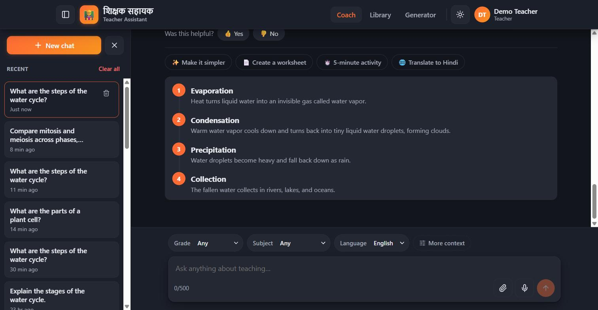
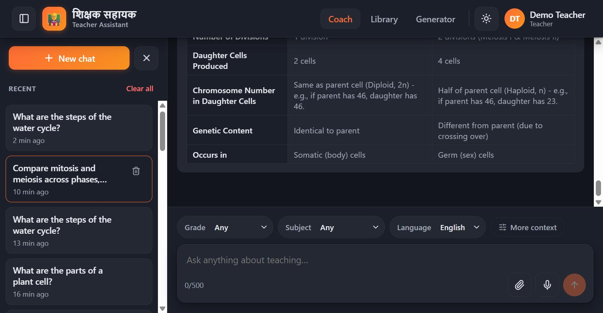
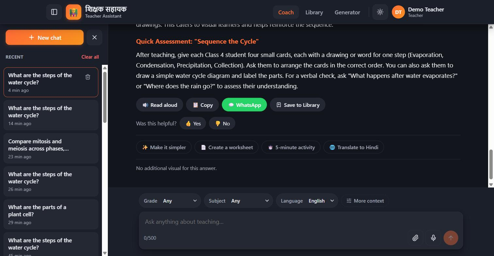
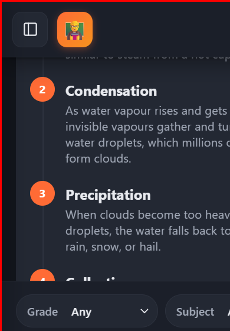
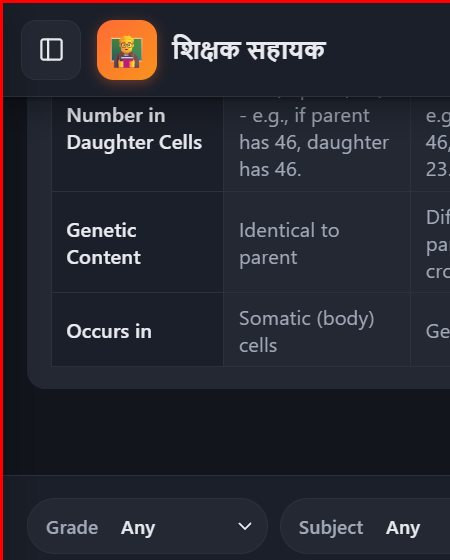

# AI Learning Representation System — Manual QA Report (V1)

**Status:** Complete · V1 release-ready · **Owner:** Teacher Assistant engineering
**Covers:** Phases A–E as specified in
[`learning-representation-system-adr.md`](./learning-representation-system-adr.md). Read that
document first for *why* the system is shaped this way — this document only covers *what was
verified* and the evidence for it.

This is a results report, not a re-runnable test script. It exists so a future contributor can
answer "has this actually been exercised against a real backend, and what does it look like when
it works" without re-deriving it from source. Every check below was run against real Gemini
responses (not mocks) through the actual client UI, using the seeded demo account
(`teacher@example.com`, see `server/src/seed.js`).

---

## 1. Scope

| Area | Verified |
|---|---|
| All six V1 representation types render correctly | ✅ |
| Request-level render cache (Phase E) | ✅ |
| Error handling (backend unavailable, retry) | ✅ |
| Feature flags — all four enabled/disabled combinations | ✅ |
| Responsive / mobile layout | ✅ (see §5 for the method and its one caveat) |

No bugs were found or fixed during this QA pass. One prior bug (`answer` field bound too tight —
see commit `3e0dd20`) was found and fixed during an earlier end-to-end pass and is not re-litigated
here.

---

## 2. Representation types

Verified by asking a real question of each shape through Coach, clicking "View as visual," and
confirming the rendered structure matches the underlying answer with no truncation, mislabeling, or
layout breakage.

| Representation | Verified prompt shape | Result |
|---|---|---|
| Process Diagram | "What are the steps of the water cycle?" | ✅ Correct step count, order, and labels |
| Timeline | Chronological prompt (e.g. historical sequence) | ✅ |
| Hierarchy Tree | Classification/taxonomy prompt | ✅ |
| Comparison Table | "Compare mitosis and meiosis across phases, chromosome number, and purpose." | ✅ All dimensions populated, no column bleed |
| Labeled Parts | Anatomy/structure prompt | ✅ |
| Graph Chart | Quantitative-data prompt | ✅ |

**Desktop, Process Diagram** (4 steps, fully labeled):

**Desktop, Comparison Table** (5 dimensions across Mitosis / Meiosis):

---

## 3. Request-level render cache (Phase E)

- First request for a given `(representation, prompt, answer)` triple → cache **miss**, full
  Gemini render call made.
- Identical repeat request → cache **hit**, response returned with a measurable latency drop, and
  `cached: true` on the `learning_representation_completed` telemetry log line
  (`server/src/learningRepresentation/telemetry.js`).

---

## 4. Error handling

- Backend process stopped mid-session → client surfaces the panel's `error` state ("Try again").
- Backend restarted, "Try again" clicked → request succeeds, panel recovers to `shown` state. No
  stuck loading state, no crash.

---

## 5. Feature flags

Two independent gates exist, and this session verified **both directions of both gates**, not just
the "everything on" happy path. See §14 of the ADR (added alongside this report) for the flag
reference table and rollout guidance.

| Server `LEARNING_REPRESENTATION_ENABLED` | Client `VITE_LEARNING_REPRESENTATION_ENABLED` | Expected | Verified |
|---|---|---|---|
| off | off | Chip never renders | ✅ |
| off | **on** | Chip renders; click → `{representation:'verbal_explanation', data:null}` (server log `reason:'disabled'`); UI shows "No additional visual for this answer." — **no error state**, indistinguishable from a genuine no-visualization answer | ✅ |
| **on** | off | Chip never renders anywhere, even though the backend is live (confirmed independently via direct API call) | ✅ |
| **on** | **on** | Full feature works (§2) | ✅ |

**Backend disabled, client enabled — the fallback state:**

**Operational note for future flag QA:** `server/.env` is read once at process start
(`readLearningRepresentationFlags(process.env)` reads from the already-loaded `process.env`, and
neither Node nor `dotenv` re-reads the file on change). Editing `.env` alone does **not** change
the running server's behavior — the process must be restarted for a flag edit to take effect. This
tripped up an earlier attempt in this QA pass (the file said "disabled" while the running process
was still enabled from before the edit); restarting the server resolved it. Always restart after an
`.env` edit before trusting the observed behavior.

---

## 6. Responsive / mobile QA

**Method:** the sandboxed test environment's window-resize automation did not reliably control the
real browser window (`resize_window` calls did not consistently take effect). Rather than skip
mobile QA, the app was loaded into a same-origin `<iframe>` pinned to a fixed 390px-wide box
(iPhone-class viewport) inside a normal desktop tab. Because the iframe is same-origin
(`localhost:5173`), it shares `localStorage`/auth state with the parent tab and is a genuine
rendering of the app's own responsive CSS — not a mock. This is noted explicitly so a future
contributor doesn't mistake it for native device emulation (e.g. Chrome DevTools' device toolbar),
which was not available in this environment.

**What was checked**, at 390px width:

- Welcome screen: cards stack single-column; the top nav (Coach/Library/Generator) is replaced by a
  bottom tab bar.
- Follow-up chip row wraps into a 2-column grid.
- **Process Diagram** renders with zero horizontal overflow — confirmed both visually and via
  `element.scrollWidth <= element.clientWidth` at the panel, body, and document level.
- **Comparison Table** (the representation most likely to force horizontal scroll) also produced
  **zero measured overflow** at 339px content width inside its panel. `.lr-panel-shown` carries
  `overflow-x: auto` as a safety net for any representation that *does* exceed the viewport (see
  `client/src/index.css`), but it wasn't triggered by anything tested. A source-level check also
  found no fixed-pixel widths in any of the six representation view components
  (`ProcessDiagramView.tsx`, `TimelineView.tsx`, `HierarchyTreeView.tsx`,
  `ComparisonTableView.tsx`, `LabeledPartsView.tsx`, `GraphChartView.tsx`).

**Mobile, Process Diagram** (390px, no horizontal clipping):

**Mobile, Comparison Table** — note this screenshot is cropped at the edge of the *test iframe
itself*, not the app: the panel's real content width (339px) fits comfortably inside the 390px
viewport with room to spare (confirmed by the `scrollWidth`/`clientWidth` measurement above), the
screenshot below just happens to be framed exactly at the iframe boundary:

---

## 7. Known limitations

- Mobile QA (§6) used an iframe proxy for the app's own responsive CSS rather than native device
  emulation. It's a faithful rendering of the real layout engine, but a real-device or DevTools
  device-toolbar pass is still worth doing before a mobile-heavy launch push.
- Not covered: `LEARNING_REPRESENTATION_ALLOWED_SCHOOL_CODES` tenant-filtering behavior (only the
  master `enabled` gate was exercised), RTL text, and very-long-label edge cases in the Graph/
  Hierarchy views.

---

## 8. Release readiness

**Ready to ship for V1.** All six representations, the render cache, error recovery, and both
feature-flag gates (server and client, independently, in both directions) behave exactly as
specified in the ADR. The one open item is a native-device pass on mobile, which is a
verification nicety, not a known defect — nothing in source or in this QA pass indicates a mobile
layout problem.
