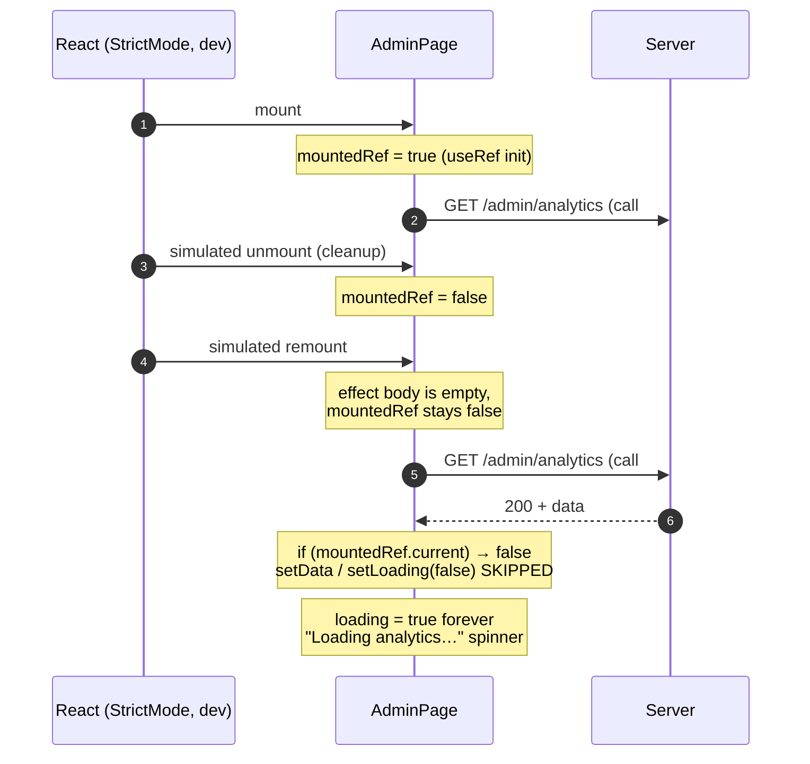
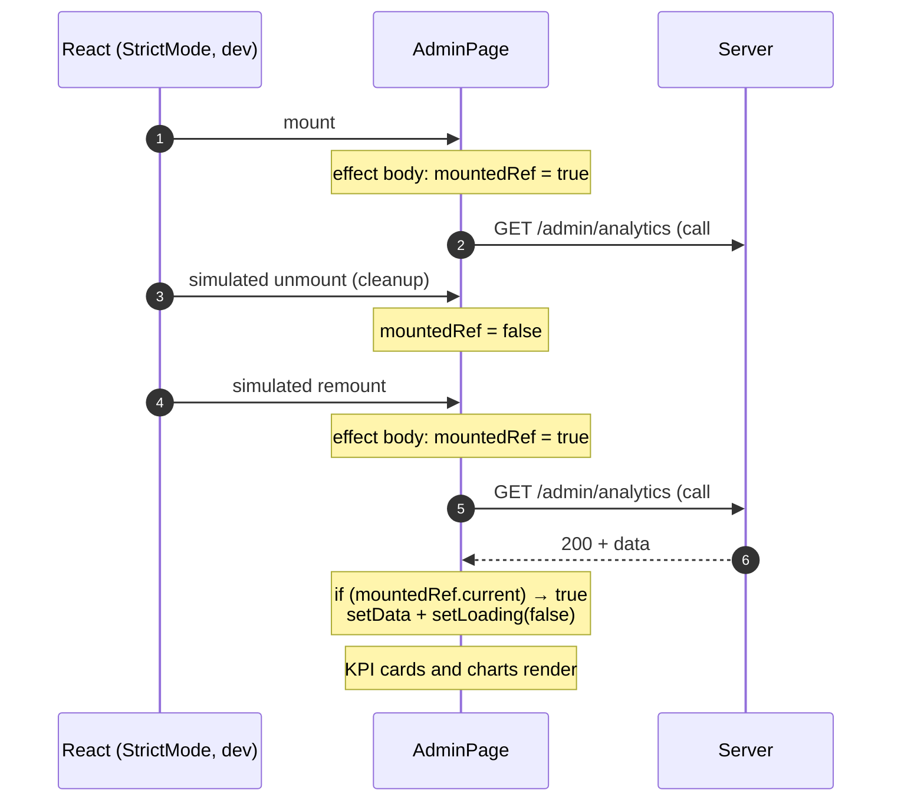
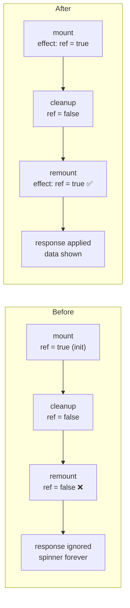

# Fix Plan — Issue #110: Super Admin analytics stuck on "Loading analytics…"

| | |
| --- | --- |
| **Issue** | [#110](https://github.com/TeachMitra-AI/Teacher-Assistant/issues/110) — Super Admin Dashboard – Analytics Data Not Loading |
| **Label** | `bug` |
| **Workspace** | `client/` only |
| **Proposed branch** | `fix/admin-analytics-stuck-loading` |
| **Status** | Plan — not yet implemented |

---

## 1. Summary

Opening **Dashboard → Overview** leaves the page on a permanent spinner, even though the
server answers `GET /api/admin/analytics` with `200`. This is a **client bug**, not a server
bug: `AdminPage` ignores the response because a "still mounted?" flag is left at `false`
after React StrictMode's dev-only remount.

## 2. Evidence

- **Server is healthy.** Authenticated as the seeded super admin, `GET /api/admin/analytics`
  returned `200` in ~6 ms with real data (`curl` and an in-page `fetch` both).
- **UI still hangs.** Loading `/admin` in Chrome showed the spinner indefinitely. The
  network log shows **two** `GET /api/admin/analytics` calls (StrictMode double-invoked the
  effect), **both `200`**, and no console errors.
- **StrictMode is on.** `client/src/main.tsx:13` wraps the app in `<StrictMode>`.

## 3. Root cause

`client/src/pages/AdminPage.tsx:29-30`

```ts
const mountedRef = useRef(true);
useEffect(() => () => { mountedRef.current = false; }, []);
```

The effect body does nothing; only its **cleanup** runs, and it sets the flag to `false`.
In dev, StrictMode simulates unmount → remount, so the cleanup runs once and the flag is
**never set back to `true`**. Every guarded state update then silently no-ops:

```ts
if (mountedRef.current) setData(res);            // line 37 — skipped
if (mountedRef.current) setError(...);           // line 39 — skipped
if (mountedRef.current) setLoading(false);       // line 41 — skipped  → spinner forever
```

Introduced by commit `07dd236` (2026-09-06), which added the ref so the new "Try again"
button could call `load()` outside the effect.

**Why tests missed it:** `AdminPage.test.tsx` renders without `<StrictMode>` and only covers
the retry path.

## 4. Before vs after

### 4.1 Before — StrictMode leaves the flag `false`



### 4.2 After — the effect re-arms the flag on every mount



### 4.3 State flow of `mountedRef`



## 5. Impact analysis (what else could break)

| Area checked | Finding |
| --- | --- |
| Same bug elsewhere? | **No.** Searched `client/src` for `mountedRef`, `isMounted`, `cancelled`, `.current = false`. `AdminPage` is the only one with this bug. Other pages (`ResourceWorkspace`, `ActivityLogTab`, `AdminSupportTicketPage`, `ClassroomSet`) use an effect-local `let cancelled`, which is StrictMode-safe. `useClassroomQueue.ts:96` already applies the exact fix proposed here (`cancelled.current = false` at effect start). |
| Consumers of `AdminPage` | One: `App.tsx:33` (lazy import) and `:128`, behind `isAdmin`. Props are unchanged. |
| Production behavior | **Unchanged.** StrictMode does not double-mount in production builds, so the ref logic is identical. |
| Unmount safety (the flag's purpose) | **Preserved.** The cleanup still sets `false`, so no setState after navigating away. |
| Server / auth / RBAC / Zod | **Not touched.** No security control is relaxed. |
| Extra request in dev | Still two GETs under StrictMode. Harmless (idempotent GET), dev-only, out of scope. |

## 6. Proposed change (surgical — 2 files)

### 6.1 `client/src/pages/AdminPage.tsx`

```diff
   const mountedRef = useRef(true);
-  useEffect(() => () => { mountedRef.current = false; }, []);
+  useEffect(() => {
+    mountedRef.current = true;
+    return () => { mountedRef.current = false; };
+  }, []);
```

The effect is declared before the `load()` effect, so on remount the flag is `true` before
any response can arrive. `useRef(true)` stays unchanged.

### 6.2 `client/src/pages/AdminPage.test.tsx`

Add a regression test: render inside `<StrictMode>` with `api` resolving analytics data, and
assert the KPI value renders and "Loading analytics…" is gone. Confirm it **fails on the
current code and passes after the fix**. The existing retry test stays as is.

### Explicitly out of scope

- No fetch timeout or `AbortController`.
- No changes to other pages or to `api.ts`.
- No removal of the dev double-request.

## 7. Steps

1. Create branch `fix/admin-analytics-stuck-loading` from `main`.
2. Write the StrictMode regression test; run it and confirm it **fails**.
3. Apply the one-line fix in `AdminPage.tsx`.
4. Re-run the test; confirm it **passes**.
5. Run the client gate (below).
6. Verify in the browser: `/admin` as super admin shows KPIs and charts.
7. Report changed files and results. Commit / PR only when asked.

## 8. Success criteria

- [ ] `/admin` as super admin renders KPI cards and charts in dev (real browser check).
- [ ] New StrictMode test fails before the fix and passes after.
- [ ] `cd client && npm run lint` passes.
- [ ] `cd client && npm test` passes.
- [ ] `cd client && npm run build` passes (this is the typecheck).
- [ ] Only `AdminPage.tsx` and `AdminPage.test.tsx` changed.

## 9. Risks and rollback

- **Risk: very low.** One assignment inside an existing effect; production path identical.
- **Rollback:** revert the single commit.
- **Not verifiable here:** behavior on the reporter's own machine or deployed environment. Ask them to retest on the fix branch.

## 10. Git

- Conventional Commit: `fix(admin): reset mountedRef on effect mount so analytics load under StrictMode`
- Feature branch → PR into `main`. No direct commit to `main`.
