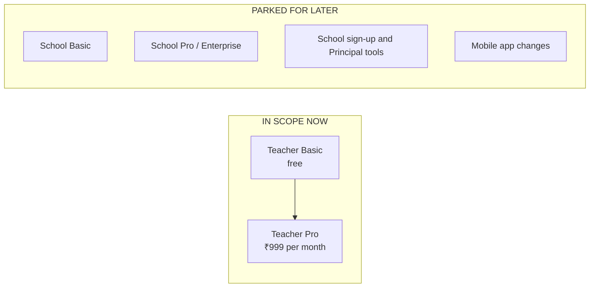
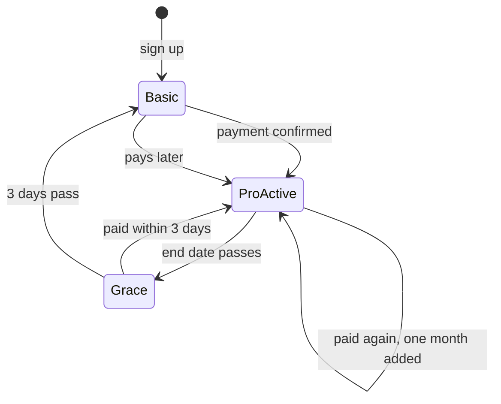

# Payment System — Final Decisions (Teacher Basic and Teacher Pro)

**Status:** Decisions recorded from your answers. Nothing is built. No code, database, migration or `mobile/` file was changed.
**Scope:** Only **Teacher Basic (free)** and **Teacher Pro (paid)**. School plans are **parked** for later.
**Related documents:** `payment-implementation-phases.md` (the updated phase plan), `payment-ui-flow.md` (where users see the buy option and the email step), `payment-system-analysis.md` (the original analysis), `account-and-signup-analysis.md` (sign-up and login issues).

---

## 1. Scope

- **RAMPUR01 stays** as the shared school for website and Google sign-ups. Because there are no school plans now, nothing can ever be bought for it.
- **Teacher attendance stays exactly as today.** It is not part of any plan. It is still controlled only by its existing flag.
- **Nothing inside `mobile/` changes.**

---

## 2. The two plans

| Feature | Teacher Basic (free) | Teacher Pro (₹999 per month) |
| --- | --- | --- |
| **Paper generator** | **50 questions per month** | Unlimited |
| **Classroom Management (classes)** | Up to **2 classes** (the number is a flag). Students per class unlimited. Attendance and fee marking allowed. On-screen reports allowed. | Unlimited classes |
| **Report downloads** (attendance and fee files) | Not allowed | Allowed |
| **Attachments (image / PDF in Coach)** | **10 images and 5 PDFs per month** | Unlimited (the existing safety caps stay) |
| **Classroom Mode (AI)** | Not allowed | Allowed |
| **Lesson plans** | Not allowed (only Classroom Mode makes them) | Allowed |
| **Coach chat** | Free, unlimited | Same |
| **AI Assistant, AI edit, Learning Representation** | Free for everyone | Same |
| **Library, notifications, Help** | Free | Same |
| **Teacher attendance** | Unchanged (not part of plans) | Unchanged |

**"Classroom Mode" means the AI feature** where a coaching question also builds a quiz, worksheet and lesson plan. It does not mean Classroom Management (classes and students).

---

## 3. The rules

### 3.1 Counting

| Item | Rule |
| --- | --- |
| **Questions** | Count the questions in every paper that was **successfully** generated. The server already checks the AI returned exactly the requested number, so counted = requested. Failures and bad requests never count. |
| **Before generating** | If a teacher asks for more questions than they have left, **refuse** with "you have N questions left this month". Nothing partial. |
| **Images and PDFs** | Each file counts once, by type, after it was processed successfully. A batch that would go over the remaining amount is refused. The existing safety caps (20 a day, 5 files per message, 8 MB per file) still apply. |
| **Classes** | Count the classes the teacher currently has. Adding a new class is blocked at the limit. **Deleting a class frees a slot.** |
| **When counts reset** | The 1st of each calendar month (IST). |
| **Lesson plans, AI edit, Coach chat** | Not counted. |

### 3.2 One plan per account, and renewing

- **One active plan per account.** A second purchase while one is active **adds a month** to the end date.
- **Renewal is by hand.** The user pays again each month. If they pay before the end date, a month is added to the end. If they pay after it ended, a new month starts from the payment.
- **There is no auto-renew** at first.

### 3.3 When Pro ends

When a plan drops back to Basic:
- **Nothing is deleted.** All data is kept.
- **Existing classes keep working.** If someone had 10 classes, all 10 still work. Only **adding a new class** is blocked until they are below the limit.
- Classroom Mode, report downloads and the higher attachment and question amounts stop.

### 3.4 Money and payments

| Item | Decision |
| --- | --- |
| **Price** | ₹999 per month (99,900 paise). A **config value** you can change, along with the period. |
| **Currency** | Indian rupees only |
| **Provider** | **Razorpay**. Because renewal is by hand, this uses one-time payments (no recurring mandates). |
| **GST** | Not handled for now |
| **Refunds** | None by default. Only for double charges or technical errors, handled by an admin. |
| **Payment records** | Kept forever |
| **Policy text** | I draft it, you review and approve it before it goes live |
| **Price text** | You approve it before going live |
| **Company and bank account** | Not ready yet. Needed before **real** payments, not before coding. |
| **Test keys** | Not ready yet. Needed before we can test payments. |
| **Server** | Deployed on Railway |
| **Database** | You confirmed it is safe (persistent volume and backups). I have not verified it. I still recommend a quick look at the Railway dashboard before real payments. |

### 3.5 Everything is changeable through flags and config

Your rule: price and limits must not be hardcoded. Environment values for now (a restart to change them), with an admin screen later. Proposed names, to be confirmed when built:

| What | Proposed name | Starting value |
| --- | --- | --- |
| Pro price | `BILLING_PRO_PRICE_PAISE` | `99900` |
| Pro period | `BILLING_PRO_PERIOD_MONTHS` | `1` |
| Grace days | `BILLING_GRACE_DAYS` | `3` |
| Free classes | `BILLING_BASIC_MAX_CLASSES` | `2` |
| Free questions per month | `BILLING_BASIC_QUESTIONS_PER_MONTH` | `50` |
| Free images per month | `BILLING_BASIC_IMAGES_PER_MONTH` | `10` |
| Free PDFs per month | `BILLING_BASIC_PDFS_PER_MONTH` | `5` |
| Master switch | `BILLING_ENABLED` | off |
| Enforce switch | `BILLING_ENFORCE` | off (watch-only) |

Prices already paid stay as charged, even if the config changes later.

### 3.6 When the limits switch on

The limits are first built in **watch-only mode**: they log what they would block and block nobody. They are switched on for everyone only **when payment works**. You can also pilot with a short list of emails. A "few chosen schools" rollout can't work because every website user is in one school.

---

## 4. Decision log

Numbers refer to your business question list (1 to 34) and the follow-up list (F1 to F13).

| Topic | Decision | Source |
| --- | --- | --- |
| RAMPUR01 stays as the shared bucket | Yes | Q1 |
| One active plan | One active plan per account | Q2, F1 |
| Price and limits | Controlled by flags and config | Q3, Q16, F12 |
| Free classes | Max 2, number set by a flag, students unlimited | Q6, F8 |
| Free generator | 50 questions per month | Q6, Q14 |
| Free attachments | 10 images and 5 PDFs per month | Q6, F5 |
| Report downloads | Pro only | Q12, Q6 |
| Classroom Mode and lesson plans | Pro only | Q10, F3, F7 |
| Coach chat | Free and unlimited | Q11 |
| Other AI features | Free for everyone | F6 |
| Pro price and period | ₹999 per month | Q16, F2 |
| Over-quota request | Refuse with "N left" | F4 |
| Pro includes | Unlimited questions, classes, attachments, report downloads, Classroom Mode | F6 |
| When Pro ends | Drop to Basic, keep everything, block only new classes above the limit, 3-day grace | Q22, F9 |
| Renewal | By hand each month | Q23 |
| Refunds | Recommended (only errors) | Q24 |
| GST | Not for now | Q19 |
| Provider | Razorpay | Q26 |
| Records | Kept forever | Q29 |
| Policy and price text | I draft, you approve | Q30, Q31 |
| Teacher attendance | Stays as it is today | F10 |
| Switching limits on | Watch-only until payment works | F11 |
| Where limits live | Environment values now, admin screen later | F12 |
| Database on Railway | You confirmed it is safe | F13 |
| Email checking | **Verify the email only at checkout.** Accept some free-limit abuse at first, and watch usage. Add sign-up verification only if abuse appears. | Open item 1 (recommended, accepted) |
| Typo in the sign-up email | At launch, the step panel points to Help & Support. A "change email" option can come later. | Recommended, accepted |
| Where users buy | One "Plans and billing" page (`/plans`), reached from the avatar menu, the Settings "My plan" card, popups on locked features, and reminders | See `payment-ui-flow.md` |

---

## 5. Parked (not doing now)

These were dropped when school plans were parked: School Basic and School Pro prices and contents, one plan per teacher versus per school, "center management", school self sign-up, school GST invoices, and free attendance for existing schools. Everything is documented in `payment-system-analysis.md` and `account-and-signup-analysis.md` if you return to it.

---

## 6. Still open

**Decided since:** email checking (verify at checkout only, see the decision log above). The free limits are per account, so anyone can make a new account with any email and get another 50 questions, 2 classes and attachments. We accept that at first and watch the usage numbers.

| # | Open item | Blocks | What I recommend |
| --- | --- | --- | --- |
| 1 | Razorpay test account and keys | Testing payments | Create a test-mode account when we reach the payment phase |
| 2 | Company and bank account | Going live | Start Razorpay's paperwork early, because approval can take time |
| 3 | AI cost per question | Whether 50 free questions and ₹999 make sense | Check your AI provider's bill after a couple of weeks of real use |
| 4 | The `RAMPUR01` Principal can see all independent teachers | Not blocking | Track as a separate privacy fix |
| 5 | Final wording of the screens and the price text | Going live | You approve the messages in `payment-ui-flow.md` section 9 |

---

## 7. What I will decide myself

- Build billing on the current SQLite database, adding new tables only. Plans live in code, with values overridden by environment.
- The plan is always read from the database, never from the login token.
- Count questions and files after success, on the 1st of the month (IST), with a tiny overshoot allowed under parallel requests.
- Send the user back to where they were after login, and show which account they are buying for.
- Reuse the existing `reminder` notification type for billing messages.
- Email receipts through Brevo, and expiry reminders 7 days and 1 day before.
- After paying, the user lands on a status page that refreshes. No payment events go into Google Analytics.
- Super admin and demo accounts are never blocked by limits. Demo accounts get manual Pro grants.
- Keep the existing daily AI safety limits.
