# Payment & Subscription — Phase-wise Implementation Plan (v2: Teacher Basic and Teacher Pro)

**Status:** Phase 1 is **implemented and tested** (not committed). Phases 2 to 6 are plan only. No `mobile/` or `client/` file was changed.
**Version:** v2. Updated for your decisions. School plans are **parked**. The paper limit is now counted in **questions**. There is now a **class limit**.
**Phase 1 now has a formal implementation plan** (section 6): the exact files, the baseline test results, the build order, the tests and the safety checks. Phases 2 to 6 get the same treatment right before each one starts.
**Read with:** `payment-decisions.md` (all decisions), `payment-ui-flow.md` (where users see the buy option and the email step), `payment-system-analysis.md` (original analysis), `account-and-signup-analysis.md` (sign-up and login issues).

---

## 1. Should we build it all at once? No, use phases

| Reason | Explanation |
| --- | --- |
| **Money code is the riskiest part** | Webhooks, double payments and refunds need care. Build them last, on a solid base. |
| **Enforce before you charge** | Never take money for a limit the backend doesn't really enforce. |
| **Every phase can be switched off** | Each phase ships behind flags, first in watch-only mode (it logs what it would block and blocks nobody). |
| **Small database changes** | The dev database is one shared SQLite file. Small, additive migrations are easier to review and undo. |
| **Early phases already help** | After Phases 1 to 3 you can give Pro to people by hand (pilots, testers) and the limits really work, before any gateway exists. |

---

## 2. Scope and the plans

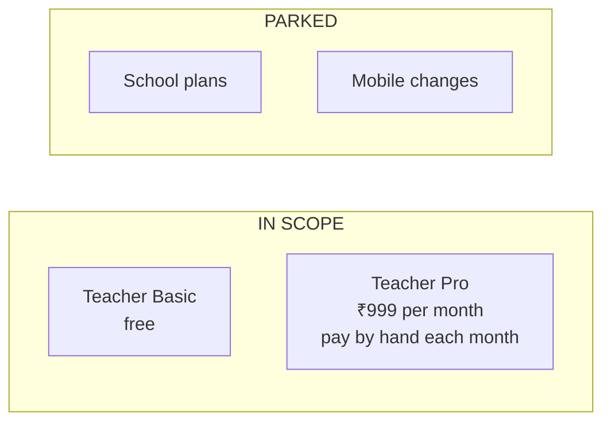

| Feature | Basic (free) | Pro |
| --- | --- | --- |
| Generator questions | 50 per month | Unlimited |
| Classes | 2 (a flag) | Unlimited |
| Report downloads | No | Yes |
| Images and PDFs | 10 images and 5 PDFs per month | Unlimited |
| Classroom Mode and lesson plans | No | Yes |
| Coach chat and other AI features | Free | Free |
| Teacher attendance | Unchanged, not part of plans | Unchanged |

---

## 3. The phases at a glance

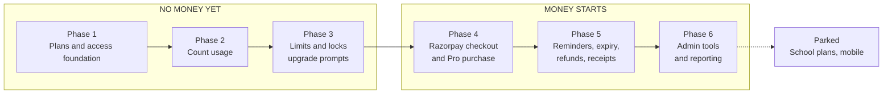

| Phase | Name | Money moves? | Relative size |
| --- | --- | --- | --- |
| **0** | Approvals | No | Tiny |
| **1** | Plans and access foundation | No | Medium |
| **2** | Count usage | No | Small–Medium |
| **3** | Limits and locks, and upgrade prompts | No | Medium–Large |
| **4** | Razorpay checkout and Pro purchase | **Yes** | Large |
| **5** | Reminders, expiry, refunds, receipts | Yes | Medium |
| **6** | Admin tools and reporting | Yes | Medium |

**The old "School billing" phase is removed** (parked). The lifecycle phase is smaller than before because renewal is by hand and there are only two plans.

---

## 4. Rules that apply to every phase

- **Everything is behind flags and OFF by default**, in the project's existing flag style.
- **Watch-only first.** A new check logs first, then blocks later.
- **Backend is the final authority.** The client only shows or hides things.
- **Database changes are additive only.** **I will not edit `schema.prisma` or run a migration without your approval.** Each phase that needs a table starts with a short schema proposal.
- **Kill switches always win.** Existing flags still override any plan.
- **No weakening of security.** Auth, roles, Zod `.strict()` bodies, rate limits, owner-scoped 404s and the secrets rules stay. Razorpay keys live only in `server/.env`.
- **Nothing in `mobile/` changes.**
- **Git:** feature branch, then a PR into `main`, with Conventional Commits. I don't commit or push unless you ask.
- **Verification gates before a phase is done:**
  - Server: `npx prisma generate`, then `npm run lint`, then `npm test`
  - Client (when touched): `npm run lint`, then `npm test`, then `npm run build`
- **Each phase ends with a check-in:** a short demo, the real test output, and the next phase's open items.

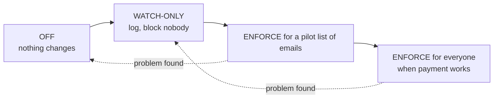

---

## 5. Phase 0 — Approvals

The key decisions are already made (`payment-decisions.md`). What is left is your **approval of the Phase 1 schema proposal**, one new table. Nothing is built.

---

## 6. Phase 1 — Plans and access foundation (FORMAL PLAN)

**Goal:** The app can answer "which plan does this teacher have, and what does it allow?" with **no visible change** and **nobody blocked**.

**Promise:** With billing switched off (the default), the app behaves **exactly** as it does today. Every existing feature, route, response and test stays the same.

> **Status:** Implemented and tested. The plan was made after reading the real code (section 6.2) and running the real test suite (section 6.3). The result is in section 6.16.

### 6.1 What Phase 1 is, and is not

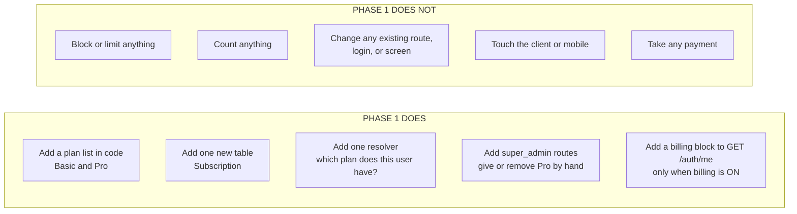

**Two changes from the earlier draft (both make Phase 1 safer):**
1. **No plan-check middleware in Phase 1.** Nothing needs enforcing yet, and adding it to existing routes would change their chains. It moves to Phase 3, where it is actually used.
2. **No `BILLING_ENFORCE` flag and no price or period settings in Phase 1.** Nothing reads them yet. They arrive in Phase 3 and Phase 4.

### 6.2 What I checked in the code

| Area | What I found | What it means for the plan |
| --- | --- | --- |
| **Route mounting** (`server/src/index.js`) | Each admin feature has its own router file, mounted with `app.use('/api/admin/…')`, with no rate limiter and `super_admin` checks inside the router (`adminSupport`, `adminSettings`). | The new admin routes follow the same pattern. Two lines are added to `index.js`. Nothing is reordered. |
| **`GET /api/auth/me`** (`routes/auth.js`) | Returns `{ user, featureFlags }`. `publicUser()` is also used by login, Google login, refresh, profile update and avatar. | Do **not** touch `publicUser()`. Add `billing` as a **separate key on `/me` only**, and only when billing is on. |
| **Tests that check the `/me` shape** | None check the exact shape. | Adding a key is safe. When billing is off, no key is added at all. |
| **Client and mobile** | Both describe the user with plain TypeScript types. Neither validates it strictly at runtime. | An extra key is ignored. Neither app changes. |
| **Flags** (`lib/flags.js`) | One `readXFlags(env)` function per feature, frozen defaults, tests in `test/lib/flags.test.js`. Values are read live from `process.env`. | Add `readBillingFlags` in the same style, with its own new test file. |
| **Numbers from the environment** (`lib/config.js`) | `parseIntEnv` clamps to a range and warns instead of crashing. | Use it for the limits and grace days. |
| **Admin audit** (`routes/admin.js`) | Each admin change writes an `Event` row (type, JSON metadata) inside the same transaction. | Grant and revoke write `Event` rows the same way. |
| **Schema style** (`schema.prisma`) | Text fields with a comment listing allowed values (SQLite has no enums). Soft links to admins (for example `SystemSetting.updatedById`). Indexes like `@@index([userId, status])`. | The `Subscription` table follows these habits. |
| **Migrations** | Small SQL files in `prisma/migrations/`. The newest is `20260831202414_…`. The test setup runs `prisma migrate deploy` on a throwaway file, never on `dev.db`. | A new migration is picked up by the tests automatically. `dev.db` stays untouched. |
| **Tests** (`vitest`) | Files run one after another on one throwaway database. Helpers: `createFixtures`, `loginAs`, `makeClient`. Tests that need a flag set it themselves and restore it. | New tests reuse these helpers and follow the same flag habit. |
| **Lint** | `eslint src evals tools` with light rules (unused variables warn). | New code must be lint-clean. |
| **CI** | Server job: `npm ci`, `npx prisma generate`, `npm run lint`, `npm test`, with only fake secrets. | The same three commands are the gate. |
| **`docs/AI_ACTION_ROUTER_README.md` "Protected Areas"** | A list from an older feature that says: do not modify auth, the schema or existing tests. It was written for that feature, not this one. | I follow its spirit: touch as little as possible, and **never edit an existing test file** (additions only). |

### 6.3 The baseline before any change

I ran the checks on the untouched code so we can tell a new problem from an old one.

| Check | Result |
| --- | --- |
| `npx prisma generate` | OK |
| `npm run lint` (server) | Clean, no warnings |
| `npm test` with your normal `.env` | 93 files, 2,380 tests. **3 fail**, 2,377 pass. Same 3 on two runs. |
| `npm test` with every feature flag forced off (like CI) | **2 fail**, 2,378 pass |

The failures already exist. They are not caused by billing:

| Failing test | Why (what I found) |
| --- | --- |
| `pushService.test.js`: 2 tests | The package `expo-server-sdk` is listed in `package.json` and the lock file, but it is **not installed** in `server/node_modules` on this machine. CI installs it with `npm ci`. |
| `resources.test.js`: "exactly one lesson_generated notification" | Fails only with your real `.env`, because your feature flags being on create extra notifications. It passes with the flags off. |

**Rule for Phase 1:** after my changes, the set of failing tests must be **identical** to this list, and every other test must pass. No new failure, and no fixing or changing existing tests.

**Two warnings I found for later, so nobody is surprised:**
- Your npm is set to `global=true`. A plain `npm install` inside a project would install **globally**. I will not run installs. Phase 1 adds no dependencies.
- The tests read your real `.env`. That is why one test depends on it. Phase 1 tests set and restore their own flags and do not rely on `.env`.

### 6.4 Files: what is new, what is edited, what is never touched

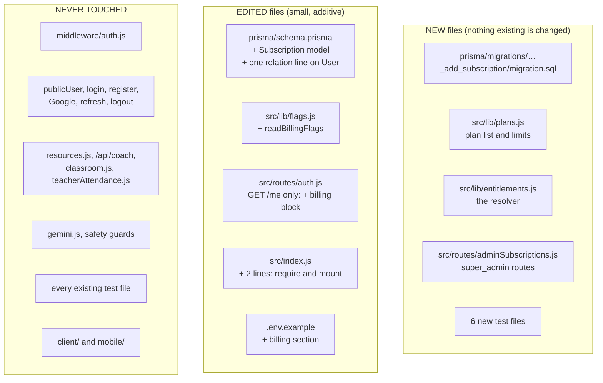

| File | Change |
| --- | --- |
| `server/prisma/schema.prisma` | Add the `Subscription` model and one line on `User` (`subscriptions Subscription[]`). That line changes the generated code only, not any existing table's columns. |
| `server/prisma/migrations/<date>_add_subscription/migration.sql` | **New.** Creates one table and two indexes. Nothing else. |
| `server/src/lib/flags.js` | Add `BILLING_FLAG_DEFAULTS` and `readBillingFlags`, and export them. No existing line changes. |
| `server/src/lib/plans.js` | **New.** The plan list and the limits, read from the environment. |
| `server/src/lib/entitlements.js` | **New.** The resolver and a small helper for `/me`. |
| `server/src/routes/adminSubscriptions.js` | **New.** Three `super_admin` routes. |
| `server/src/routes/auth.js` | In `GET /me` only: add the billing block when billing is on. Wrapped so a billing error can never break `/me`. |
| `server/src/index.js` | Add one `require` and one `app.use('/api/admin/subscriptions', …)` next to the other admin routers. |
| `server/.env.example` | Document the new settings, in the same style as the other features. |
| `server/test/...` | **6 new test files.** No existing test file is edited. |

### 6.5 The database change (needs your approval before anything is written)

**Proposed table, in the repo's style:**

```prisma
// A paid plan a teacher holds. "Teacher Basic" is the ABSENCE of a row, so free
// users never need one. One active row per user is enforced in code (Prisma
// cannot express "unique among active rows"), inside a transaction.
model Subscription {
  id          String   @id @default(cuid())
  user        User     @relation(fields: [userId], references: [id])
  userId      String
  planKey     String   // teacher_pro (closed list in lib/plans.js)
  status      String   @default("active") // active | revoked (expiry is worked out from endsAt, never stored)
  source      String   @default("manual") // manual | gateway (gateway arrives in Phase 4)
  startsAt    DateTime
  endsAt      DateTime
  grantedById String?  // soft reference to the admin who granted it, like SystemSetting.updatedById
  note        String?
  createdAt   DateTime @default(now())
  updatedAt   DateTime @updatedAt

  @@index([userId, status])
  @@index([endsAt])
}
```

Plus one line on `User`: `subscriptions Subscription[]`.

**Why it is safe:**
- It only **adds** a table. No existing table, column or row changes.
- Rolling back means leaving the table unused. No "down" step is needed.
- Nothing reads it while billing is off.

**How I will create the migration without touching your real database:**

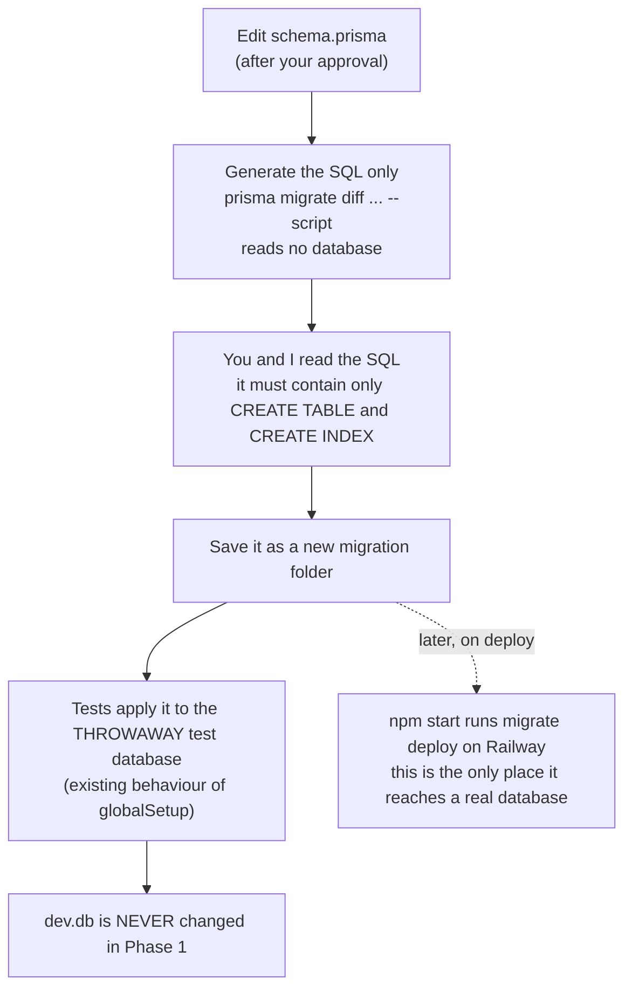

**Why `dev.db` stays untouched:** it is shared by all branches. If a migration is applied to it from this branch, other branches that lack the migration folder can see "drift" and be asked to reset it. That is exactly your saved rule, so Phase 1 never applies the migration to `dev.db`. For a manual check I use a **copy** of it.

### 6.6 The settings (all optional, with safe defaults)

| Setting | Default | Meaning |
| --- | --- | --- |
| `BILLING_ENABLED` | `false` | Master switch. Off means every new thing below is invisible and inert. |
| `BILLING_GRACE_DAYS` | `3` (range 0–30) | Days Pro keeps working after its end date. |
| `BILLING_BASIC_MAX_CLASSES` | `2` (range 0–100000) | Free classes. Used from Phase 3. |
| `BILLING_BASIC_QUESTIONS_PER_MONTH` | `50` | Free questions a month. Used from Phase 2 and 3. |
| `BILLING_BASIC_IMAGES_PER_MONTH` | `10` | Free images a month. |
| `BILLING_BASIC_PDFS_PER_MONTH` | `5` | Free PDFs a month. |
| `BILLING_EXEMPT_ROLES` | `super_admin` | Roles never limited. Unknown names are ignored with a warning. |

A wrong value never crashes the server. It warns and uses the default (the same rule as every other setting in the app). Phase 1 only **reports** the limits in `/me`. Nothing enforces them yet.

### 6.7 How the resolver decides

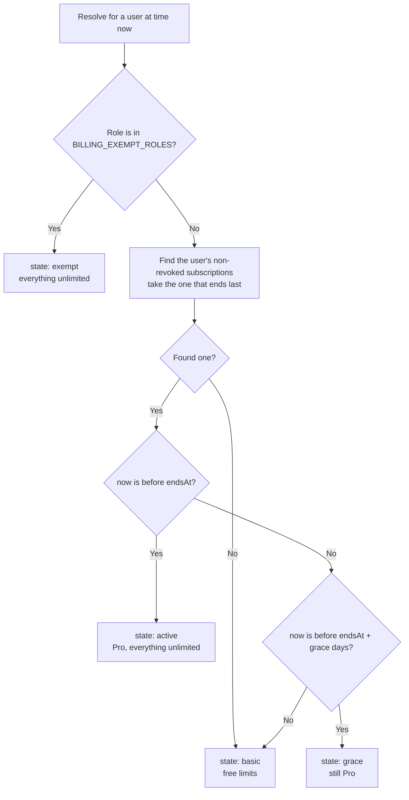

- **Pure function, clock passed in.** It takes the user, the subscription rows, the current time and the settings, so tests can use any date without waiting.
- **Feature list it returns:** `reportDownloads`, `classroomMode` and `lessonPlans` (yes or no), and the limits `questionsPerMonth`, `classes`, `imagesPerMonth`, `pdfsPerMonth` (a number, or empty for unlimited).
- **Read from the database, never from the login token.**

### 6.8 The three admin routes (`super_admin` only, under `/api/admin/subscriptions`)

| Route | What it does |
| --- | --- |
| `POST /` | Give Pro to a user. Body (strict): `userId`, `planKey` (`teacher_pro`), `months` (1–36), optional `note`. If the user's Pro is still running, it **adds months to the end date**. If it ended or is in grace, it **starts fresh from now**. |
| `GET /?userId=…` | Show that user's subscription rows and what the resolver says. For support and testing. |
| `POST /:id/revoke` | Mark a row `revoked`. Repeating it changes nothing. |

**Rules for all three:**
- Only `super_admin` (other roles get 403, no token gets 401).
- When billing is off they answer `503` with code `BILLING_DISABLED`, like every other feature.
- Zod `.strict()` bodies. Unknown fields are rejected.
- An unknown user or row gives `404`.
- Every change writes an `Event` row (`subscription_granted`, `subscription_extended`, `subscription_revoked`) with a JSON note, in the same transaction.
- "Add months" keeps the end of the month correct (31 Jan plus 1 month is the last day of February).

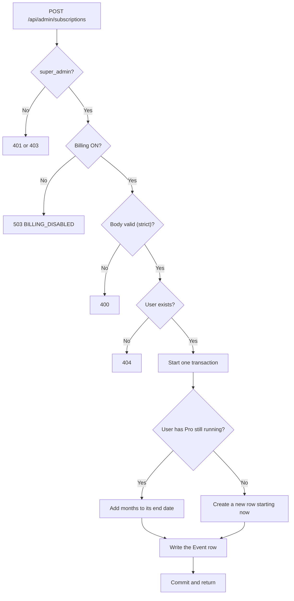

### 6.9 The change to `GET /api/auth/me`

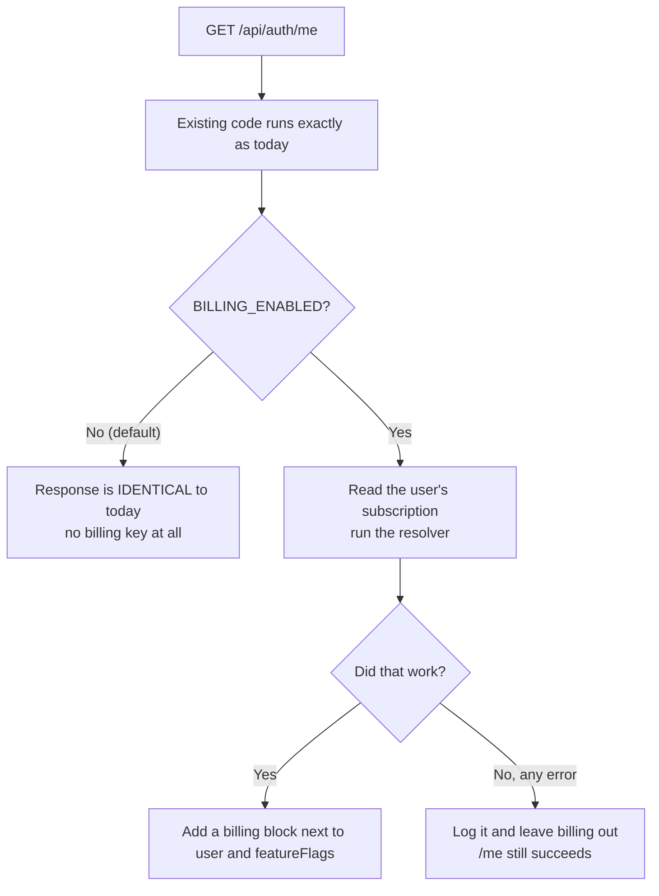

The block, only when billing is on:

```json
"billing": {
  "plan": "teacher_basic",
  "state": "basic",
  "endsAt": null,
  "graceEndsAt": null,
  "features": { "reportDownloads": false, "classroomMode": false, "lessonPlans": false },
  "limits": { "questionsPerMonth": 50, "classes": 2, "imagesPerMonth": 10, "pdfsPerMonth": 5 }
}
```

A limit of `null` means unlimited. `plan` is `teacher_pro` and `state` is `active`, `grace` or `exempt` in those cases. This block is for display only in Phase 1. The server does not use it to allow or block anything yet.

### 6.10 The build order (with stop points)

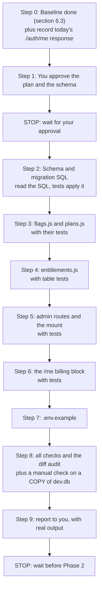

After **each** step I run the fast checks (lint and the new tests). After steps 2, 6 and 8 I run the **whole** server suite and compare with the baseline. If anything new fails, I stop and fix it before going further.

### 6.11 The tests I will add (new files only)

| New test file | What it proves |
| --- | --- |
| `test/lib/billingFlags.test.js` | Default is off. The usual spellings work. A typo warns and keeps the default. Numbers clamp to their range. Unknown roles are ignored with a warning. |
| `test/lib/plans.test.js` | The plan list and limits have the expected defaults. Environment values override them. Bad values fall back safely. |
| `test/lib/entitlements.test.js` | A table of cases with a fake clock: no row, active, the last second before the end, inside grace, the last second of grace, after grace, revoked, exempt role, and several rows. Also the month arithmetic (31 Jan plus 1 month). |
| `test/adminSubscriptions.test.js` | 401 with no token. 403 for teacher, `school_admin` and `resource_person`. 503 when billing is off. Grant creates. A second grant extends. A grant after the end starts fresh. Strict body. Months limits. 404 for an unknown user. Revoke is repeatable. Audit rows exist. Other users are untouched. |
| `test/billing.me.test.js` | Billing off: `/me` has exactly the same top-level keys and user keys as today. Billing on: the block is right for Basic, Pro, grace and exempt users. A failing billing lookup still returns a normal `/me`. |
| `test/billing.noSideEffects.test.js` | With billing **on**, login, refresh and the existing response shapes are unchanged. |

**Flag habit:** tests that need billing on set the flag themselves and restore it afterwards, the same way the existing tests do. They never depend on your `.env`.

### 6.12 How I make sure nothing existing breaks

| Guard | How it is checked |
| --- | --- |
| **Off by default** | With `BILLING_ENABLED` unset, `/me` and every route behave as today. A test proves it. |
| **Additive only** | The schema, the migration and the code only add. Nothing is renamed, moved or deleted. |
| **No edits to existing tests** | `git diff --stat server/test/` must show only new files. |
| **Small, listed edits** | `git diff --stat` must list only the files in section 6.4. Anything else is a mistake. |
| **Same failures as the baseline** | The whole server suite after Phase 1 must have exactly the same failing tests as section 6.3, and no others. |
| **Both environments** | The suite is run twice: with your normal `.env`, and with all feature flags forced off (like CI). |
| **Billing on and off** | The new tests run in both modes. |
| **Lint and generate** | `npx prisma generate` and `npm run lint` must be clean. |
| **Login and tokens** | `middleware/auth.js` and every login path are untouched, and the existing auth tests stay green and unedited. |
| **Fail-safe `/me`** | Any billing error is caught, logged, and leaves `/me` working. |
| **No secrets** | No keys are added. Only names and defaults appear in `.env.example`. |
| **Manual check** | On a **copy** of the database, start the server, grant Pro to a test teacher, and check `/me` with billing off and on. `dev.db` itself is never opened for writing. |

### 6.13 Risks and how each is handled

| Risk | How it is handled |
| --- | --- |
| The migration changes your shared `dev.db` and causes drift on other branches | It is never applied to `dev.db` in Phase 1. Tests use a throwaway file. Manual checks use a copy. |
| `/me` changes shape and confuses the client or mobile | The key is added only when billing is on, next to `user`, never inside it. Both apps ignore extra keys. Billing off gives an identical response. |
| A billing bug takes `/me` down | The billing part is wrapped, logged and skipped on error. |
| An admin gives Pro to the wrong person | Every grant is audited and can be revoked. Months are limited to 1–36. |
| Two grants at once create two active rows | Grant and extend run inside a transaction. A test covers repeated grants. |
| A wrong setting value | Numbers clamp and warn. Unknown roles are ignored with a warning. |
| Dates and month ends | The clock is passed in, and there are tests for month ends and for the exact boundaries. |
| Confusing old failures with new ones | The baseline is recorded (section 6.3). The failing set must match exactly. |
| An accidental global install | No installs and no new dependencies in Phase 1. |
| The new table reaches Railway on the next deploy | It is additive, and `npm start` already runs `migrate deploy`. You confirmed the database is safe. I still recommend a quick look at the volume and backups before the first deploy. |

### 6.14 Assumptions I made (tell me if any is wrong)

1. **Only `super_admin` is exempt** from limits. `school_admin` and `resource_person` are treated like normal teachers. It is a setting (`BILLING_EXEMPT_ROLES`), so it is easy to change.
2. **Admin grant uses months** (1–36), not a date. Granting again while Pro runs adds to the end date. Granting after it ended starts fresh from now, as decided.
3. **`billing` is left out of `/me` entirely** when billing is off, so the response is byte-for-byte the same as today.
4. **No middleware, no enforce flag, no price settings** in Phase 1 (moved to later phases, see section 6.1).
5. **The migration is never applied to `dev.db`** in this phase.
6. **I work on the branch you are on now** (`payment-system`). I do not commit or push unless you ask. The six planning documents stay untracked unless you tell me otherwise.

### 6.15 Definition of done for Phase 1

- [ ] You approved the schema (section 6.5).
- [ ] `npx prisma generate` and `npm run lint` are clean.
- [ ] The full server suite has **exactly** the baseline failures, and every other test passes, in both environments.
- [ ] `git diff --stat` lists only the files in section 6.4. No existing test file is changed.
- [ ] With billing off, `/api/auth/me` is identical to today.
- [ ] With billing on, `/me` shows the right block for Basic, Pro, grace and exempt users.
- [ ] `super_admin` can grant, extend, look up and revoke, and every action is audited.
- [ ] No route, screen or behaviour other than `/me` (with billing on) is different.
- [ ] `dev.db` was never written to.
- [ ] I report the real command output and anything that could not be verified.

**Nothing in Phase 1 needs the client, mobile, Razorpay, the email step or the UI.**

### 6.16 Phase 1 result (what was actually built and checked)

**Built, exactly as planned:**
- 5 existing files edited, all additive (125 lines added, 1 line replaced): `schema.prisma`, `flags.js`, `auth.js` (`GET /me` only), `index.js` (2 spots), `.env.example`.
- 4 new source files: the migration, `lib/plans.js`, `lib/entitlements.js`, `routes/adminSubscriptions.js`.
- 6 new test files, **140 new tests**. No existing test file was touched. Nothing in `client/` or `mobile/` changed.

**Checks (real results):**

| Check | Result |
| --- | --- |
| `npx prisma generate` and `npm run lint` | Clean |
| Full server suite, your normal `.env` | 2,517 pass, **3 fail**. The same 3 as the baseline. |
| Full server suite, feature flags forced off (CI-like) | 2,517 pass, **3 fail**. The same 3. |
| New tests | All 140 pass |
| `git diff` audit | Only the 5 planned files changed. No existing test changed. |
| `dev.db` | Never written to. The file hash is identical before and after. |
| Migration on a copy of your real database | Applied cleanly, and it was the only pending one |
| Live server on that copy, billing OFF | `/me` has exactly `user` and `featureFlags`. Login has no billing key. Admin routes answer 503. |
| Live server on that copy, billing ON | Basic teacher shows the free limits. Grant makes Pro active. A second grant extends the same row. A teacher calling the admin route gets 403. Revoke returns to Basic. Three audit events were written. |
| Deliberately broken code (4 ways) | The tests caught every break, and the files were restored exactly |

**The 3 failing tests already existed and are not caused by billing:**
- 2 in `pushService.test.js`: the `expo-server-sdk` package is not installed on this machine.
- 1 in `resources.test.js` ("exactly one lesson_generated notification"): it also fails on the untouched baseline code in a clean environment, so it is an existing failure that has nothing to do with billing. It passed once in my very first baseline run, so it is not fully consistent.

**The full suite is intermittently flaky on this machine, and that is proven to be independent of billing.** Now and then a full run shows one extra random failure: a valid token rejected with 401, a login or route answering 404, or a 15-second timeout. I saw this in about 5 of my 14 full runs, and it was a different test each time. To check the cause, I ran the **untouched baseline code** (a separate git worktree at the pre-billing commit, with your `.env`) 4 times. **3 of those 4 runs also had a random extra failure** (`assistant.hardening`, `classroom.fees`, `teacherAttendance`, again 404s and a hook timeout). So it is an existing environment problem. The cause is not found. It went away when I ran the same files alone. Only the same 3 failures above are constant. Any single extra failure that does not repeat when the file is re-run alone should not be read as a billing problem.

**Not done in Phase 1, by design:** no `dev.db` migration (it reaches a real database only when `npm start` runs `migrate deploy` on deploy), no commit, and no UI.

---

## 7. Phase 2 — Count usage

**Goal:** The database records how much each teacher has used, without blocking anyone.

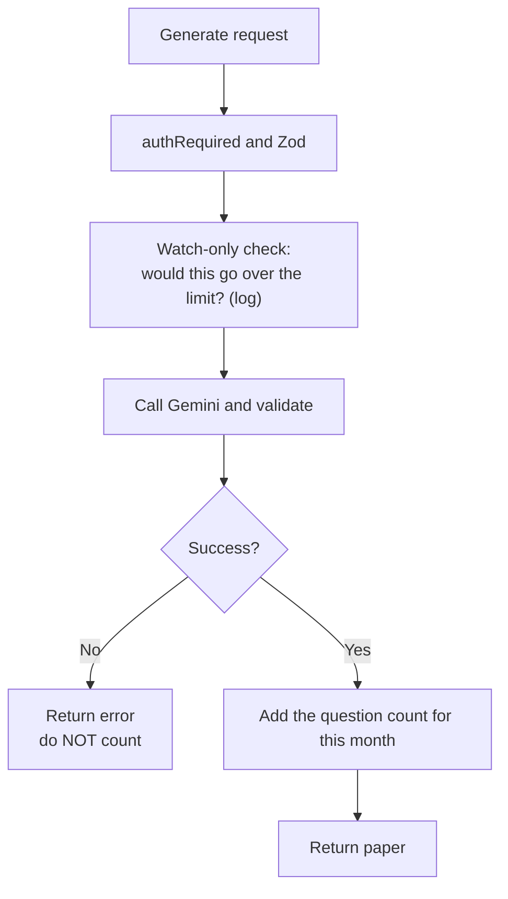

### What we implement
- A **`UsageCounter` table** *(needs your approval)*: user, kind (`questions`, `images`, `pdfs`), month, count.
- **Questions:** added after each successful `/resources/generate`. Counted = the requested number (the server already checks the AI returned exactly that).
- **Images and PDFs:** added per file after an attachment is processed successfully.
- **Classes:** not a counter. Computed live from the teacher's current classes.
- Months are calendar months in IST. Failed generations and bad requests never count.
- `/auth/me` returns "used and remaining" when billing is enabled.

### Dependencies
Phase 1.

**Care needed:** counting questions means adding a small step inside the generator route (`routes/resources.js`), which older project notes call a protected area. So Phase 2 gets its own formal plan first, in the same style as section 6. The change must be additive, behind the billing flag, and must not alter the route's response.

### Testing
- **Failure paths:** a 502 bad AI answer and a 400 don't change any count.
- **Concurrency:** many parallel requests give the right total.
- **Month rollover** with a fake clock.
- **Files:** a batch of mixed images and PDFs is counted by type.
- **Regression:** the existing generator and attachment tests pass and response bodies are unchanged.

### Open items for this phase
None. Counting rules are decided.

---

## 8. Phase 3 — Limits and locks, and upgrade prompts

**Goal:** The plans really restrict things. Testers get Pro by hand. Users see clear upgrade prompts. Still no payment.

### What is enforced (server side)

| Rule | Where it is checked |
| --- | --- |
| 50 questions per month on Basic. Ask for more than is left, and you are refused with "you have N left". | `POST /api/resources/generate`, before the Gemini call |
| 2 classes on Basic. Deleting a class frees a slot. Existing classes above the limit keep working. | `POST /api/classroom/classes` |
| 10 images and 5 PDFs per month on Basic. | `POST /api/coach/attachment` |
| Report downloads are Pro-only. | The classroom attendance export and the fee export routes |
| Classroom Mode is Pro-only. A Basic user gets the normal Coach answer, and the client shows an upgrade prompt in place of the classroom materials. | `POST /api/coach` (the classroom mode part) |
| Lesson plans and the batch generator are Pro-only (only Classroom Mode uses them). | `POST /api/resources/generate-set` and `generate-lesson-plan` |

Left alone: Coach chat, AI Assistant, AI edit, Learning Representation, teacher attendance, and everything else.

### What else we implement
- The **plan-check middleware** and the **`BILLING_ENFORCE` flag** (both moved here from Phase 1, because this is the first phase that uses them).
- A **stable error contract**: a clear `code` (limit reached, or feature locked) plus a friendly message, so the client can show an upgrade prompt and older cached clients still show something readable.
- **Client (web only):** upgrade prompts, a "used X of Y" meter, and a locked-Classroom-Mode state. The Upgrade button says "Contact us" until Phase 4.
- **Rollout:** watch-only first, then a pilot list of emails, then everyone **when payment works** (Phase 4).

### Dependencies
Phases 1 and 2.

### Testing
- **Matrix tests:** plan (Basic, Pro, in grace, expired) against each rule above, in watch-only and enforce modes.
- **Blocked before cost:** a blocked request never calls Gemini.
- **Boundary cases:** exactly at the limit, one over, and a request bigger than what is left.
- **Kill-switch precedence** is unchanged (for example the classroom-management and classroom-mode flags still override).
- **Expiry behaviour:** a plan ending mid-month keeps existing classes working and blocks only new ones.
- **Client tests and build.**
- **Manual check** with demo accounts given different manual plans.
- **Gates:** server and client.

### Client screens for this phase
The upgrade popups, the usage meters, the "Pro" tags and the "My plan" card in Settings are described in `payment-ui-flow.md` (sections 2 to 4). The Upgrade button says "Contact us" until Phase 4.

### Open items for this phase
None. **Email checking is decided:** verify at checkout only (Phase 4). The free limits are per account, so a new account can get a fresh free quota. We accept that at first and watch the usage numbers.

---

## 9. Phase 4 — Razorpay checkout and Pro purchase

**Goal:** A teacher can pay ₹999 and get Pro automatically for one month.

### What we implement
- A **provider layer**: one small internal interface (create order, verify payment, read the webhook, fetch status). The rest of the app never uses Razorpay's own names.
- **New tables** *(need approval)*: a billing payment table (clearly named, for example `BillingPayment`, because student fees already use "paid") and a webhook-event table (to ignore repeats).
- **Routes** (all Zod `.strict()`, rate limited, owner-scoped):
  - create checkout (the **server** decides the price from config, never from the request),
  - webhook (registered **before** `express.json()` so the raw body can be verified),
  - "my payments" and payment status.
- **Activation:** only a verified webhook, or a status check we make ourselves, marks a payment paid and activates or extends Pro. The browser redirect never activates anything.
- **Pay again:** a second purchase adds a month to the end date (or starts a new month if it already ended).
- **Reconciliation:** a small, safe-to-repeat function that re-checks payments stuck in `pending`.
- **Client (web):** a Pro page, checkout, a **payment-return page** (a new route, because today unknown paths are sent to `/`), and "my subscription".
- **Email verification at checkout only** (decided; needed for receipts). It reuses the forgot-password pattern: a verification-token table, an `emailVerifiedAt` field on the user *(both need approval)*, a "send link" route, a "confirm token" route, and `/auth/me` reporting the state. **The checkout route refuses unverified users.** Google accounts count as verified. A typo in the sign-up email is handled by Help & Support at launch.
- **Client screens:** the `/plans` page, the email step panel, `/verify-email/:token`, `/billing/return`, and the Settings badge, as described in `payment-ui-flow.md`.
- **Go back where you were after login**, and show which account is being upgraded.
- **Config:** Razorpay keys in `server/.env`, a `BILLING_CHECKOUT_ENABLED` flag, test mode first.

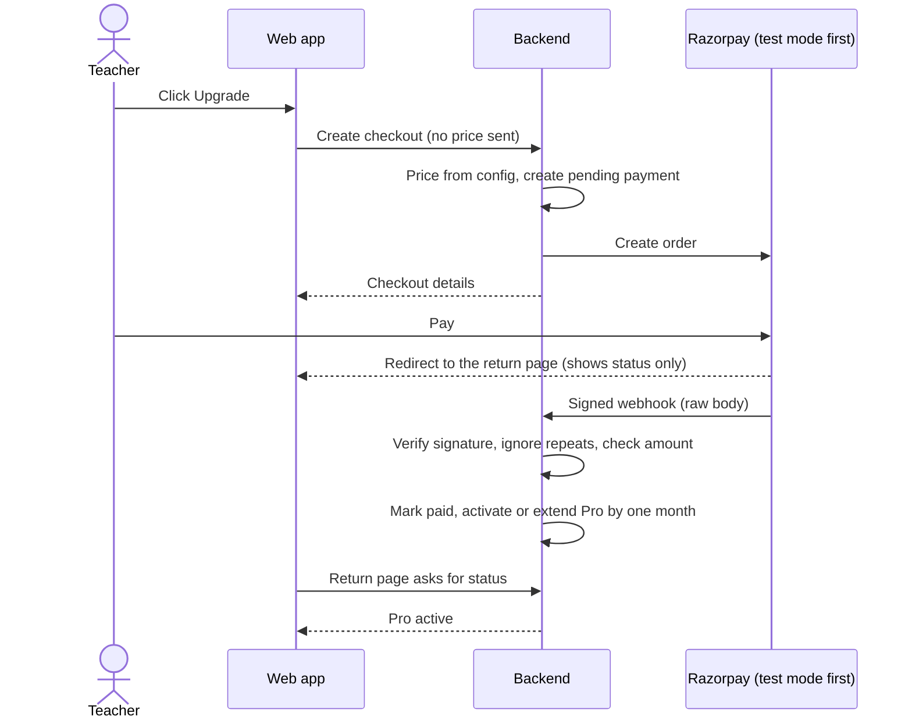

### Dependencies
- Phase 3 (limits really work before money is taken).
- A **Razorpay test account and keys**.
- A **public HTTPS address** for the webhook. Your Railway deployment covers this.

### Testing
- **A fake provider in tests.** No real Razorpay calls. Signed webhook test fixtures.
- **Webhook cases:** bad signature, duplicate, out of order, late, never arrives (the reconcile function fixes it), amount or currency mismatch.
- **Pending never activates.** Failed and expired payments change nothing.
- **Security tests:** a price sent in the request body is ignored, another user's payment returns 404, strict schemas, rate limits, no secrets in logs.
- **Body-parser test:** the webhook gets the raw body while every other route still gets JSON.
- **Pay-again tests:** early payment adds to the end date, late payment starts a fresh month, and a second purchase never creates a second active plan.
- **Sandbox end to end** with Razorpay test mode against the Railway URL.
- **Client tests and build:** the return page, error states, and "paid but logged out".
- **Go-live checklist (not code):** live keys, company and bank account, policy text and price text approved, a quick look at the Railway volume and backups.

### Open items for this phase
- **Razorpay test account and keys** (needed to test).
- **Company and bank account** (needed before real payments, not before coding).
- **You approve** the policy text and the price text before going live.

---

## 10. Phase 5 — Reminders, expiry, refunds, receipts

**Goal:** The full subscription life for a monthly, pay-by-hand plan.

### What we implement
- **Expiry housekeeping sweep** (like the existing 5-minute attendance reminder): marks old subscriptions expired, sends "expires soon" reminders 7 days and 1 day before, and re-checks pending payments. Safe to run twice and safe if late, because **access always compares the end date with now**, never the sweep.
- **Grace period:** 3 days after the end date, then Basic rules.
- **Refunds** only for double charges or technical errors, done by an admin, plus the webhook that reports a refund.
- **Email receipts** through Brevo.
- **Reminders** through the existing notification system (reusing the `reminder` type).
- **Cancellation** is just "don't pay again". There is no auto-renew to stop.

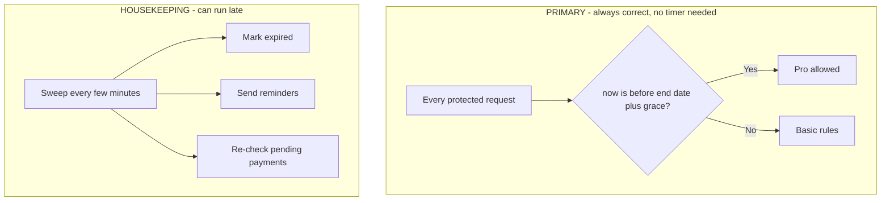

### Dependencies
Phase 4.

### Testing
- **Fake-clock tests** for the end date, the 3-day grace and the drop to Basic.
- **The sweep is repeat-safe:** running twice changes nothing the second time.
- **A late or stopped sweep is safe:** an expired plan is still treated as expired.
- **Reminders:** sent once, not repeated, and they respect the notifications flag.
- **Refund webhook** handling.
- **Regression:** Phases 1 to 4 tests still pass.

### Open items for this phase
None. The rules are decided.

---

## 11. Phase 6 — Admin tools and reporting

**Goal:** Operate the system.

### What we implement
- **Super admin billing dashboard:** a list of payments, a screen for granting and revoking plans (the Phase 1 routes), and starting a refund.
- **Admin analytics:** active Pro subscribers and revenue.
- **A support workflow** for payment problems, using the existing Help & Support inbox with a payment category.

### Dependencies
Phases 4 and 5.

### Testing
Admin role tests, dashboard totals matching the payment table, and regression across all earlier phases.

### Open items for this phase
- Whether the admin dashboard should show revenue (recommended yes, simple totals).

---

## 12. Parked

- **School plans** (School Basic and School Pro), school sign-up, Principal billing tools, school GST invoices, and free attendance for existing schools.
- **Mobile app** billing screens (Q61 and Q62 from the earlier list).
- A **privacy fix** so the `RAMPUR01` Principal can't see all independent teachers.
- **Auto-renew** and yearly plans.
- **Coupons and free trials.**

Everything is documented in `payment-system-analysis.md` and `account-and-signup-analysis.md` if you return to any of it.

---

## 13. Suggested next step

1. **Read section 6** (the formal Phase 1 plan) and tell me if any assumption in section 6.14 is wrong.
2. **Approve the schema** in section 6.5. Nothing is written until you do.
3. Say **"start Phase 1"**. I then follow the build order in section 6.10, run the checks after each step, and report the real output.
4. Before each later phase, I write its formal plan in the same style, and we do a short check-in.
