# Payment & Subscription System — Analysis

**Status:** Analysis only. Nothing is built. No code, database, or `mobile/` file was changed.
**Goal:** Explain how PAY-01 to PAY-05 can fit into the app we have today, and list what you must decide first.

> **Scope update:** This is the original, full analysis. The scope has since been narrowed to **Teacher Basic and Teacher Pro only** (School plans are parked). The final decisions are in `payment-decisions.md`, and the updated phase plan is in `payment-implementation-phases.md`. The questions in section 11 below are kept as history. Where they disagree with `payment-decisions.md`, the decisions file wins.

> **How to read the diagrams:** they are written in Mermaid. They show as pictures on GitHub, in VS Code (Markdown preview) and in most Markdown viewers.

---

## 0. The short version

1. **There is no payment code today.** No gateway, no plans, no subscriptions. A user is either a `teacher`, `school_admin`, `resource_person` or `super_admin`. That is all.
2. **The app has no "plan" idea at all.** But it has good building blocks: feature flags, a `SystemSetting` table, notifications, and one background timer.
3. **The backend never checks a plan today.** `authRequired` only reads the login token. It never asks the database. So the plan must be looked up from the database on every protected request. It must **not** be stored inside the login token.
4. **Paper generation has no usage record.** Three routes call the AI. Nothing is saved when a paper is made. The only counter in the app lives in memory and resets on every restart. It is not safe for billing. We need a real database counter.
5. **"Center management" does not exist by that name.** The closest feature is *Classroom Management* (classes, students, fees). You must confirm what "center" means.
6. **Schools can only be created by a `super_admin`.** A school cannot sign itself up. So "School subscription & billing" needs a decision about who buys and how a school is created.
7. **Every website and Google sign-up is put into ONE shared school (`RAMPUR01`).** This is hardcoded in `auth.js`. Only the mobile app can send a different school code. This is the biggest design trap for the payment system (see section 2.7).
8. **The existing JSON parser will break payment webhooks** unless the webhook route is placed before it (see section 3).
9. **Teacher attendance works today for free.** If "no subscription = free plan" and attendance is only in School plans, current schools using attendance would lose it. You must decide how to treat them (see section 2.5).
10. **There are 5 AI features, but your plan list only mentions papers.** Coach chat, Assistant, Attachments and Learning Representation also cost money and are not covered by any plan rule yet (see section 1.11).
11. **Many business rules are still open.** They are listed in section 10, and a simple checklist is in section 11. I did not guess any of them.

---

## 0.1 Which requirement is covered where

**Note:** I only had the *titles* of PAY-01 to PAY-05, not the detailed acceptance criteria. If your spec has more detail (specific screens, reports, invoice format), it must be checked against this document.

| Requirement | Where it is covered | Still open (question numbers in section 11) |
| --- | --- | --- |
| **PAY-01** Payment gateway & infrastructure | Sections 3, 7, 8 (webhooks, verification, payment states, secrets, raw-body problem, provider layer) | Provider and payment methods (Q49, Q50), test keys (Q64), public server URL (Q63), company/bank account (Q54) |
| **PAY-02** Subscription plans & pricing | Sections 2, 6 (plan → subscription → payment model, database sketch) | What each plan contains and its price (Q4–Q19) |
| **PAY-03** Teacher subscription & checkout | Sections 2, 3, 9.2, 9.4 | Teacher Basic / Pro contents, price, renewal (Q4, Q5, Q12, Q40) |
| **PAY-04** School subscription & billing | Sections 2.4, 2.6, 2.7, 9.3 | Shared default school (Q1–Q3), who buys (Q34–Q36), teacher vs school plan (Q30–Q32), invoices (Q51–Q53) |
| **PAY-05** Management, billing & access control | Sections 4, 5, 8, 9.5, 9.6 | Paper limits (Q20–Q28), cancel / refund / upgrade / expiry (Q41–Q48), existing users (Q37–Q39) |

**Not covered by this analysis on purpose** (it is an analysis, not a build plan): screen designs, exact API shapes, test plan, and anything inside `mobile/`. The screens needed are listed in Q56–Q57.

---

## 1. How the app works today (only the parts that matter)

### 1.1 Users, teachers, schools

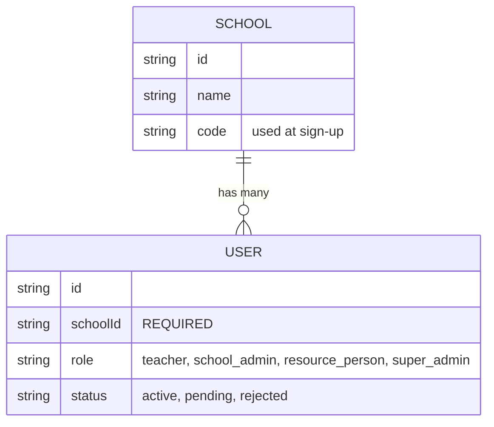

- **Every user must belong to a school.** There is no "independent teacher with no school".
- **Sign-up and the default school (checked in `routes/auth.js`):**
  - The school code is **optional** at sign-up.
  - **Website and Google sign-ups send no code**, so they are placed in `DEFAULT_REGISTRATION_SCHOOL_CODE`, which is **hardcoded to `RAMPUR01`** (not an env variable).
  - Only a caller that sends a code (the mobile app) is placed in that school.
  - New accounts are created `active` right away. (The comment in `schema.prisma` that says new signups start `pending` is out of date.)
- Schools are created only by a `super_admin` (`POST /api/admin/schools`) or by the seed script.
- Only a `super_admin` can change a user's role.
- `school_admin` is the Principal. They approve teachers and review teacher attendance.

### 1.2 Login and tokens

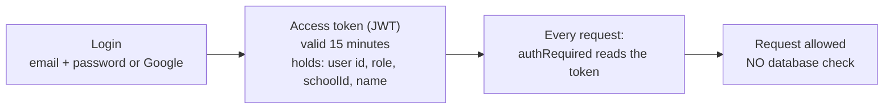

**Why this matters:** if we put the plan inside the token, then after a user pays, they would wait up to 15 minutes to get access. After a plan expires they would keep access for up to 15 minutes. So the plan must be read from the database.

The app already does small database lookups inside its gates (for example the attendance gate looks up the school code). So one extra lookup on protected routes fits the current style.

**Where the UI learns about the user:** `GET /api/auth/me` returns the user's id, name, email, role and school. It has **no plan or limit information today**. This is the natural place to add "current plan + remaining limits" for the UI (display only). Tokens are refreshed through `POST /api/auth/refresh`.

### 1.3 Paper generation

Three endpoints, all in `server/src/routes/resources.js`, all guarded only by `authRequired` (any logged-in user):

| Endpoint | What it makes |
| --- | --- |
| `POST /api/resources/generate` | One quiz / worksheet / assessment |
| `POST /api/resources/generate-set` | Up to 4 papers in ONE AI call |
| `POST /api/resources/generate-lesson-plan` | One lesson plan |

What each one does today:

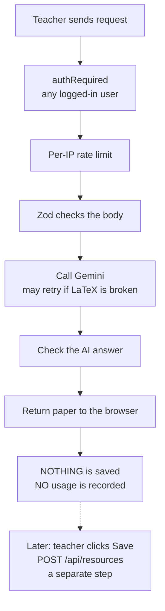

Important facts:
- **Nothing is counted.** There is no record that a paper was generated.
- **Saving is separate from generating.** So we cannot count papers by counting saved resources. A teacher could generate without saving.
- The AI Assistant ("action router") only *prepares* a generator form. The teacher still presses Generate. So the assistant ends up calling the same three routes. **One enforcement point covers both.**
- The web app and the mobile app both call the same backend routes.
- **Classroom Mode also calls these routes.** The client's Classroom Mode queue (`useClassroomQueue.ts`) sends the four question-type papers as ONE `generate-set` request and the lesson plan as another. So one coaching turn can create several papers at once. This matters for how a "paper" is counted.
- There are other AI calls that are *not* papers: `/api/coach` (chat) and `/api/resources/:id/ai-action` (AI edit of a saved item). You must decide if they count (section 10).

### 1.4 Teacher attendance

- Teacher self check-in / check-out. The Principal (`school_admin`) reviews.
- Data is per school (`SchoolAttendanceConfig`, `TeacherAttendance`, `SchoolHoliday`, ...).
- Routes are in `server/src/routes/teacherAttendance.js`.
- Two gates exist today:
  - `TEACHER_ATTENDANCE_ENABLED` env flag (master kill switch, returns 503 when off)
  - `TEACHER_ATTENDANCE_ALLOWED_SCHOOL_CODES` (optional rollout filter)
- Admin-only routes also need `requireRole('school_admin')`.

### 1.5 "Center management"

- I searched the whole repo. **There is no "center" concept.**
- The closest feature is **Classroom Management**: a teacher's own classes, students, student attendance and fees (`SchoolClass`, `Student`, `AttendanceRecord`, `FeeRecord`).
- It belongs to **one teacher**, not to the school. Other teachers, even in the same school, cannot see it.
- It has one env flag: `CLASSROOM_MANAGEMENT_ENABLED`.
- **Do not confuse it with** `CLASSROOM_MODE_ENABLED`. That is a different, unrelated AI feature.

### 1.6 Existing payment / billing code

None. I searched for Razorpay, Stripe, Paytm, Cashfree, PhonePe, PayU, subscription, billing, invoice, entitlement. Only two things showed up:
- A note that the *hosting account* had a payment lapse (not app code).
- A plan document that says the home page must not invent pricing claims.

### 1.7 Background work (scheduler)

- There is **no cron, no queue, no worker.**
- There is exactly **one** background timer: `setInterval` in `server/src/index.js`. It runs the teacher-attendance checkout reminder every **5 minutes**.
- It only starts when the server is run directly (not during tests).
- It lives inside the web server process. If the server restarts, the timer restarts. If the server is down, nothing runs.

### 1.8 Existing tools we can reuse

| Tool | Where | Useful for |
| --- | --- | --- |
| Feature flags (env + admin override) | `lib/flags.js`, `SystemSetting` | Kill switch for billing |
| Notifications (in-app, realtime, push) | `lib/notificationService.js`, `pushService.js` | Expiry reminders |
| Realtime (one Socket.IO room per user) | `lib/socketServer.js` | Telling an open tab "your plan is now active" right after the webhook |
| Email sender (Brevo, `EMAIL_FROM`) | `lib/email.js` | Receipts |
| `Event` table | `schema.prisma` | Audit trail |
| Role guard | `requireRole(...)` | Admin-only billing routes |
| Zod `.strict()` bodies | every route | New endpoints need it |
| Per-IP rate limiters | `index.js` | Payment endpoints |

### 1.9 The database

- SQLite, one file, one server. A move to Postgres is planned but **not approved** (`docs/postgres-migration-plan.md`).
- The schema uses `String` fields for "enums" (SQLite has none), with a comment listing the allowed values. New models should follow this.
- The app is India-focused (attendance uses a fixed IST offset). Prices are in ₹.
- `npm start` in `server/` runs `prisma migrate deploy` first. So any new migration is applied **automatically on the next deploy**. This is another reason billing tables must be reviewed carefully before merging.

### 1.10 Extra findings from the second check

| What I checked | What I found | Why it matters |
| --- | --- | --- |
| **Any limit on classes / students?** | No. `routes/classroom.js` only limits text length and 120 marks per request. There is **no cap** on how many classes or students a teacher can create. | "Unlimited center management" is today's behavior. Any limit for Basic plans is brand new. |
| **Notification types** | A **closed list** in `lib/notificationTypes.js` (`announcement`, `lesson_generated`, `assessment_ready`, `report_ready`, `system_update`, `reminder`). The client keeps the same list in `config.ts`. | Subscription messages ("expires soon", "payment received") need a new type in **both** places in the same commit, or can reuse `reminder`. |
| **Client pages** | The routes in `App.tsx` include Coach, Library, Classroom, Attendance, Generator, Settings, Admin, Terms and Privacy. There is **no** pricing, checkout or billing page. | These pages are new work. |
| **Client error handling** | `apiErrorMessages.ts` maps only 429, 5xx and a generic message. A backend `error` string wins if present. | A "limit reached / upgrade" response needs a clear message and code so the client can show an upgrade prompt. Otherwise the user sees a vague error. |
| **Name clash** | The Classroom feature already tracks **student fees** (`FeeRecord`, status `paid / partial / pending`). No model named `Plan`, `Subscription`, `Payment` exists. | The word "payment" already means "a student's fee" in the code. New model names should make clear they are the **app's own billing**, to avoid confusion. |
| **Terms and Privacy pages** | They exist (`/terms`, `/privacy`). | Taking money usually needs refund / cancellation wording. Someone must write and approve it. |
| **Help & Support** | A ticket system already exists. | It can be the place users report payment problems, but you must decide who handles them. |

### 1.11 Every feature in the app, and how it touches payments

Your plan list only names papers, attendance and center management. This is the **complete** list of what the app does today, so nothing is forgotten.

| Feature | Uses AI (costs money)? | Limits today | Plan question |
| --- | --- | --- | --- |
| **Coach chat** (`POST /api/coach`). In Classroom Mode it also makes a planner AI call. | Yes | Per-IP rate limit only. **No per-user limit.** | Free and unlimited, or limited on Basic? |
| **Paper generator** (3 routes) | Yes | Per-IP limit (`RESOURCE_GENERATE_RATE_LIMIT_MAX`, 30 in `.env.example`). **No per-user limit.** | In your plan list |
| **AI edit of a saved item** (`/resources/:id/ai-action`) | Yes | Only the general per-IP limit. The tight generate limiter covers only paths that start with `/api/resources/generate`. | Does it count as a paper? |
| **AI Assistant** (`/assistant/interpret`) | Yes | Per-user 100/day **in memory** (resets on restart) + per-IP | Included in which plan? |
| **Attachments** (image / PDF in Coach) | Yes, the most expensive | Per-user 20/day **in memory** + per-IP | Pro only? |
| **Learning Representation** | Yes, up to 2 calls | Per-user 50/day **in memory** + per-IP | Included in which plan? |
| **My Library** (saved papers, lesson plans) | No | No cap on the number of items. Only a size limit per item. | Storage limit on Basic? |
| **My History** (past coach answers) | No | None found | Keep how long? |
| **Classroom Management** (classes, students, student attendance, fees, analytics) | No | **No cap** on classes or students | This is probably "center management" (Q8) |
| **Exports:** student attendance CSV, fees CSV/Excel, teacher-attendance Excel | No | None | Free or Pro only? |
| **Teacher Attendance** (check-in/out, history, school history, review, school settings, holidays, activity log, reminders) | No | School-level, behind a flag | In your plan list |
| **Notifications** (in-app, realtime, mobile push, admin announcements) | No | Behind `NOTIFICATIONS_ENABLED` | Reused for billing messages |
| **Admin tools** (approve or reject teachers, change roles, analytics, feature flags, support inbox) | No | Role-restricted | Free, or part of School plans? |
| **Help & Support** | No | Per-IP limit | Free for everyone |
| **Sign-in** (email + password, Google, forgot password by email) | No | Lockout, per-IP limit | Free for everyone |
| **Profile picture** (stored in the database) | No | Per-IP limit | Free |

**Important observations**
- Five different AI features exist, but your plan list only talks about **papers**. The other four (Coach, Assistant, Attachments, Learning Representation) cost money too. See Q69–Q74.
- The three per-user daily limits (100 / 50 / 20) live in memory and reset on restart. They are cost protection, not billing. If a plan says "unlimited", these would still silently cap the user. See Q70.
- **"Unlimited papers" is not truly unlimited.** The per-IP generate limit and the AI provider's own request limit still apply. Many teachers in one school often share **one public IP** (school Wi-Fi), so they would share one per-IP bucket. See Q71.
- **There is no session limit.** One login can be used on many devices. "One teacher / account" is not enforced beyond the login itself. See Q75.
- **Mobile app today** has screens for sign-in, Coach, Generator, Library, Classroom (classes and students), Notifications, Admin analytics, Settings and Help. It has **no teacher-attendance screens or API module**. It does call the generator, so limit errors will reach it. Mobile sign-ups send a real school code, unlike the website (section 2.7).
- The product overview document (`PROJECT-OVERVIEW-FOR-NON-TECHNICAL-STAKEHOLDERS.md`) says business models are only "potential" and lists **freemium for individual teachers and a paid tier for schools needing admin tools**. It confirms no pricing was ever decided. It matches your plan list.

---

## 2. The plan / subscription model

### 2.1 The big idea: **Plan is not Role**

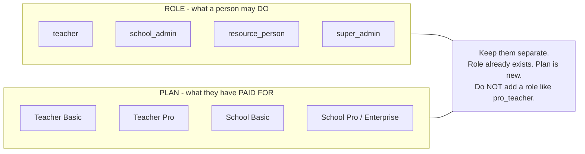

### 2.2 The four plans

| Plan | Who buys | Price | Paper generation | Teacher attendance | Center management | Other |
| --- | --- | --- | --- | --- | --- | --- |
| **Teacher Basic** | One teacher | Free | *Not stated* | *Not stated* | *Not stated* | "Basic functionality" (undefined) |
| **Teacher Pro** | One teacher | *Not stated* | Unlimited | *Not stated* | *Not stated* | "All functionality" (undefined) |
| **School Basic** | A school | ₹299 (*period not stated*) | Limited (*limit not stated*) | Yes | *Not stated* | "Core features" (undefined) |
| **School Pro / Enterprise** | A school | *Not stated* | Unlimited | Yes | Unlimited | School / enterprise features |

Anything marked *Not stated* is a decision for you (section 10). I did not fill any of it in.

### 2.3 How the pieces connect

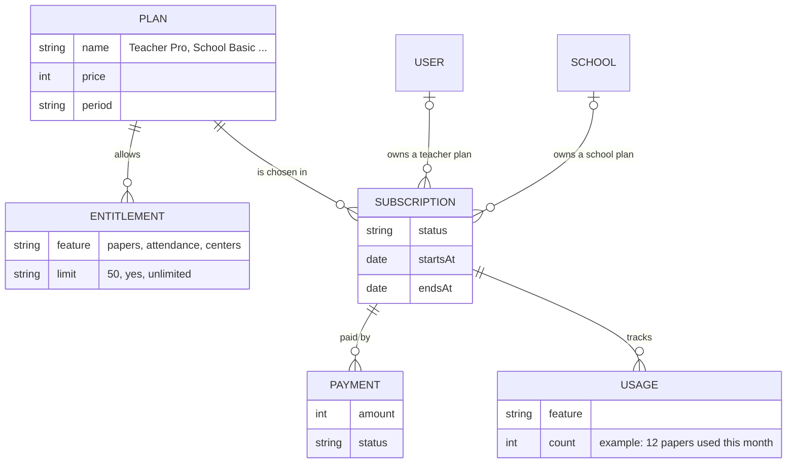

In simple words:
- A **Plan** is a product on the price list.
- **Entitlements** are what the plan allows. They answer "can they do X?" and "how many?".
- A **Subscription** says "this user (or this school) is on this plan from date A to date B".
- A **Payment** is one attempt to pay. One subscription can have many payments (first purchase, renewals, retries).
- **Usage** counts how much of a limit was used in the current period.

### 2.4 Two kinds of buyer

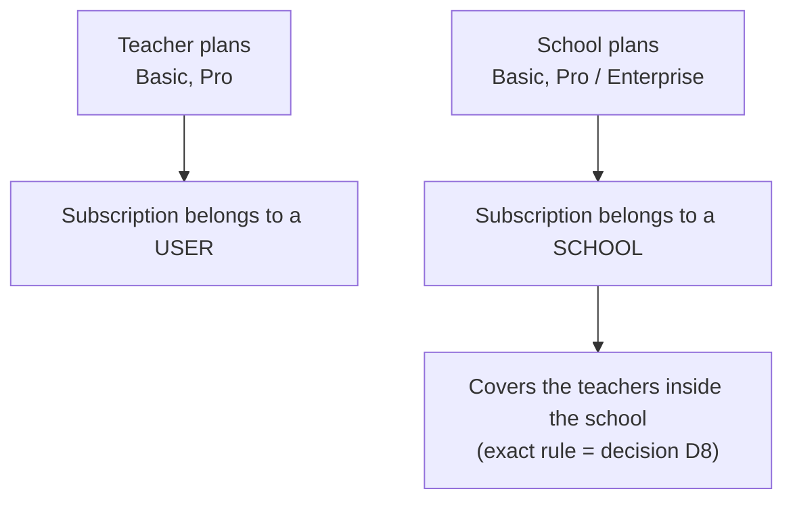

### 2.5 "No subscription" means Teacher Basic

Today every existing user has no plan. Simplest rule that matches how the app already treats missing settings:

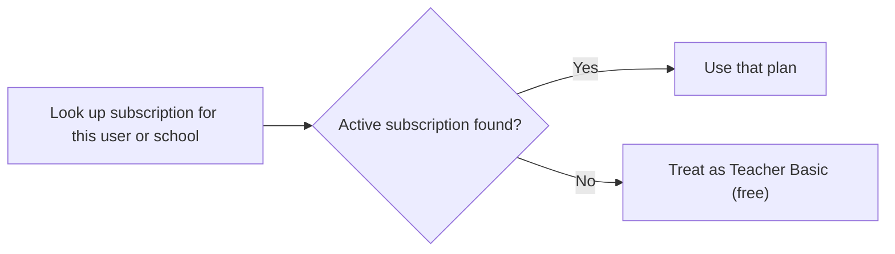

So existing users need no data migration, and free users need no row. (Whether to *grandfather* existing users is still your decision.)

**Watch out for a trap.** Teacher attendance works today for every school where the flag is on. Under your plan list, attendance is only in the **School** plans. So the day billing turns on, a school using attendance with no subscription would **lose it**.

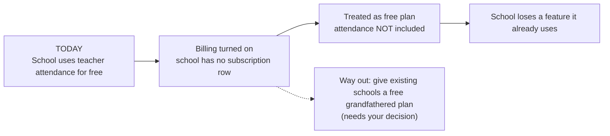

### 2.6 The hard question: teacher inside a school

Every user belongs to a school, so both can be true at once:

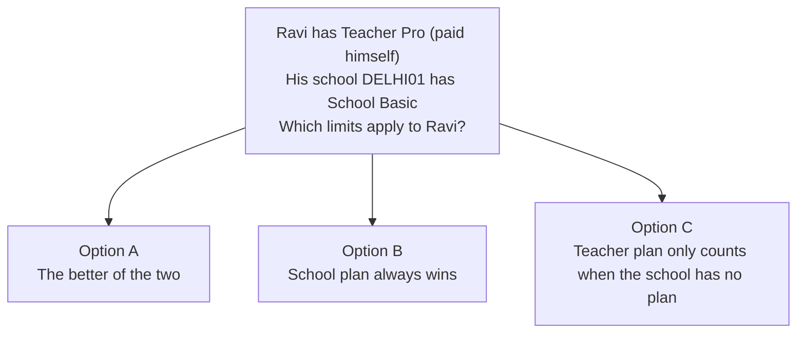

I will not choose. It changes how the app decides access. See decision D8.

### 2.7 The shared default school (important)

Because website and Google sign-ups are all placed in `RAMPUR01` (section 1.1), this one school is **not a real school**. It is a bucket holding every individual teacher who signed up online. It also holds the demo `school_admin`.

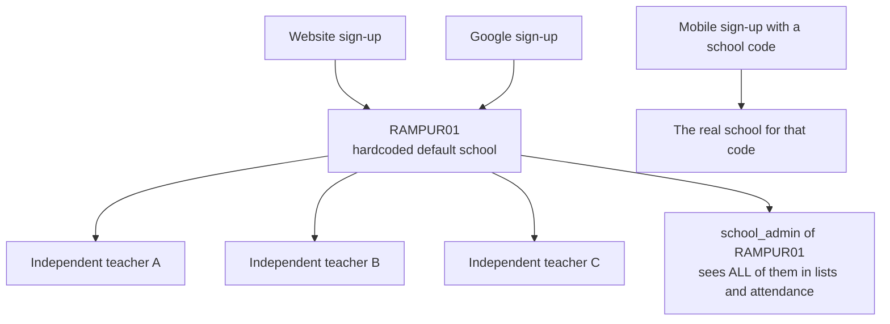

What this means for billing:
- If a **School plan** is bought for `RAMPUR01`, it would cover every independent teacher in that bucket. That is almost certainly not wanted.
- Teacher plans (Basic / Pro) must belong to the **user**, not to `RAMPUR01`.
- The rule "school plan covers the teachers in the school" needs an exception for this default school, or the default school must be treated as "no school".
- The `school_admin` of `RAMPUR01` can already see all these teachers in user lists and attendance. That is existing behavior, but a paid School plan would make it a real privacy and billing question.

This needs your decision (see Q1 in section 11).

### 2.8 Where the plan catalog should live

| Option | Good | Bad |
| --- | --- | --- |
| **Plans in code** (a config file) | Simple, reviewed in Git, no admin UI | Changing a price or limit needs a deploy |
| **Plans in the database** | Editable without deploy | Needs an admin screen and more care |

Lean: start with plans in **code**, and store only "who is on which plan" in the database. Revisit if you want to change prices often.

---

## 3. Payment architecture

### 3.1 The happy path

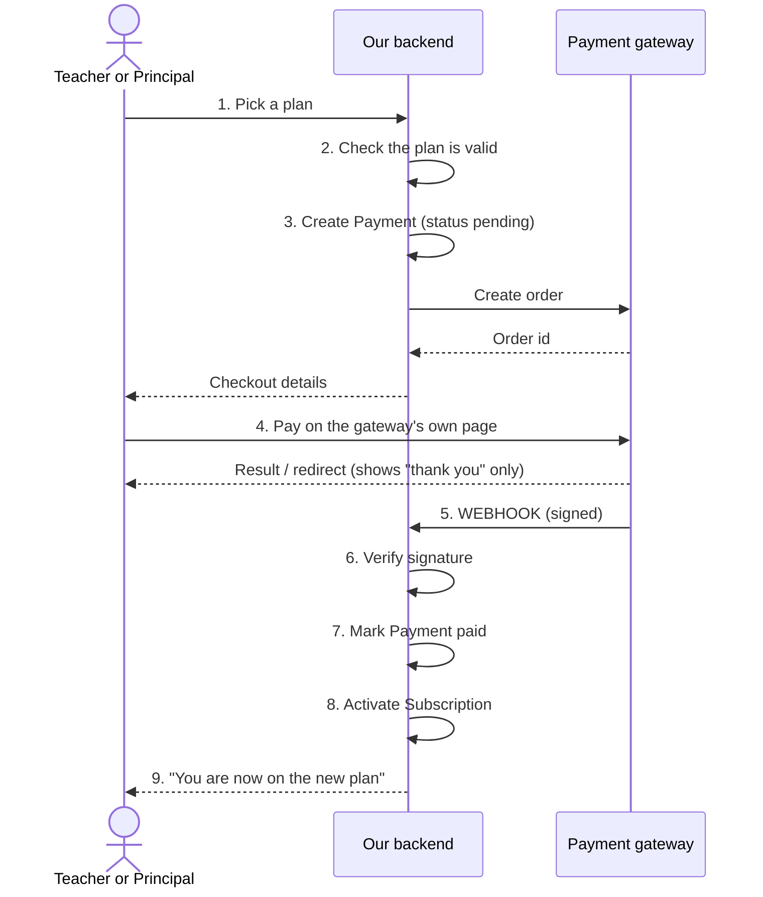

Key rule: **the webhook (step 5), not the browser redirect, activates the subscription.** The browser redirect can be faked or lost. The signed server-to-server webhook is the trusted signal.

Also: we ask the gateway for the payment status ourselves as a backup if a webhook never arrives.

### 3.2 States

**Payment**

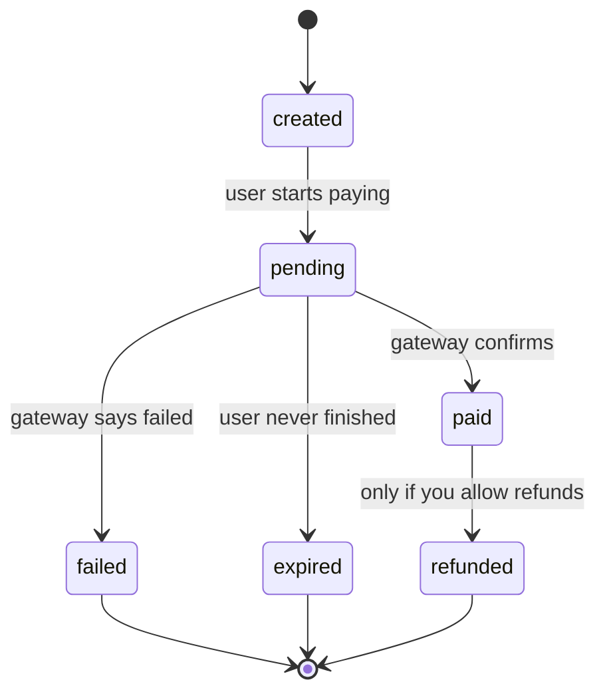

**Subscription**

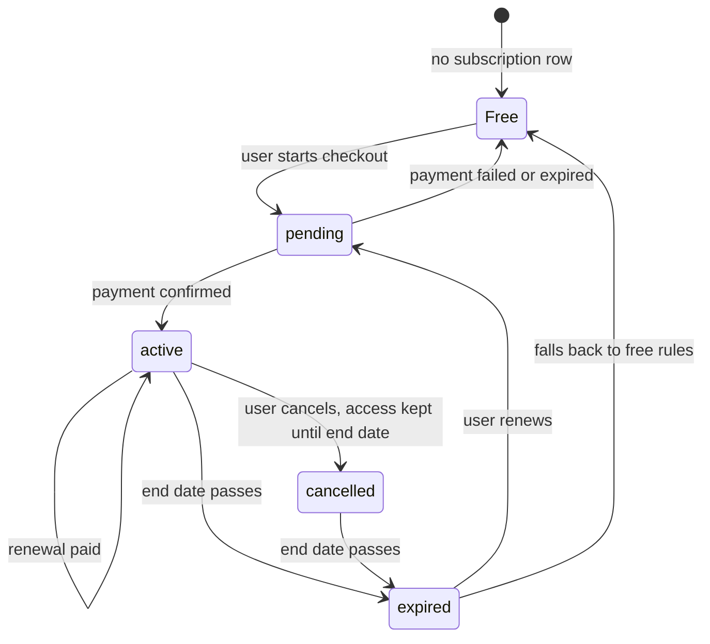

### 3.3 Cases you must handle

| Case | What should happen |
| --- | --- |
| **Success** | Payment `paid`, subscription `active`, end date set, user notified |
| **Failure** | Payment `failed`, nothing changes, user can retry |
| **Pending** (user closed the page, bank slow) | Payment stays `pending`. Do **not** activate. Re-check with the gateway later. |
| **Webhook arrives twice** | Must not activate or extend twice. Store the event id, ignore repeats. |
| **Webhook arrives late or out of order** | Must still end in the right state |
| **Webhook never arrives** | Backup check by asking the gateway |
| **Renewal** | Depends on decision D12 (auto-renew or manual) |
| **Cancellation** | Depends on decision D14 |
| **Expiry** | See section 8 |
| **Refund** | Depends on decision D14 |

How a repeated webhook should be handled:

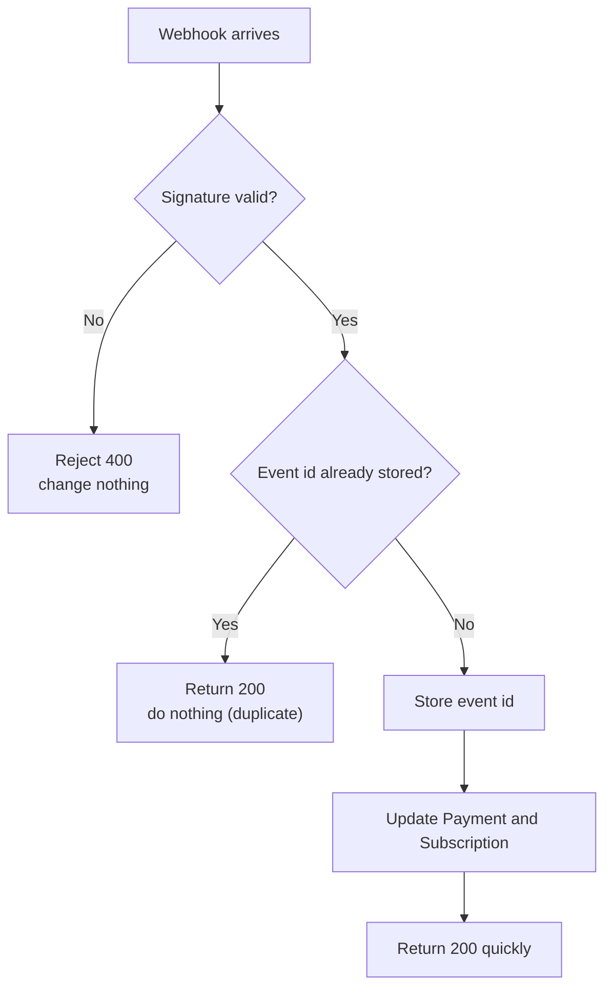

### 3.4 Things in the current code that affect this

- **The JSON parser blocks webhook signatures.** `index.js` parses every body with `express.json()` for all routes. Gateways sign the **raw** body. The webhook route must be registered **before** that parser and use a raw-body parser. This is easy to get wrong.

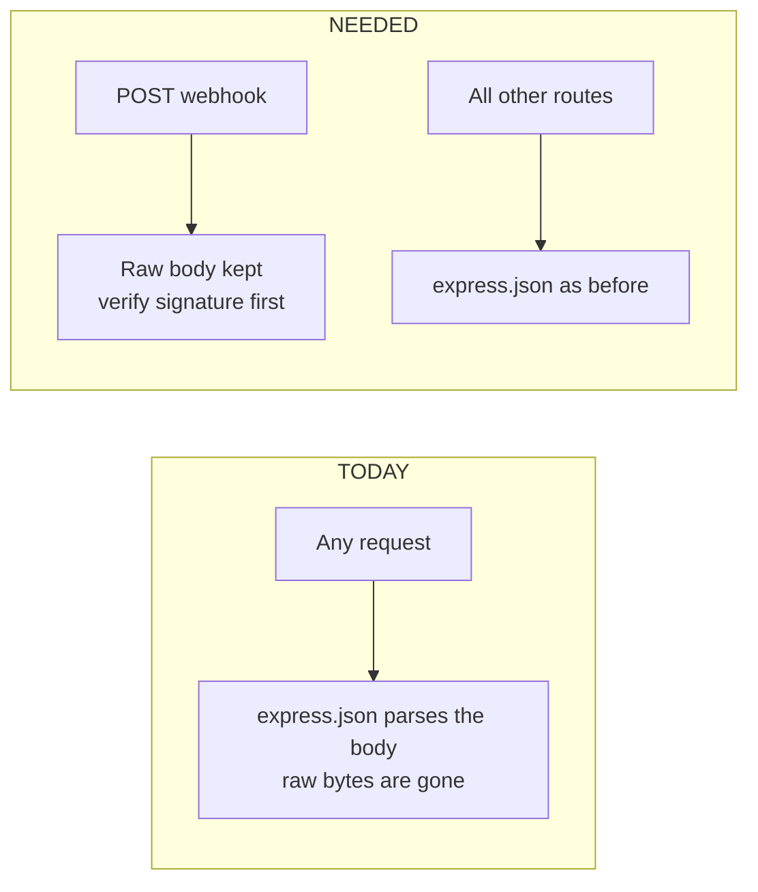

- **The server needs a public HTTPS URL** for the gateway to call. Local development needs a tunnel or the gateway's test tools.
- **The website and the API are hosted separately.** The client is a Vercel single-page app (`vercel.json` sends every path to `index.html`) and the API is its own deployment.
  - **Return page:** after paying, the gateway sends the user back to a client URL. That page does not exist yet. Today the client's catch-all route sends unknown paths to `/`, so a return URL would be lost unless a real route is added. If the login has expired by then, the user lands on the login page. The design must handle "paid, but logged out".
  - **Webhook and CORS:** the gateway calls the API directly with no browser `Origin` header. The existing CORS rule already allows requests with no `Origin`, so the webhook is not blocked. Any new client address still has to be added to `CORS_ORIGINS`.
  - **Security headers:** the API uses `helmet()`. The client sets **no** Content-Security-Policy today, so a gateway's checkout script or popup would not be blocked. If a CSP is added later, the gateway's domains must be allowed.
  - **Service worker:** `/api/*` is set to `NetworkOnly`, so plan and limit responses are never served from cache. Good. But the app shell is cached and auto-updates, so an older cached client may not know how to show an "upgrade" message. It would show a generic error unless the backend sends a clear message.
- **Secrets stay on the server.** Gateway keys go in `server/.env` (git-ignored), the same way the Gemini key does. Never in `client/` or `mobile/`. gitleaks in CI will block committed secrets.
- **Never handle card details.** Use the gateway's hosted checkout so card data never touches our server.
- **Payments are owner-scoped.** A user sees only their own payments. Someone else's payment returns **404**, like resources do today.
- **New endpoints need Zod `.strict()` schemas** and a rate limiter (the app already does this for every route).
- **SQLite and money.** Store amounts as whole numbers in paise (₹299 = `29900`), never decimals. SQLite allows one writer at a time, which helps avoid double-activation, but the design should still not depend on it because Postgres is planned later.

---

## 4. Access control — how the app knows what a user can do

### 4.1 The questions and where each is answered

| Question | Answered by |
| --- | --- |
| Which plan does this user / school have? | Look up the subscription in the database |
| Is it active? | Compare `endsAt` with the current time, and check status |
| Can they generate a paper? | Plan allows it **and** limit not reached |
| Reached the paper limit? | Compare usage counter with the plan's limit |
| Can they use teacher attendance? | Plan includes it **and** the school is on a plan that has it |
| Can they manage centers? | Plan includes it |
| After expiry? | Fall back to Teacher Basic rules (or whatever you decide in D15) |

### 4.2 The one rule: backend is the final authority

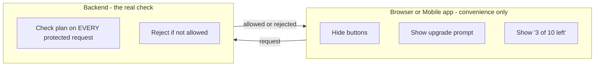

The client already has `VITE_*_ENABLED` flags. Those only hide buttons on cached builds. The current code says so itself: they are not the real switch. The same is true for plans. A user can edit the browser, so the frontend can never be trusted.

### 4.3 Where checks go in the existing code

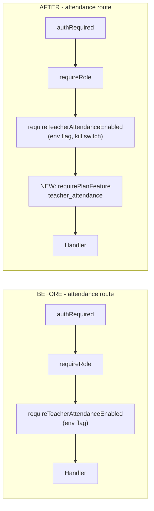

- **Feature gates** (attendance, center / classroom management): add one more middleware next to the existing gates. Same file, same style.
- **Paper limit:** inside the three generate routes (section 5).
- **Layering:** the env flags stay as the emergency kill switch. The plan check sits on top. If either says no, the answer is no. A kill switch must always win.
- **Different error for plan problems.** Today a disabled feature returns `503 ... DISABLED`. A plan problem should return a *different* status and code (for example "upgrade needed" or "limit reached") so the app can show an upgrade prompt instead of "unavailable".
- **Tell the UI what the user has.** The current-user endpoint (`/auth/me`) can include the plan and remaining limits so screens can show or hide things. That is display only.

### 4.4 Web vs mobile

The mobile app calls the same backend, so backend checks protect it automatically. **I did not look into changing anything in `mobile/`** (you said not to). Later, mobile will need its own screens to show upgrade prompts. Also see decision D20 about app-store rules.

---

## 5. Paper limits

### 5.1 Where to enforce

Everything goes through three routes, so enforce **inside those routes**, not on the client.

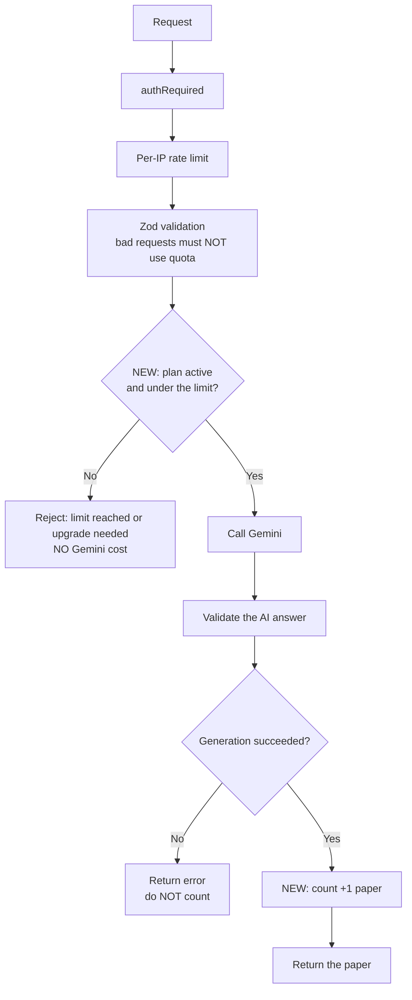

Why this order:
- **Check before the AI call.** Otherwise a blocked user still costs us AI money.
- **Count only after success.** The route can fail (bad AI answer, retries). A user should not lose a paper for our failure.
- **Validate first.** A malformed request must not burn quota.

### 5.2 The existing counter is not good enough

The app has a per-user daily counter (`assistant/budget.js`). Its own header says:
- it lives **in memory**,
- it **resets when the server restarts**,
- with more than one server it splits per server.

That was fine for protecting AI capacity. **It is not fine for billing**, because a restart would give everyone free papers. We need a counter in the **database**.

The `Event` table records things but it is for analytics and audit, not accurate limits. A dedicated usage record is the cleaner choice.

### 5.3 Races (two requests at once)

If a user is at 9 of 10 and sends two requests at the same moment, both may pass the check. Two safe options:

| Option | Idea |
| --- | --- |
| **Reserve, then confirm or give back** | Add 1 before the AI call; subtract 1 if it fails. Strict, slightly more code. |
| **Check, then count after success** | Simpler. A tiny overshoot is possible under parallel clicks. |

Choose based on how strict the limit must be (decision D11). Note the generator page already blocks double-clicks on the client, but that is not a guarantee.

### 5.4 Things that make "one paper" unclear

- `generate-set` makes up to **4 papers in one AI call**. Is that 1 or up to 4?
- A lesson plan is not really a "paper". Does it count?
- If a paper fails and the user retries, does the retry count?
- Does "regenerate" count?
- When does the limit reset (calendar month? subscription cycle? daily?)
- Is a school's limit shared by all teachers, or is it per teacher?

All of these are decisions (section 10). The design can support any answer, but I must not pick one.

---

## 6. Database — what would likely be needed

**No migration is created.** This is a sketch to discuss.

### 6.1 Diagram

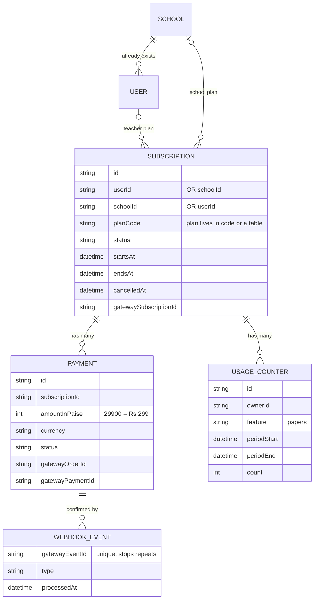

### 6.2 What each model would hold

| Model | Purpose | Main fields (idea only) |
| --- | --- | --- |
| **Plan** *(only if plans go in the DB)* | The price list | code, name, audience (teacher/school), price in paise, period, limits |
| **Subscription** | Who is on which plan | owner (user **or** school), plan code, status, start, end, cancel info, gateway subscription id |
| **Payment** | One payment attempt | subscription, amount (paise), currency, status, gateway order/payment ids, timestamps |
| **UsageCounter** | Papers used this period | owner, feature, period start/end, count |
| **PaymentWebhookEvent** | Idempotency + audit | gateway event id (unique), type, processed time |

Possible small changes to existing models: **probably none.** A user with no subscription row is on Teacher Basic. A separate `billing` snapshot on `User`/`School` is optional and probably unnecessary.

### 6.3 Rules to follow (from the existing project)

- `String` fields with a comment for "enums" (same as `role`, `status` today).
- Money as integer paise + a `currency` field.
- All times in UTC.
- Pick model names that clearly mean **the app's own billing** (for example `BillingPayment`, not just `Payment`), because `FeeRecord` already uses "paid / partial / pending" for **student fees**.
- Any new table is owner-scoped; missing and not-yours both return 404.
- Adding tables needs a Prisma migration. Per your saved rule, **I will not run a migration or edit `schema.prisma` without your approval.**
- The single `dev.db` is shared across branches, so the change must be planned carefully.

---

## 7. Payment provider

**Is one already in the project? No.** Nothing to reuse.

**I am not choosing one.** These are the things that decide the choice:

| Question | Why it matters |
| --- | --- |
| Do you need **auto-renew** (recurring charge) or is **pay-per-period** enough? | Recurring needs a provider feature for saved mandates (UPI AutoPay / e-mandate / card-on-file). One-time payments per period are much simpler. |
| Which payment methods must work (UPI, cards, netbanking, wallets)? | Indian users mostly expect UPI |
| Do school buyers need **GST invoices** or bank transfer / purchase orders? | Schools and Enterprise often pay by invoice, not by card |
| Fees and payout time | Affects your margin at ₹299 |
| Test / sandbox mode and good docs | Needed to test without real money |
| Business paperwork | Some providers need company or bank verification before going live |
| Webhook quality (signatures, retries) | Correctness of activation |

Commonly considered in India: **Razorpay, Cashfree, PayU, PhonePe PG, Paytm PG, Stripe.** I have not checked current availability, fees or feature support. Confirm on each provider's site before choosing.

**A useful design choice regardless of provider:** put the provider behind one small internal layer, so the rest of the app never depends on one provider's names. This is not building extra features. It just keeps the choice reversible.

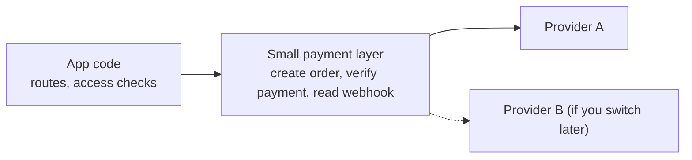

---

## 8. Expiry and renewal — how it fits the scheduler

### 8.1 What we have

One in-process `setInterval` (every 5 minutes). No queue, no cron, single process. It is fine for light housekeeping. It is **not** safe to rely on it for correctness, because if it is down or restarts, nothing runs.

### 8.2 Recommended split

```mermaid
flowchart TD
    subgraph PRIMARY["PRIMARY - always correct, no timer needed"]
        P1["Every protected request"] --> P2{"now is before endsAt?"}
        P2 -- "Yes" --> P3["Allowed"]
        P2 -- "No" --> P4["Treated as expired"]
    end
    subgraph HOUSE["HOUSEKEEPING - can run late"]
        H0["Sweep every few minutes<br/>(like the attendance reminder)"] --> H1["Mark old subscriptions expired"]
        H0 --> H2["Send 'expires soon' reminders"]
        H0 --> H3["Re-check pending payments"]
        H0 --> H4["Fix any missed webhooks"]
    end
```

**Rule:** access must depend on the **end date compared with now**, not on a timer having flipped a flag. Then a missed sweep never gives free access.

### 8.3 Renewal

| If you choose | Then |
| --- | --- |
| **Manual renewal** | The sweep sends reminders. The user pays again. Simple. |
| **Auto-renew** | The gateway charges on its own. Our webhook extends the end date. The sweep only reconciles. Needs recurring support from the provider. |

```mermaid
flowchart LR
    subgraph M["Manual renewal"]
        M1["Sweep sends reminder"] --> M2["User pays again"] --> M3["Webhook extends end date"]
    end
    subgraph A["Auto-renew"]
        A1["Gateway charges by itself"] --> A2["Webhook extends end date"]
        A1 -.-> A3["If the charge fails:<br/>grace period decision D15"]
    end
```

Reminders can reuse the existing notification system (needs `NOTIFICATIONS_ENABLED`) and email.

### 8.4 Limits reset

Usage counters reset by **period**. If a counter row is keyed by period start, a new period simply starts at zero. No reset job is needed.

### 8.5 Limits of the current scheduler

- Single process: if the app runs on more than one server, every server would run the sweep. It must be safe to run twice (idempotent).
- Not started in tests, so the logic should be a plain function that tests can call.

---

## 9. BEFORE vs AFTER

### 9.1 Paper generation

**BEFORE**

```mermaid
flowchart LR
    T["Teacher"] --> R["/resources/generate"] --> G["Gemini"] --> P["Paper returned"]
    P --> N["Nothing recorded<br/>any logged-in user<br/>unlimited<br/>only a per-IP rate limit"]
```

**AFTER**

```mermaid
flowchart TD
    T["Teacher"] --> R["/resources/generate"]
    R --> Q["Look up plan in the database"]
    Q --> A{"Active and under limit?"}
    A -- "No" --> X["Reject: limit reached / upgrade"]
    A -- "Yes" --> G["Gemini"]
    G --> V["Validate"]
    V --> C["Count +1 (only on success)"]
    C --> P["Paper returned"]
```

### 9.2 Teacher subscription

**BEFORE**

```mermaid
flowchart LR
    S["Sign up"] --> U["Use everything<br/>there is only one level"]
```

**AFTER**

```mermaid
flowchart TD
    S["Sign up"] --> B["Teacher Basic<br/>free, no payment row"]
    B --> UP["Click Upgrade"]
    UP --> CO["Checkout"]
    CO --> PAY["Pay"]
    PAY --> WH["Webhook"]
    WH --> PRO["Subscription active<br/>= Teacher Pro"]
```

### 9.3 School subscription

**BEFORE**

```mermaid
flowchart LR
    SA["super_admin creates School"] --> T["Mobile teachers sign up with the school code<br/>Website and Google sign-ups go to RAMPUR01"]
    T --> NB["No billing anywhere"]
```

**AFTER**

```mermaid
flowchart TD
    SC["School exists<br/>created by super_admin<br/>or self-serve if you decide so"] --> CH["school_admin chooses<br/>School Basic or Pro"]
    CH --> CO["Checkout and pay"]
    CO --> WH["Webhook"]
    WH --> SUB["Subscription owned by the SCHOOL"]
    SUB --> TE["Teachers of that school get the plan's features<br/>exact rule = decision D8"]
```

### 9.4 Checkout

**BEFORE**

```mermaid
flowchart LR
    X["No checkout exists"]
```

**AFTER**

```mermaid
flowchart TD
    PP["Plan page"] --> CP["Choose plan"]
    CP --> PEND["Backend creates a pending Payment"]
    PEND --> GP["Gateway hosted page<br/>user pays"]
    GP --> WH["Gateway calls our webhook (signed)"]
    WH --> VER["We verify the signature"]
    VER --> ACT["Payment paid<br/>Subscription active"]
    ACT --> NOT["Notify user"]
    GP -.-> RED["Browser redirect only shows 'thank you'<br/>it never activates anything"]
```

### 9.5 Feature access

**BEFORE**

```mermaid
flowchart LR
    subgraph ATT["Attendance"]
        A1["Flag on?"] --> A2["Role ok?"] --> A3["Allowed"]
    end
    subgraph CLS["Classroom"]
        C1["Flag on?"] --> C2["Allowed"]
    end
    subgraph PAP["Papers"]
        P1["Logged in?"] --> P2["Allowed"]
    end
```

**AFTER**

```mermaid
flowchart LR
    subgraph ATT["Attendance"]
        A1["Flag on?"] --> A2["Role ok?"] --> A3["Plan includes attendance?"] --> A4["Allowed"]
    end
    subgraph CLS["Classroom or center mgmt"]
        C1["Flag on?"] --> C2["Plan includes it?"] --> C3["Allowed"]
    end
    subgraph PAP["Papers"]
        P1["Logged in?"] --> P2["Plan ok?"] --> P3["Under limit?"] --> P4["Allowed"]
    end
    K["Kill-switch flag still overrides everything"] -.-> ATT
    K -.-> CLS
    K -.-> PAP
```

### 9.6 Expiry

**BEFORE**

```mermaid
flowchart LR
    X["Nothing expires"]
```

**AFTER**

```mermaid
flowchart TD
    E["endsAt passes"] --> R["Next request:<br/>now is after endsAt"]
    R --> T["User treated as expired"]
    E --> SW["Sweep marks status expired<br/>and sends a notice"]
    T --> F["Access drops to the fallback rules<br/>you choose in D15"]
    SW --> F
    F --> REN["User can renew from the plan page"]
```

---

## 10. Decisions you need to make

I did not make any of these.

> **How this relates to section 11:** this section (D1–D24) explains the main decisions in short. Section 11 (Q1–Q68) is the full, simple checklist to answer, and it also includes the smaller and newer questions (for example the shared default school). **Answer from section 11.** If the two ever differ, section 11 is the one to trust. (Section 11 has Q1–Q83.)

### Plans and prices
- **D1. Teacher Basic:** what exactly is "basic functionality"? Does it have a paper limit? Or unlimited papers?
- **D2. Teacher Pro price** and billing period.
- **D3. School Basic:** ₹299 per **month, quarter or year**? Per school or per teacher?
- **D4. School Basic paper limit:** how many? Shared by the whole school, or per teacher?
- **D5. School Pro / Enterprise price.** Is it one fixed price, per-teacher pricing, or "contact us / custom quote"? Are "Pro" and "Enterprise" one plan or two?
- **D6. Billing period:** monthly, yearly, or both? Any discount for yearly?

### Who gets what
- **D7. "Center management":** what does this mean? Is it the existing **Classroom Management** (classes, students, fees), or something new that does not exist yet? What does "unlimited" count (classes, students, centers)? What do Basic plans get?
- **D8. Teacher inside a school:** if a teacher has their own Pro plan but their school is on School Basic (or the reverse), which plan wins? Does a school plan cover all its teachers? Is there a seat limit?
- **D9. Teacher Pro and attendance:** attendance is a school feature reviewed by the Principal. Does Teacher Pro include it? Or only school plans?
- **D10. Who can buy a school plan:** only the `school_admin`? Can a `super_admin` grant plans by hand (for example for a sales deal or a pilot)? Since schools are created only by a `super_admin` today, do you also need **school self-signup**?

### Money and billing rules
- **D11. What counts as "one paper"?** A `generate-set` of 4 papers = 1 or 4? Do lesson plans, AI-edit and chat count? Do retries and regenerates count? When does the limit reset (calendar month / plan cycle / daily)? How strict must it be (allow tiny overshoot, or exact)?
- **D12. Renewal:** auto-renew or pay manually each period?
- **D13. Upgrade / downgrade:** do you refund the unused part (proration), or switch at the next period? What if a school moves from Pro to Basic while over the Basic limit?
- **D14. Cancellation and refunds:** can users cancel? Keep access until the paid period ends? Any refund window? Who approves refunds?
- **D15. After expiry (or failed renewal):** drop to free? Read-only? A grace period (how many days)? What happens to data they created above the free limits (classes, students, saved papers)? Is data ever deleted?
- **D16. Free trial:** any trial for Pro plans? For how long?
- **D17. Existing users:** are current users moved to Teacher Basic, or "grandfathered" with something more? For how long?

### Provider and compliance
- **D18. Payment provider** (see section 7). Do you have a business account/paperwork ready for any of them?
- **D19. GST and invoices:** do you need tax invoices, receipts, or payment by bank transfer / purchase order for schools?
- **D20. Mobile app stores:** if the mobile app sells or unlocks paid plans, app-store payment rules may apply to digital subscriptions. Do you want purchases only on the web, or inside the app? (Needs checking against the stores' current rules; I did not verify them.)

### Project and operations
- **D21. Database:** is it acceptable to build billing on the current SQLite setup, or must the Postgres move (currently not approved) come first? Billing correctness is more sensitive than most features.
- **D22. Rollout:** should billing follow the same staged rollout style as other features (a master flag plus allowed school codes), so it can be tested with one school first?
- **D23. Marketing text:** the home page says it must not invent pricing claims. Once plans are real, who approves the pricing copy and the "free to start" wording?
- **D24. Records:** how long must payment records be kept?

---

## 11. Open questions — answer these before we implement

Simple words. Even small ones are here, because a small unanswered question can still stop the work. Write your answer next to each one. If you say "you decide", I will pick the simplest option and tell you.

### A. The shared default school (must answer first)
- [ ] **Q1.** Everyone who signs up on the website or with Google goes into one school, `RAMPUR01`. Should this stay? Or should independent teachers have **no school** for billing purposes?
- [ ] **Q2.** If a real school buys a plan, should it **never** be `RAMPUR01`? (So a School plan cannot accidentally cover all the independent teachers.)
- [ ] **Q3.** The `school_admin` of `RAMPUR01` can see all the independent teachers. Is that OK, or should it change before we charge money?

### B. Plans and what they include
- [ ] **Q4.** What does **Teacher Basic** (free) include? Please list the features.
- [ ] **Q5.** What does **Teacher Pro** include beyond unlimited papers? Does it include classroom management? Teacher attendance?
- [ ] **Q6.** What does **School Basic** include, exactly? ("Core features" is not clear enough.)
- [ ] **Q7.** What does **School Pro / Enterprise** include? Is "Pro" and "Enterprise" one plan or two?
- [ ] **Q8.** What is "center management"? Is it the existing classes / students / fees screens, or something else?
- [ ] **Q9.** What does "unlimited center management" count? Number of classes? Students? Centers?
- [ ] **Q10.** Should Basic plans have a limit on classes or students? (Today there is no limit at all.)
- [ ] **Q11.** Do the plan names stay exactly "Teacher Basic / Teacher Pro / School Basic / School Pro"? What should the school top plan be called on screen?

### C. Prices and billing
- [ ] **Q12.** Teacher Pro price?
- [ ] **Q13.** School Basic ₹299: per **month**, **3 months**, or **year**? Per school or per teacher?
- [ ] **Q14.** School Pro / Enterprise price? Fixed, per teacher, or "contact us"?
- [ ] **Q15.** Monthly, yearly, or both? Any discount for yearly?
- [ ] **Q16.** Only Indian rupees (₹), or other currencies too?
- [ ] **Q17.** Is GST added on top of the price, or already included?
- [ ] **Q18.** Do you want a free trial for the Pro plans? How many days?
- [ ] **Q19.** Any coupon or discount codes?

### D. Paper limits
- [ ] **Q20.** How many papers can School Basic make? Shared by the whole school, or per teacher?
- [ ] **Q21.** Does Teacher Basic (free) have a paper limit? How many?
- [ ] **Q22.** What counts as one paper? One `generate-set` request makes up to 4 papers. Is that 1 or 4?
- [ ] **Q23.** Does a **lesson plan** count as a paper?
- [ ] **Q24.** Does an **AI edit** of a saved paper count? Does **AI chat (Coach)** count?
- [ ] **Q25.** If the AI fails and the teacher tries again, does the second try count?
- [ ] **Q26.** When does the paper count go back to zero? Start of each calendar month, each plan month, or each day?
- [ ] **Q27.** Should the limit be exact, or is a small overshoot OK when someone clicks twice quickly?
- [ ] **Q28.** When the limit is reached, what should the teacher see? (Only a message, or an "Upgrade" button too?)

### E. Who owns a plan (accounts and roles)
- [ ] **Q29.** The same email can have accounts in two schools. Is "one teacher" = **one account** or **one person**?
- [ ] **Q30.** If a teacher has Teacher Pro **and** their school has School Basic, which one wins?
- [ ] **Q31.** Does a School plan cover **all** teachers in that school? Is there a limit on the number of teachers?
- [ ] **Q32.** Does the Principal (`school_admin`) count as a teacher when counting teachers?
- [ ] **Q33.** What plan do `resource_person` and `super_admin` users have?
- [ ] **Q34.** Who is allowed to **buy** a School plan? Only the Principal? Can a `super_admin` also give a plan by hand?
- [ ] **Q35.** What if the Principal leaves or changes? Who takes over billing?
- [ ] **Q36.** Should schools be able to **sign up by themselves**, or does a `super_admin` always create them (as today)?

### F. Existing users (do not break what works today)
- [ ] **Q37.** Schools using **teacher attendance today** would lose it once billing starts. Should they keep it free for now? For how long?
- [ ] **Q38.** Should all current users start on Teacher Basic, or get something better for a while (a "thank you" period)?
- [ ] **Q39.** The demo / test accounts (like the Rampur admin): should they have free plans?

### G. Paying, cancelling, refunds
- [ ] **Q40.** Auto-renew (charged again by itself) or the user pays again by hand each time?
- [ ] **Q41.** Can a user cancel? Do they keep access until the end of the paid time?
- [ ] **Q42.** Do you give refunds? In how many days? Who decides?
- [ ] **Q43.** Upgrading in the middle of a period (Basic → Pro): pay only the difference, or start a fresh period?
- [ ] **Q44.** Downgrading (Pro → Basic): when does it take effect? Now, or at the end of the paid time?
- [ ] **Q45.** If a payment fails on renewal: how many days of grace? How many retries?
- [ ] **Q46.** When a plan **expires**: go back to free, or read-only, or blocked?
- [ ] **Q47.** After expiry, what happens to things made while they were paid (extra classes, students, saved papers)? Keep, hide, or delete? For how long?
- [ ] **Q48.** How many days before expiry should we remind them? By app notification, email, or both?

### H. Payment provider and money paperwork
- [ ] **Q49.** Which payment provider? Do you already have an account?
- [ ] **Q50.** Which ways to pay must work: UPI, cards, net banking, wallets?
- [ ] **Q51.** Do schools need a **GST invoice**? What details go on it (school name, address, GSTIN)?
- [ ] **Q52.** Should we send an email receipt after each payment?
- [ ] **Q53.** Can a school pay by bank transfer or purchase order instead of online?
- [ ] **Q54.** Is there a company / bank account ready so the money can actually be paid out?
- [ ] **Q55.** How long must we keep payment records?

### I. Screens and wording
- [ ] **Q56.** Do you want a public **pricing page** (before login), a checkout page, and a "My subscription / billing history" page?
- [ ] **Q57.** Should the Principal see a billing page for the school? Should a super admin see all payments?
- [ ] **Q58.** Who writes the refund / cancellation policy for the Terms page?
- [ ] **Q59.** Who handles payment problems from users (the Help & Support tickets)?
- [ ] **Q60.** The home page says it must not show made-up prices. Who approves the final price text?

### J. Mobile app and testing
- [ ] **Q61.** Will paid plans be bought **only on the website**, or also inside the mobile app? (App stores may have their own payment rules. I have not checked them.)
- [ ] **Q62.** For now, should mobile just show "please upgrade on the website" when a limit is hit? (Mobile code is not part of this work.)
- [ ] **Q63.** Where will the server run, so the payment provider can reach it? The README says the Railway deployment is currently unavailable. Payment confirmations cannot be fully tested without a public HTTPS address.
- [ ] **Q64.** Do we have provider **test-mode** keys to test without real money?

### K. Technical choices (I can decide these if you say "you decide")
- [ ] **Q65.** Is it OK to build billing on the current SQLite database, without waiting for the Postgres move?
- [ ] **Q66.** Should billing have a master on/off switch like the other features (and be tested on one school first)?
- [ ] **Q67.** Should plans live in a code file (simple) or in the database (editable without deploy)?
- [ ] **Q68.** Should we add a new notification type for billing, or reuse the existing `reminder` type?

### L. Other features that are not in your plan list (added after the full feature check)
- [ ] **Q69.** Which of these AI features are in which plan: **Coach chat, AI Assistant, Attachments (image/PDF), Learning Representation, AI edit**? For each: free, limited on Basic, or Pro only?
- [ ] **Q70.** Three daily AI limits exist today (Assistant 100, Attachments 20, Learning Representation 50 per user per day). They reset when the server restarts. Keep them as cost protection next to the plan limits, or replace them with plan limits?
- [ ] **Q71.** "Unlimited papers" is still slowed by a per-IP limit and the AI provider's own limit. Many teachers in one school may share one Wi-Fi IP. Should the promise say "fair use"? Are you OK if a busy school hits the limit?
- [ ] **Q72.** Are the **Excel / CSV exports** (student attendance, fees, teacher attendance) free, or only for Pro plans?
- [ ] **Q73.** Should Basic plans have a limit on **saved papers** in the Library, or on how long **history** is kept?
- [ ] **Q74.** Is **Coach chat** free and unlimited for everyone, or limited on Basic?
- [ ] **Q75.** One login can be used on many devices today. Is that fine for "one teacher / one account", or do you want a device or session limit?
- [ ] **Q76.** Are **admin tools** (approve teachers, school analytics) free for every school, or only in School plans?
- [ ] **Q77.** After paying, should an open screen update **instantly** ("Plan active!") using the existing realtime feature, or is it OK to refresh the page?
- [ ] **Q78.** After paying on the gateway page, where should the user land? What if their login has expired by then?
- [ ] **Q79.** Should payment events be tracked in Google Analytics (like page views), or kept out of analytics for privacy?
- [ ] **Q80.** Do you know roughly what one paper costs in AI charges? (It decides whether the prices and the School Basic limit make sense.) Are we on a paid AI plan with the AI provider?
- [ ] **Q81.** Should the admin dashboard show **revenue and active subscriptions**? (Today it only shows usage numbers.)
- [ ] **Q82.** If a teacher account is removed, must we keep their payment records? (There is no user-delete feature today.)
- [ ] **Q83.** Mobile teachers get a real school (from the school code) but website teachers all go to `RAMPUR01`. Should that difference stay?

---

## Appendix — where I looked

Files read or searched (read-only): `server/prisma/schema.prisma`, `server/src/index.js`, `server/src/middleware/auth.js`, `server/src/routes/auth.js`, `server/src/routes/resources.js`, `server/src/routes/teacherAttendance.js`, `server/src/routes/classroom.js`, `server/src/routes/admin.js`, `server/src/lib/flags.js`, `server/src/lib/roles.js`, `server/src/lib/notificationTypes.js`, `server/src/assistant/budget.js`, `server/src/actions/descriptors/generateAssessment.js`, `server/src/seed.js`, `client/src/App.tsx`, `client/src/lib/resources.ts`, `client/src/lib/apiErrorMessages.ts`, `client/src/hooks/useClassroomQueue.ts`, `client/vercel.json`, `client/vite.config.ts` (service worker), `client/src/lib/analytics.ts`, `server/src/lib/email.js`, `server/src/lib/socketServer.js`, every route file in `server/src/routes/` (full endpoint list), the mobile `screens/` and `api/` folders (listing only), `README.md`, `PROJECT-OVERVIEW-FOR-NON-TECHNICAL-STAKEHOLDERS.md`, and several `docs/` files.

I did not change any code, database, migration, `.env` file, or anything inside `mobile/`.
