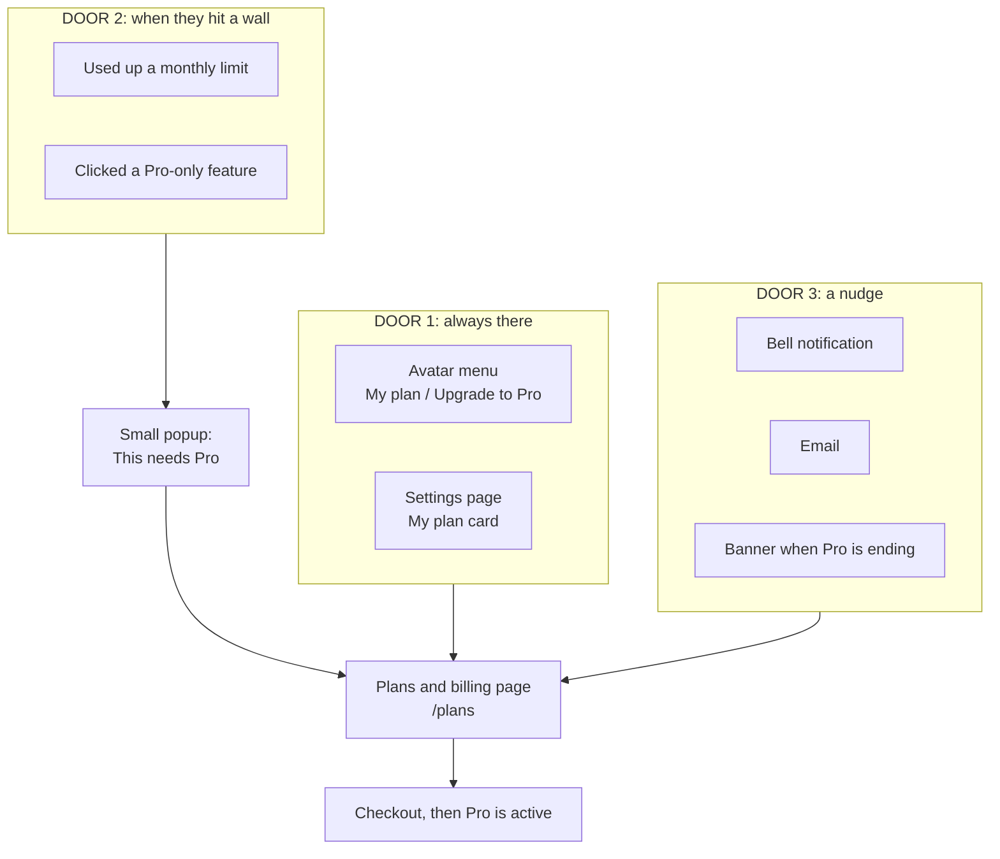
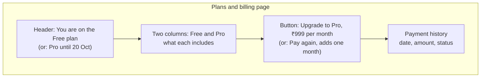
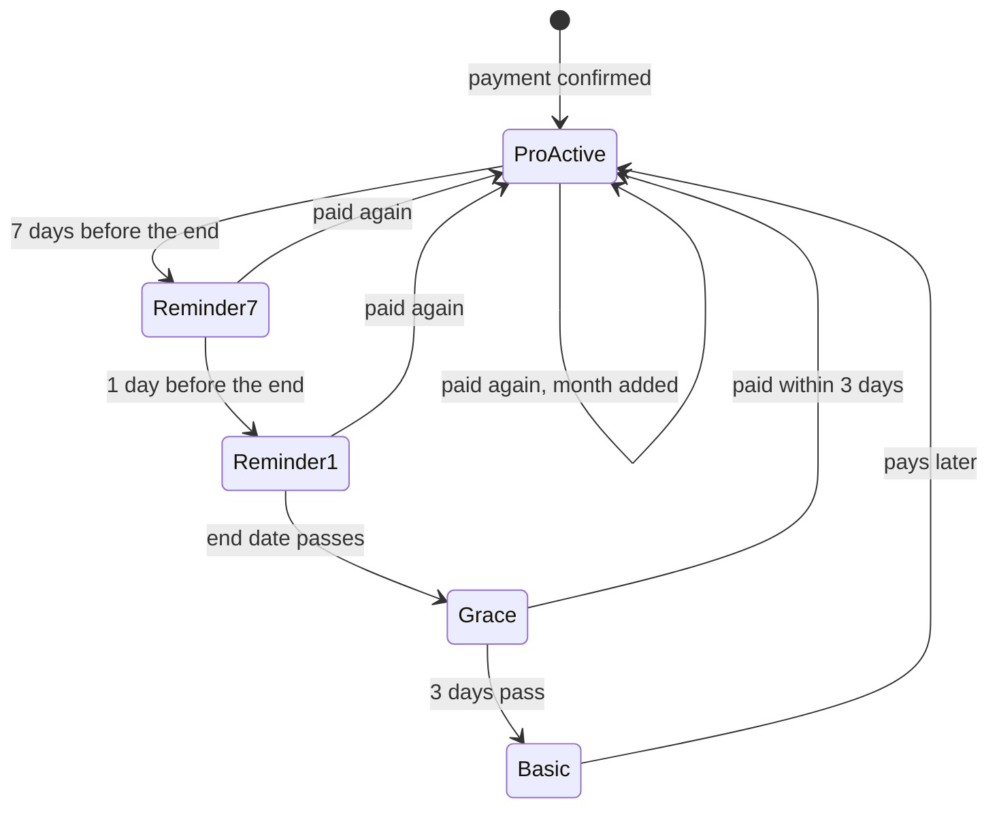
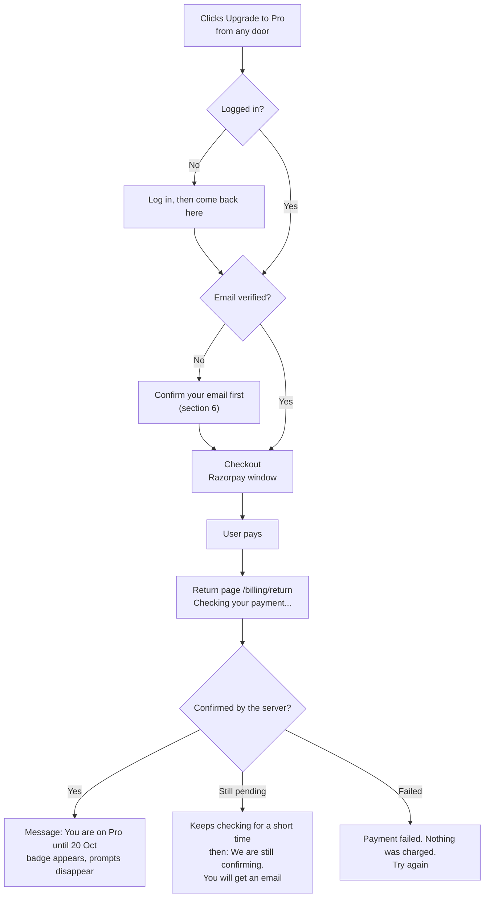
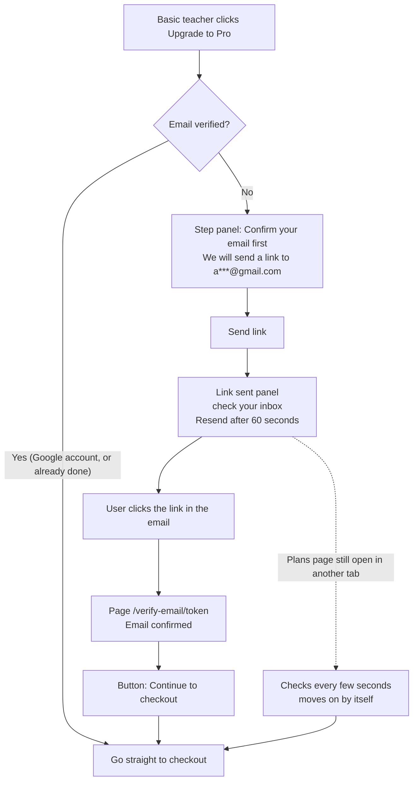
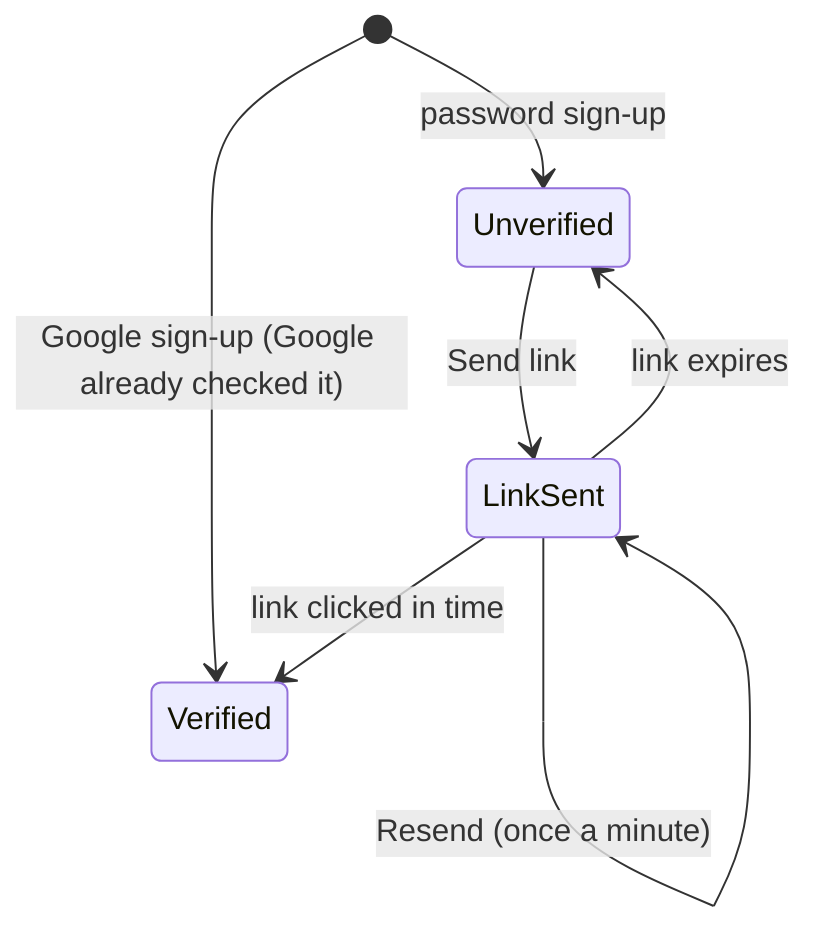

# Payment System — UI Flow (Where Users See and Use the Buy Option)

**Status:** Design only. Nothing is built. No code, database, migration or `mobile/` file was changed.
**Scope:** Teacher Basic (free) and Teacher Pro (₹999 per month), on the **web app** (which also works on phones through the browser and installed web app). The native mobile app is not changed.
**Related documents:** `payment-decisions.md` (decisions), `payment-implementation-phases.md` (phases), `payment-system-analysis.md`, `account-and-signup-analysis.md`.

---

## 1. The idea in one picture

A user meets the buy option in **three ways**. Think of them as three doors.

Everything leads to **one page**: `/plans` ("Plans and billing"). That keeps it simple. There is one place to compare plans, pay, renew and see payment history.

---

## 2. Door 1: the always-there options

### 2.1 Avatar menu (top right on desktop, drawer on phones)
Today the menu has Getting Started, Settings, Need Help?, legal links and Sign out. We add **one item**:

| User is | The item says |
| --- | --- |
| Basic | **"Free plan. Upgrade to Pro"** (highlighted) |
| Pro | **"Pro until 20 Oct"** (opens `/plans`) |
| Pro in grace | **"Pro ended. Renew now"** |

The avatar chip can also carry a small **"PRO"** badge for Pro users.

### 2.2 Settings page: "My plan" card
A new card near the top of Settings:
- Current plan and end date.
- **Usage meters** (Basic only): questions 32 of 50, classes 2 of 2, images 4 of 10, PDFs 1 of 5, and the date they reset.
- The **Upgrade to Pro** or **Renew** button.
- An email line with a badge: **"Verified ✓"** or **"Not verified. Verify now"**.

### 2.3 The Plans page (`/plans`)

- Price and period come from config, not from the page's code.
- A logged-out visitor is asked to log in first, then returned to `/plans`.

---

## 3. Door 2: at the moment of need

Locked things are **not hidden**. They are shown with a small **"Pro"** tag, so users know they exist. Clicking one opens a short popup:

> **"Classroom Mode is a Pro feature."** [See Pro plan] [Not now]

Limits show a **meter**, and a clear message when the wall is reached.

| Where | What the user sees | What the popup says |
| --- | --- | --- |
| **Generator page** | "42 of 50 questions used this month" under the Generate button. Asking for more than is left shows an error in place. | "You have 8 questions left this month. Upgrade for unlimited." |
| **Classroom, class list** (add class) | At 2 classes the add-class form is replaced with a lock message. | "Free plan allows 2 classes. Upgrade for unlimited." |
| **Classroom, Reports** (Download Excel button) | The button has a small lock. | "Report downloads are a Pro feature." |
| **Coach, "+" menu** (Classroom Mode) | Classroom Mode shows a "Pro" tag. | "Classroom Mode is a Pro feature." |
| **Coach, attachments** | At the limit, adding a file shows a message. | "You have used your 10 images this month. Upgrade for unlimited." |

**How it works under the hood (simple):** the server sends a clear error with a **code** (limit reached, feature locked, or email not verified). The app already reads an error code on every response, so one shared popup component can show the right message. The backend still refuses the action, so the popup is only the friendly part.

**Old cached versions of the app:** the server's error message text is readable, so an older version shows a normal message instead of breaking.

---

## 4. Door 3: nudges

| When | What the user gets |
| --- | --- |
| 7 days before the end | A bell notification and an email: "Your Pro ends on 20 Oct. Renew" |
| 1 day before the end | The same again, and a small banner at the top of the app |
| During the 3 grace days | A banner: "Your Pro ended. 2 days left. Renew now" |
| After grace | Back to the free plan. A calm message: "You are back on Free. Your data is safe." |

If notifications are switched off, the email and the banner still work.

---

## 5. The buying journey

Important rules the screens follow:
- The **return page only shows status**. It never activates anything. The server activates Pro when Razorpay's signed message arrives.
- The **price is never sent from the page**. The server uses its own config.
- A second payment while Pro is active **adds a month**.
- If the user closes the window or the payment is slow, the plan still activates later, and they get an email receipt.

---

## 6. Email confirmation at checkout (decided)

**Decision:** verify the email **only when buying**. Existing free users are not disturbed.

It reuses what the app already does for forgot-password: an emailed one-time link, stored hashed, expiring, single use, sent through Brevo.

### The screens
1. **Step panel** on the Plans page: the address with part hidden, and a "Send link" button.
2. **Link-sent state:** "Check your inbox", a Resend button that waits 60 seconds, and a hint about spam and Help & Support.
3. **`/verify-email/:token` page:** "Email confirmed ✓" and a "Continue to checkout" button. An expired or used link shows a message and "Send a new link".
4. **Settings badge:** "Verified ✓" or "Verify now".

### Edge cases

| Case | What happens |
| --- | --- |
| Google account | Already verified. No step. |
| Link clicked while logged out | "Email confirmed", then "Log in to continue", then back to checkout |
| Link opened on another device | Still works. The original tab moves on by itself. |
| Link expired or used twice | Clear message and "Send a new link" |
| Too many Send clicks | "Please wait a minute." The server enforces this too. |
| Email service down or not configured | "We can't send emails right now. Try again later." Checkout stays closed. No one is charged. |
| **Typo in the sign-up email** | **Decided:** at launch, the step panel shows "Wrong address? Contact Help & Support". A "change email" option can be added later if this happens often. |
| Existing free users | Nothing changes until they try to buy |

### What we build (all data changes need your approval first)
- A verification-token table (a mirror of the password-reset token table).
- An `emailVerifiedAt` field on the user.
- A "send link" route (login required, rate limited, Zod `.strict()`) and a "confirm token" route.
- `/auth/me` reports whether the email is verified.
- **The checkout route refuses unverified users**, so the backend is the final authority.
- Client: the step panel, the `/verify-email/:token` page and the Settings badge.

---

## 7. What is new in the client

| New | Purpose |
| --- | --- |
| `/plans` page | Compare plans, upgrade, renew, payment history |
| `/billing/return` page | Shows the payment status after Razorpay |
| `/verify-email/:token` page | Confirms the emailed link |
| "My plan" item in the avatar menu | Always-there door |
| "My plan" card in Settings | Meters and the Upgrade button |
| One shared "needs Pro" popup | Used by every locked feature and limit |
| Top banner | Ending soon, in grace |
| Small "Pro" tags | On locked buttons |

**Flags:** all of this stays hidden while billing is off. A client flag such as `VITE_BILLING_ENABLED` only decides whether the UI shows. The real switches are on the server, the same rule as every other feature in the app.

**Where these already-existing pieces would change (web only):**

| Screen | Existing piece |
| --- | --- |
| Avatar menu | `ProfileMenu` |
| Desktop top bar and phone bottom bar | `TopBar` and `BottomNav` (banner only) |
| Settings | `SettingsPage` |
| Generator | `GeneratorPage` |
| Class list | `ClassList` |
| Reports download | `ReportsPanel` |
| Classroom Mode and attachments | `ClassroomModeMenu`, `AddMenu`, `Composer`, `AttachmentTray` |
| Messages | The existing `Toast` |

---

## 8. What stays the same

- **Coach chat, AI Assistant, AI edit, Learning Representation, Library, notifications and Help** look and work exactly as today.
- **Teacher attendance** is unchanged and not part of any plan.
- **The native mobile app** is not changed. The backend rules still protect it, and a limit there shows the server's message. Its own upgrade screens are a later, separate step.
- **Before the payment phase is finished**, the Upgrade button says "Contact us", and testers get Pro from an admin by hand.

---

## 9. Words the screens will use (simple and calm)

| Situation | Message |
| --- | --- |
| Questions running low | "8 questions left this month" |
| Limit reached | "You have used your 50 free questions this month. They reset on 1 Nov." |
| Locked feature | "Classroom Mode is a Pro feature." |
| Class limit | "The free plan allows 2 classes. Your existing classes stay." |
| Email step | "Confirm your email so we can send your receipt." |
| Payment pending | "We are still confirming your payment. We will email you." |
| Payment failed | "The payment did not go through. Nothing was charged." |
| Pro active | "You are on Pro until 20 Oct." |
| After Pro ends | "You are back on Free. Your data is safe." |

The final wording and the price text are yours to approve before going live.
